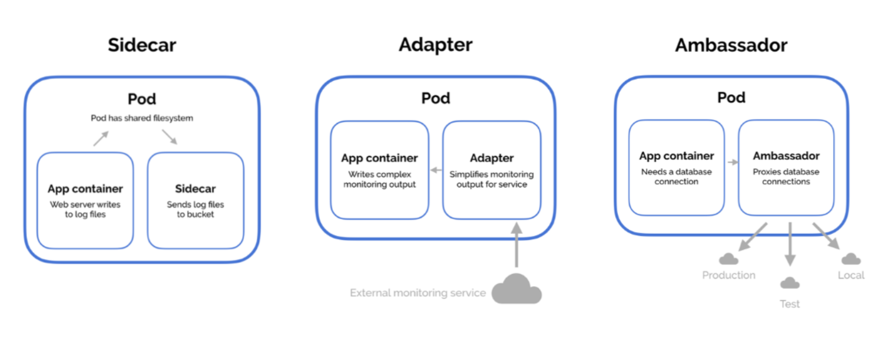
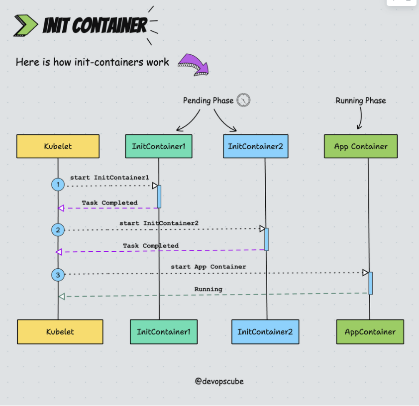
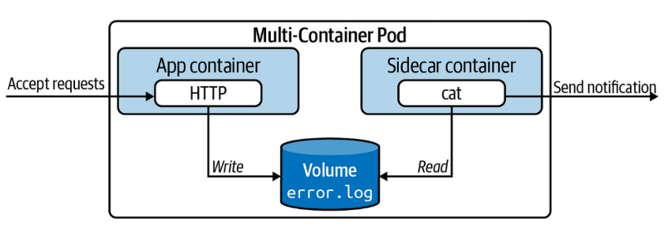

# POD MULTI CONTAINER IN K8S

## I. Lý do cần thiết kế Pod với nhiều Container

Mặc dù Pods thường có một container chính (app container), Kubernetes hỗ trợ nhiều containers trong cùng Pod để giải quyết các vấn đề phức tạp. Các containers chia sẻ:

- **Network namespace**: Cùng IP và ports, giao tiếp qua localhost.
- **Storage volumes**: Mount chung để chia sẻ files.
- **IPC namespace**: Chia sẻ process signals nếu cần.
- **Lifecycle**: Pod ready khi tất cả containers ready, nhưng init containers chạy trước.

Ưu điểm:

- Containers hỗ trợ lẫn nhau (ví dụ: logging sidecar thu thập logs từ app).
- Đảm bảo tất cả containers chạy cùng node
- Efficiency: Giảm overhead so với nhiều Pods riêng (mỗi Pod có overhead network/IP)
- Patterns: Sidecar (enhance), Adapter(transform output), Ambassador (proxy external).



## II. Init Containers

Init Container (Container khởi tạo) trong Kubernetes là các container đặc biệt chạy và hoàn thành trước khi các container ứng dụng chính (App Container) được bắt đầu.

Nó dùng để chuẩn bị môi trường (ví dụ: clone repo, check database ready, generate config) trước khi ứng dụng được phép khởi động. Chúng chạy đến hoàn thành (exit 0), nếu fail thì retry theo restartPolicy (default Always cho init).

Ưu điểm:

- **Setup precondition**: Đảm bảo môi trường sẵn sàng (ví dụ: clone Git repo vào volume, check DB connection).
- **Security**: Chạy với privileges cao hơn app (ví dụ: chown files), rồi app chạy least privilege.
- **One-time tasks**: Không chạy liên tục như sidecar, tiết kiệm resource.



### 1. Cấu hình Init container trong YAML

```yaml
apiVersion: v1
kind: Pod
metadata:
  name: init-pod
spec:
  initContainers:
  - name: init-downloader
    image: busybox
    command: ["/bin/sh"]
    args: ["-c", "wget -O /work-dir/index.html http://example.com/index.html"]
    volumeMounts:
    - name: work-volume
      mountPath: /work-dir
  containers:
  - name: app-container
    image: nginx
    volumeMounts:
    - name: work-volume
      mountPath: /usr/share/nginx/html
  volumes:
  - name: work-volume
    emptyDir: {}
```

## III. Sidecar Pattern

**Sidecar** là một container phụ chạy song song với container chính (app container) trong cùng Pod, nhằm mở rộng hoặc hỗ trợ chức năng mà không thay đổi code của app chính. Sidecar thường xử lý các nhiệm vụ phụ như logging, monitoring, proxy, hoặc file synchronization. Vì chia sẻ network và storage với app, sidecar có thể giao tiếp qua localhost hoặc read/write files chung mà không cần overhead network.

**Ví dụ**: App container write logs và file, sidecar đọc và ship đến ELK stack

Ưu điểm:

- Thêm tính năng như encrypt traffic hoặc ship logs mà không modify app image.
- Tách biệt trách nhiệm, dễ maintain
- Common use cases: Logging (Fluentd sidecar thu thập logs từ app), Proxy (Envoy sidecar cho service mesh), Monitoring (Prometheus exporter), hoặc Backup (sidecar sync files đến storage external).
- **Limitaitions**: Tăng resource usage cho Pod, không scale độc lập (toàn Pod scale cùng).



### 1. Cấu hình Sidecar trong YAML

```yaml
apiVersion: v1
kind: Pod
metadata:
  name: sidecar-pod
spec:
  containers:
  - name: app-container
    image: nginx:latest
    volumeMounts:
    - name: logs-volume
      mountPath: /var/log/nginx
  - name: logging-sidecar
    image: busybox
    command: ["/bin/sh"]
    args: ["-c", "tail -n+1 -f /var/log/nginx/access.log"]
    volumeMounts:
    - name: logs-volume
      mountPath: /var/log/nginx
  volumes:
  - name: logs-volume
    emptyDir: {}
```

### 2. Ambassador Pattern

**Ambassador** là proxy cho app container kết nối external services (ví dụ: database sharding, A/B testing). App connect localhost, ambassador handle logic. nhiệm vụ duy nhất của nó là làm đại diện giao tiếp ra ngoài.

**Ví dụ**: App connect DB qua ambassador, nó route đến prod/dev dựa trên env.

### 3. Adapter Pattern

**Adapter** transform output của app để match chuẩn (ví dụ: convert logs sang JSON cho monitoring tool).

Hiểu đơn giản là chuyển đổi dữ liệu sang định dạng khác

## IV. Thiết kế Multi-Container Pod trong YAML

```YAML
apiVersion: v1
kind: Pod
metadata:
  name: multi-pod
spec:
  initContainers:
  - name: init-setup
    image: busybox
    command: ['sh', '-c', 'echo "Setup done" > /work-dir/setup.txt']
    volumeMounts:
    - name: shared-vol
      mountPath: /work-dir
  containers:
  - name: app-container
    image: nginx
    ports:
    - containerPort: 80
    volumeMounts:
    - name: shared-vol
      mountPath: /usr/share/nginx/html
  - name: sidecar-logger
    image: busybox
    command: ['sh', '-c', 'tail -f /var/log/nginx/access.log']
    volumeMounts:
    - name: log-vol
      mountPath: /var/log/nginx
  volumes:
  - name: shared-vol
    emptyDir: {}
  - name: log-vol
    emptyDir: {}
```

```yaml
apiVersion: v1
kind: Pod
metadata:
  name: combined-pod
spec:
  initContainers:
  - name: init-setup
    image: busybox
    command: ['sh', '-c', 'echo "Init done" > /data/init.txt']
    volumeMounts:
    - name: shared-data
      mountPath: /data
  containers:
  - name: app
    image: nginx
    volumeMounts:
    - name: shared-data
      mountPath: /usr/share/nginx/html
  - name: sidecar
    image: busybox
    command: ['sh', '-c', 'while true; do echo "Sidecar running" >> /data/log.txt; sleep 5; done']
    volumeMounts:
    - name: shared-data
      mountPath: /data
  volumes:
  - name: shared-data
    emptyDir: {}
```

## V. Các lệnh Kubectl để quản lý

- Tạo Pod: `kubectl apply -f multi-pod.yaml`
- Get pod: `kubectl get po`
- Describe: `kubectl describe pod multi-pod` (Xem events mỗi container, init status).
- Logs: `kubectl logs multi-pod -c sidecar-logger` (chỉ định container).
- Exec: `kubectl exec -it multi-pod -c app-container -- /bin/sh`.
- Debug init fail: Nếu init crash, Pod ở init phase, dùng describe xem logs init.
- Get all containers: `kubectl get pod combined-pod -o jsonpath='{.spec.containers[*].name} {.spec.initContainers[*].name}'`.