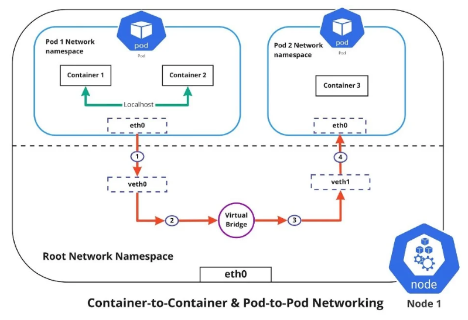
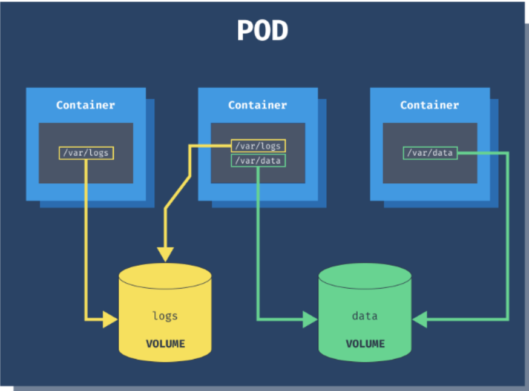

# RESOURCE SHARE IN K8S

## I. Lý do cần chia sẻ tài nguyên giữa các Container

- Pod là đơn vị triển khai, không phải container.
- Các container trong cùng Pod được thiết kế để phối hợp như các process trong một máy.
- Kubernetes vẫn dùng Linux namespaces và cgroups để giữ mỗi container có môi trường riêng.
- Tuy nhiên, Kubernetes chủ động cho các container trong cùng Pod chia sẻ một số tài nguyên (đặc biệt là Network Namespace và Volumes) để chúng có thể giao tiếp và làm việc cùng nhau một cách hiệu quả như:
  - Giảm latency: Giao tiếp qua localhost thay vì network full (ví dụ: app gửi request đến sidecar proxy trên port 8080).
  - Chia sẻ data: Sử dụng volumes để read/write files chung, tránh duplicate storage hoặc external mounts.
  - Tích hợp chặt chẽ: Sidecar có thể monitor app qua shared process signals (IPC) hoặc PID namespace.
  - Efficiency: Giảm resource overhead so với multi-Pods (mỗi Pod có IP riêng, network policies phức tạp hơn).
  - Patterns hỗ trợ: Enable sidecar (share logs qua volume), ambassador (share network cho proxy), adapter (transform data chung).

Tuy nhiên, chia sẻ cũng có rủi ro: Một container crash có thể ảnh hưởng toàn Pod, hoặc conflict permissions trên shared volume.

## II. Network Namespace

Tất cả containers trong Pod chia sẻ cùng network namespace: Cùng IP, ports, và localhost. Điều này cho phép:

- Giao tiếp nội bộ qua localhost:port mà không cần Service hoặc DNS.
- Sidecar proxy traffic: App connect localhost:8080, sidecar forward đến external.
- Debug: Exec vào một container để curl localhost từ container khác.

Ví dụ: App container listen port 80, sidecar curl localhost:80 để health check.



## III. Storage (Volumes)

Chia sẻ storage qua volumes là phổ biến nhất, cho phép containers mount cùng volume để read/write files. Types volumes cho sharing:

- **emptyDir**: Temporary, xóa khi Pod die; lý tưởng cho cache/logs.
- **hostPath**: Mount từ node host, share giữa containers nhưng không persistent qua Pod restarts.
- **configMap/Secret**: Mount config như files, share env-like data.
- **persistentVolume**: Cho data persistent, nhưng trong multi-container thường dùng emptyDir cho intra-Pod.



## IV. IPC Namespace

IPC (Inter-Process Communication) Đây là cơ chế để các process giao tiếp trực tiếp với nhau mà không cần dùng network. Ví dụ trong Linux có Shared Memory, Message Queue và Semaphore(đồng bộ tiến trình). 

## V. PID Namespace

Khi enable `shareProcessNamespace: true`, containers thấy processes của nhau qua /proc, có thể ps aux từ một container thấy tất cả.

  - Use case: Debug toàn Pod, hoặc sidecar monitor app processes.
  - Ví dụ: Sidecar dùng kill để signal app container.

## VI. UTS Namespace

Containers chia sẻ hostname và domainname (UTS namespace), nên `hostname` giống nhau.

## VII. Environment Variables và Config

Không trực tiếp share env vars, nhưng có thể dùng Downward API hoặc ConfigMap để inject chung.

## VIII. Cấu hình chia sẻ tài nguyên trong YAML

Pod với app và sidecar share emptyDir cho logs:

```yaml
apiVersion: v1
kind: Pod
metadata:
  name: shared-volume-pod
spec:
  containers:
  - name: app-container
    image: nginx
    volumeMounts:
    - name: shared-logs
      mountPath: /var/log/app
  - name: sidecar-container
    image: busybox
    command: ["/bin/sh"]
    args: ["-c", "tail -f /logs/access.log"]
    volumeMounts:
    - name: shared-logs
      mountPath: /logs
  volumes:
  - name: shared-logs
    emptyDir: {}
```

- App write vào /var/log/app, sidecar đọc từ /logs.

### Chia sẻ Network (Localhost)

```yaml
apiVersion: v1
kind: Pod
metadata:
  name: shared-network-pod
spec:
  containers:
  - name: app-container
    image: nginx
    ports:
    - containerPort: 80
  - name: client-sidecar
    image: busybox
    command: ["/bin/sh"]
    args: ["-c", "while true; do wget -q -O- localhost:80; sleep 10; done"]
```

- Sidecar access app qua localhost:80

### Chia sẻ Process Namespace

Enable shareProcessNamespace để sidecar thấy processes của app:

```yaml
apiVersion: v1
kind: Pod
metadata:
  name: shared-process-pod
spec:
  shareProcessNamespace: true
  containers:
  - name: app-container
    image: nginx
  - name: monitor-sidecar
    image: busybox
    command: ["/bin/sh"]
    args: ["-c", "ps aux; sleep infinity"]
```

- Sidecar chạy `ps aux` thấy nginx processes

Các lệnh Kubectl để quản lý và debug Share

- **Describe Pod**: `kubectl describe pod shared-volume-pod`(Xem volumeMounts, events nếu mount fail).
- **Exec để check share**: `kubectl exec -it shared-volume-pod -c sidecar-container -- ls /logs` (xem files từ app).
- **logs từ sidecar**: `kubectl logs shared-volume-pod -c sidecar-container`.
- **Check network**: `kubectl exec -it shared-network-pod -c client-sidecar -- curl localhost:80`
- **Debug process**: `kubectl exec -it shared-process-pod -c monitor-sidecar -- ps aux` (thấy all processes).
- **Port-forward**: `kubectl port-forward pod/shared-network-pod 8080:80`