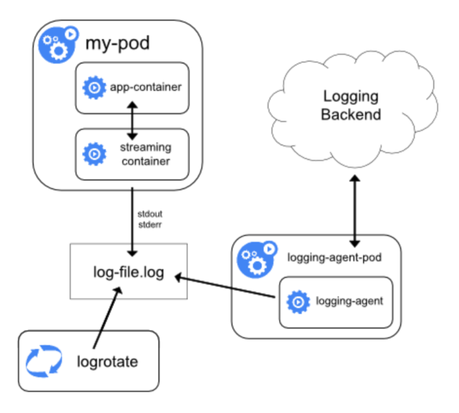
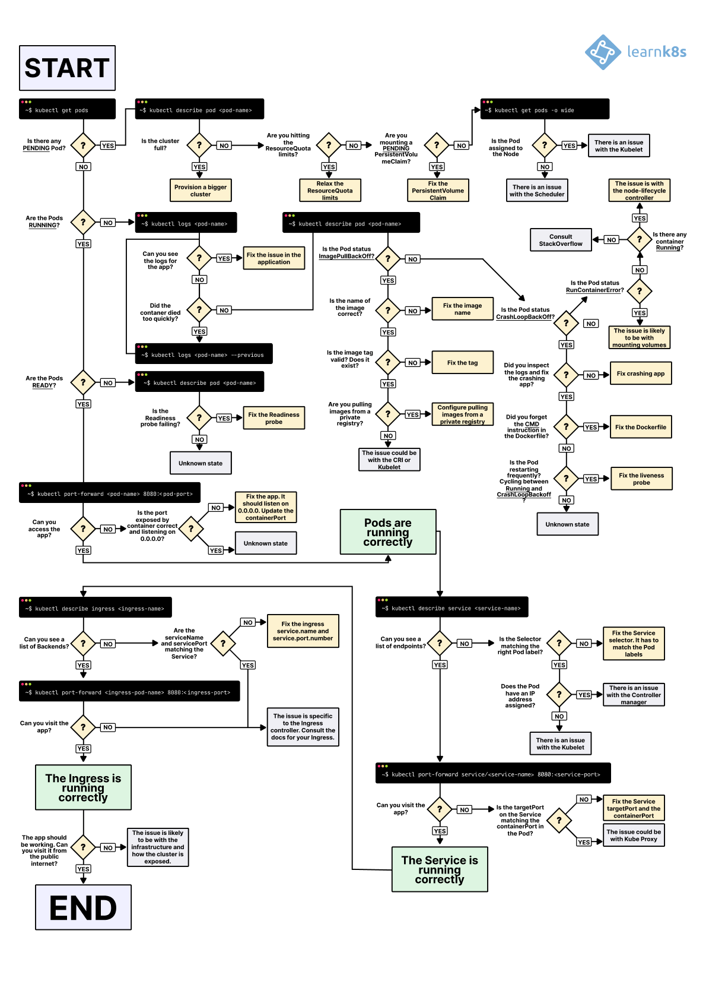
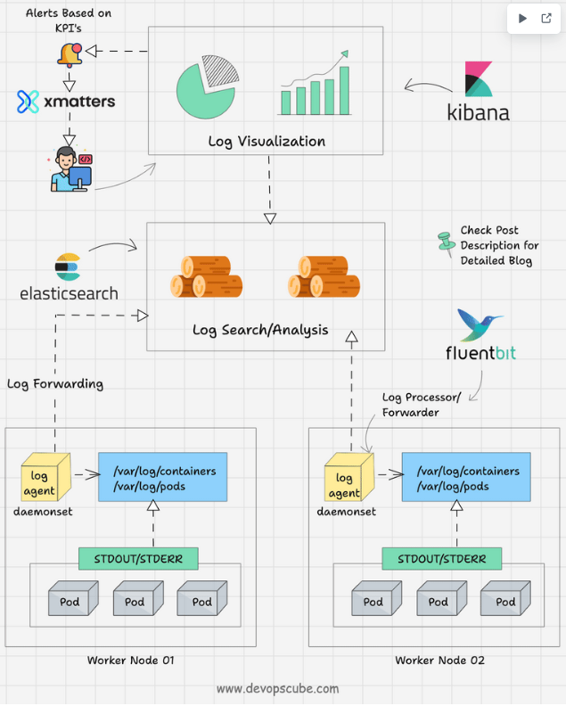
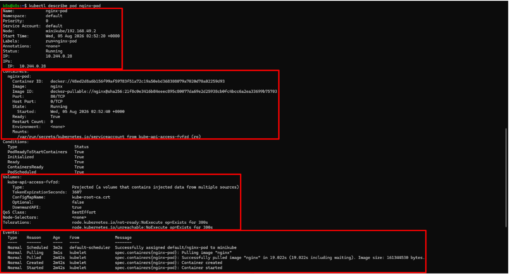

# Logs trong Kubernetes

## 1. Khái niệm

Log chỉ đơn giản là những dòng text mà chương trình ghi ra để thông báo nó đang làm gì.

Một chương trình Linux có 2 nơi xuất dữ liệu quan trọng: `stdout/stderr`. Container cũng giống hệt Linux vì nó chỉ là một process bị cô lập.

Docker sẽ không để mất logs, Docker runtime sẽ lưu lại:
`/var/lib/docker/containers/<container-id>/<container-id>-json.log` và `docker logs mycontainer` thực chất là đọc file đó.

Kubernetes cũng tương tự nhưng chỉ thêm 1 lớp kubelet

### 1.1 Container Runtime

- Có thể là

```bash
Docker
containerd
CRI-O
```

- Hiện nay đa số là containerd.

### 1.2 Cấu trúc logs

- **Container logs**: Containerd ghi log xuống disk, lưu tại `/var/log/pods` trên node, Sau đó k8s tạo shortcut`/var/log/containers/` symlink đến.
  - Nếu dùng docker làm container runtime thì như minikube vì Node k8s chỉ là 1 container muốn truy đường dẫn thật thì dùng `docker volume inspect`
- **Pod logs**: Aggregate từ tất cả containers trong Pod
  - Một Pod có thể có nhiều container
  - Khi `kubectl logs pod` mặc định là container đầu tiên, muốn xem container khác chỉ định rõ bằng `-c`
  - Kubernetes vẫn lưu log của container trước: `kubectl logs pod --previous` để xem log container vừa crash.
- **Cluster logs**: Ngoài ứng dụng còn có log của chính K8s như `kube-apiserver`, `kubelet`, `scheduler`,`controller-manager`,`etcd`... Gọi chung là Cluster logs

#### Kubelet

- Ở đây ta ôn lại kubelet 1 chút: 
Kubelet là người quản lý(agent) của Kubernetes chạy trên mỗi node. Mỗi Worker đều có kubelet. Ví dụ: API server ra lệnh tạo Pod Nginx, Kubelet là người đi chuẩn bị và ra lệnh tạo cho containerd.

Kubelet là một nhân viên điều phối, orchestrator trên node, nó sẽ không trực tiếp làm mọi việc, mà gọi các thành phần khác để làm.

Quá trình khi ta `kubectl logs <service>`

- kubectl gửi request tới API server
- API server tra pod nằm ở worker 2 -> chuyển request đến kubelet của Worker 2.
- Kubelet đọc logs rồi trả về cho API server -> kubectl.

### 1.3 Quản lý logs:

- **Basic**: `kubectl logs` lấy trực tiếp từ kubelet
- **Advanced**: Sidecar container ship logs đến ELK (Elasticsearch, Logstash, Kibana) hoặc tools như Loki.
  - Cấu hình thư mục lưu trữ logs mount vào shared volume sau đó Sidecar đọc shared volume rồi gửi đến Loki.
- **Best practice**: Không write logs vào files trong container (trừ volume), dùng stdout để dễ aggregate. Vì mỗi ứng dụng 1 dạng file logs khác nhau rất khó để có thể quản lý toàn bộ nhưng ngược lại nếu tất cả cùng ghi stdout thì chỉ cần 1 cấu hình dùng chung.



## 2. Events trong Kubernetes

Events là objects ghi lại các sự kiện xảy ra trong cluster, như Pod created, scheduled, image pull fail, hoặc node not ready. Chúng lưu trong etcd với TTL (default 1 giờ), giúp trace vấn đề hệ thống.

Type events:

- **Normal**: Thông tin thông thường (e.g., Pulling image).
- **Warning**: Lỗi tiềm ẩn (e.g., FailedScheduling).

Events liên kết với objects (Pod, Node) qua involvedObject field.

Trong CKAD, events hữu ích để debug tại sao Pod Pending hoặc CrashLoopBackOff.

Lệnh `kubectl get events`

## 3. Các lệnh Kubectl để giám sát Logs

`kubectl logs` lấy logs từ Pod/container. Syntax cơ bản: 

```bash
kubectl logs <pod-name> [c- <container>] [options]
```

- Follow realtime:`kubectl logs -f my-pod`
- Log từ previous:`kubectl logs my-pod --previous`
- Limit lines: `kubectl logs my-pod --tail=50`
- Timestamp: `kubectl logs my-pod --timestamps`
- Since time: `kubectl logs my-pod --since=1h`
- All containers: `kubectl logs my-pod --all-containers`

### Kubectl giám sát events

- **liệt kê events**: `kubectl get events` (defautl namespace)
- **All namespace**: `kubectl get events -A`
- **Watch realtime**: `kubectl get events --watch`
- Sort by time: `kubectl get events --sort-by=.metadata.creationTimestamp | grep my-pod`
- Output format: `kubectl get events -o wide` (thêm detail)
- Filter: Dùng `kubectl get events -l app=myapp` (label selector)

Flowchart troubleshooting K8s



### Diagram pod logs và events flow, minh họa cách events liên kết với logs cho observability



## 4. `kubectl describe`

- Là lệnh cung cấp thông tin chi tiết về một resource (như Pod, Node, Deployment), bao gồm metadata, spec, status, conditions, và events liên quan. Đây là “first stop” cho debug, vì nó aggregate data từ API server mà không cần nhiều lệnh riêng lẻ.

Cấu trúc output của `describe pod`:

- **Name/Namespace/Labels/Annotations**: Metadata cơ bản.
- **Status**: Phase (Pending/Running/Succeeded/Failed/Unknown), Conditions (Ready, Initialized, etc.), IP/Node.
- **Containers/Init Containers**: Image, State (Running/Waiting/Terminated), Ready, Restart Count, Probes.
- Volumes/Mounts: Chi tiết storage
- Events: Last events liên quan đến Pod

Syntax: `kubectl describe pod [-n]`

- Options:

  - `--show-events=false`: Ẩn events nếu không cần.
  - Output chỉ phần: Kết hợp với `|grep Events` để filter.



Dùng `kubectl describe` kết hợp với `kubectl exec` để debug:

- `kubectl exec nginx-pod -- ls /app`
- `kubectl exec -it nginx-pod -c nginx -- /bin/sh`
- `kubectl exec -c sidecar my-pod -- tail log`
