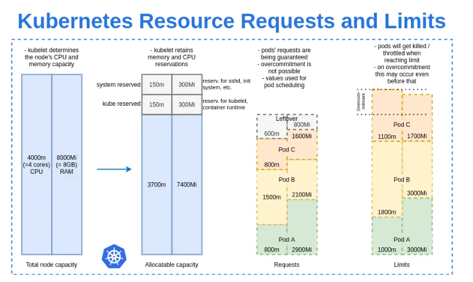
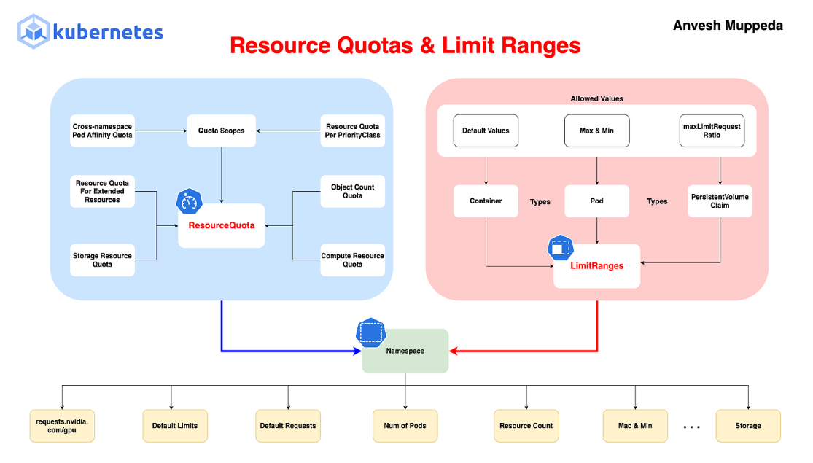

# Resource Requests & Limits

Trong Kubernetes, mỗi container trong Pod có thể khai báo requests (yêu cầu tối thiểu) và limits (giới hạn tối đa) cho CPU và memory. Những giá trị này giúp scheduler quyết định node nào để chạy Pod và kubelet quản lý runtime.

- **Requests**: Lượng tài nguyên tối thiểu mà container yêu cầu để chạy. Scheduler sử dụng để chọn node có đủ allocatable resources (tổng node capacity trừ system/kube reserved). Nếu không đủ, Pod Pending. Requests cũng quyết định QoS class và priority khi evict.
- **Limit**: Giới hạn tối đa container có thể sử dụng. Nếu vượt (memory), container OOMKilled; nếu CPU, throttled (giảm tốc độ). Limits ngăn container “starve” các Pod khác trên node

Đơn vị:

- CPU: 1 = 1 vCPU/core; 100, = 0.1 CPU
- Memory: Bytes (e.g., 256Mi = 256 mebibytes, 1Gi = 1 gibibyte)

Lợi ích tối ưu:

- **Scheduling hiệu quả**: Scheduler fit Pods vào nodes phù hợp, tránh overcommit.
- **Prevent failures**: Limits tránh OOM, requests đảm bảo minimum.

Lợi ích tối ưu:

- **Scheduling hiệu quả**: Scheduler fit Pods vào nodes phù hợp, tránh overcommit.
- **Prevent failures**: Limits tránh OOM, requests đảm bảo minimum.
- **QoS management**: Phân loại Pods để evict low-priority trước khi node stress.
- **Cost optimization**: Tránh lãng phí cloud resources



- Nhìn vào bức ảnh trên: Kubernetes quyết định 1 Pod có được chạy trên Node không và nếu chạy thì nó được dùng bao nhiêu CPU/RAM.
- Diễn ra theo 4 bước: Dung lượng Node -> Kubelet giữ lại tài nguyên cho hệ thống -> Scheduler nhìn REQUESTS để xếp Pod -> Runtime giới hạn bằng LIMITS.
- Limits ví dụ:

  - Pod A request 1000m nhưng limit tận 1800m
  - Điều này có nghĩa là Pod luôn được đảm bảo 1000m nhưng nếu CPU còn dư, nó có thể dùng đến 1800m và không được vượt quá

- CPU vượt limit, CPU chỉ bị chậm lại, Container vẫn sống
- RAM vượt limit, Kernel OOM killer và kill container.

Scheduler chỉ dùng **request** để quyết định Pod có được đặt lên Node hay không. Sau khi Pod đã chạy, Scheduler không còn can thiệp nữa. Lúc Pod đang chạy:

- CPU limit được Linux kernel (CFS/cgroups) thực thi bằng cách giảm tốc (throttle).
- Memory limit được Linux kernel thực thi bằng OOM Killer khi vượt giới hạn.
- Kubelet chỉ theo dõi trạng thái và nếu container bị kill thì sẽ restart theo `restartPolicy`.

## 1. Quality of Service (QoS) Classes và Cách tính

Dựa trên requests/limits, Kubernetes gán QoS class cho Pod (tổng từ tất cả containers):

- Kubernetes xếp hạng mức độ quan trọng của Pod
Ví dụ đang có Pod A 3GB, Pod B 3GB, Pod C 2GB
- Đột nhiên 1 Pod tăng lên, Node không thể giữ tất cả phải chọn 1 Pod bị đuổi dựa trên QoS.
- **Guaranteed**: Requests = Limits (cho tất cả resources). Không xin thêm, không overcommit mặc định cho tất cả. Ưu tiên cao nhất, không evict trừ critical.
- **Burstable**: Requests != Limits. Có thể tăng đột biến
- **BestEffort**: ưu tiên thấp nhất. Không có request không có limit có bao nhiêu thì xin bấy nhiêu và sẽ bị evict nếu không còn.

QoS được gán cho cả Pod, nhưng điều kiện được kiểm tra trên tất cả các container trong Pod. Nghĩa là chỉ cần 1 container là Burstable thì cả QoS là Burstable.

## 2. Phân biệt ResourceQuota và LimitRange

- ResourceQuota: quản lý tổng tài nguyên của Namespace
- LimitRange: quản lý từng Pod/Container/PVC.



### 2.1 ResourceQuota

- Là Quota của Namespace, ResourceQuota không quan tâm Pod nào dùng bao nhiêu nó chỉ quan tâm limit không được vượt quá limit Admin đặt cho Namespace.
- Namespace: total CPU, total RAM, total Pods.

## 2.2 LimitRange

- Check từng Pod
- `maxLimitRequestRatio`: không được vượt quá ? lần request ví dụ là 4 thì limit = 4 lần requests.

## 3. Cấu hình Resource Limits và Requests trong YAML

```yaml
apiVersion: v1
kind: Pod
metadata:
  name: resource-pod
spec:
  containers:
    - name: app
      image: nginx
      resources:
        requests:
          cpu: "100m"     # 0.1 CPU
          memory: "128Mi"
        limits:
          cpu: "200m"
          memory: "256Mi"
```

## 4. Các lệnh để Kubectl quản lý Resources

- **Xem resources Pod**: `kubectl describe pod`
- **Top usage**: `kubectl top pod` (yêu cầu metrics-server)
- **Get QoS**: `kubectl get pod -o jsonpath='{.status.qosClass}'`.