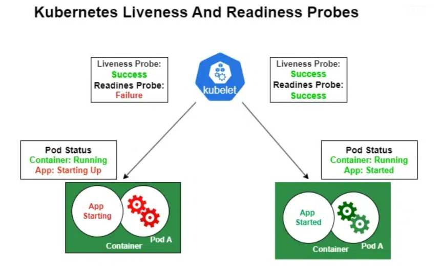
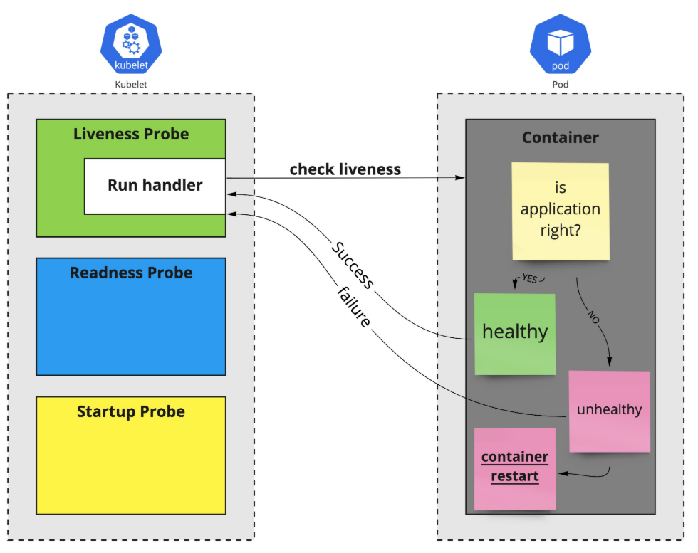
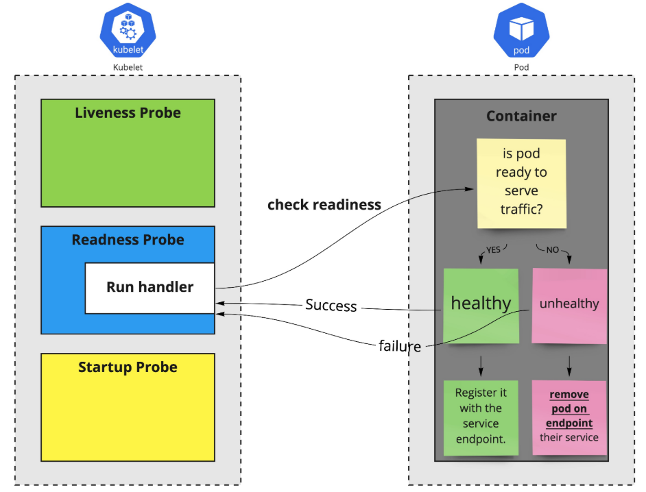
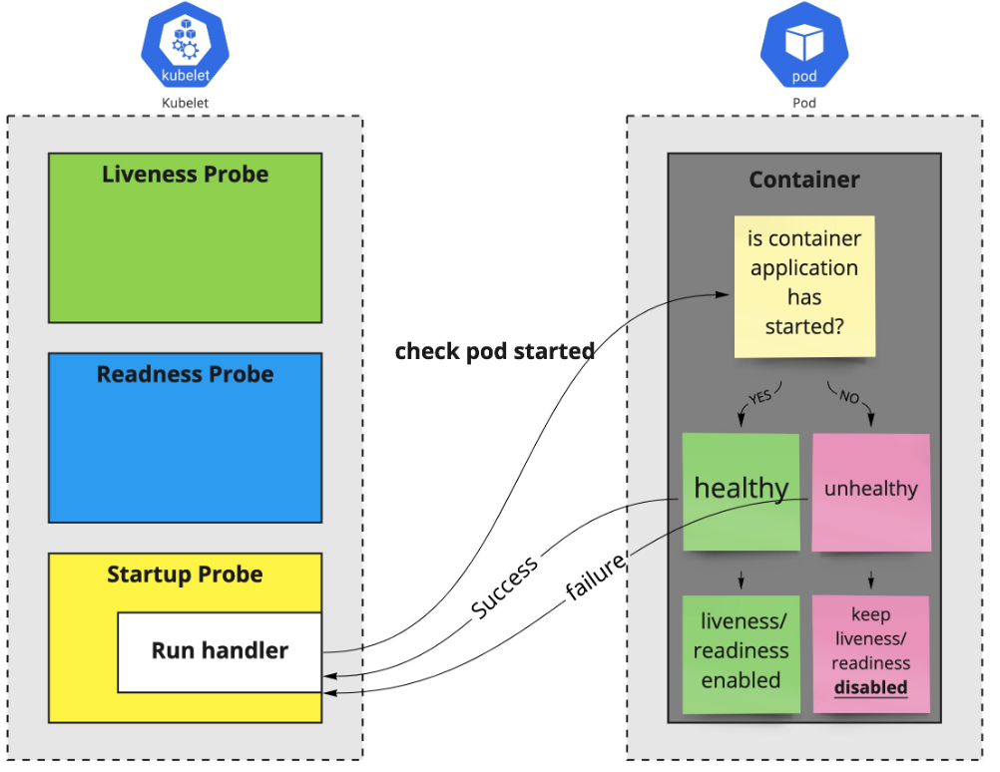

# Probes

## 1. Khái niệm

**Probes** là các health check mà kubelet thực hiện định kỳ trên containers để kiểm tra trạng thái. Chúng giúp Kubernetes đưa ra quyết định thông minh: restart container nếu “dead” (liveness), hoặc remove/add Pod từ Service endpoints nếu not/ready for traffic (readiness). Probes đặc biệt quan trọng cho apps stateful hoặc có dependencies (e.g., wait DB connect). 

Advantage:

- **Self-healing**: Tự động recover từ failures mà không cần manual intervention
- **Zero-downtime**: Readiness ngăn traffic đến Pods chưa ready, tránh user errors.
- **Efficiency**: Giảm false positives từ container crashes, tối ưu resource.
- **Types**: HttpGet (check endpoint), TCPSocket (check port open), Exec (run command inside), GRPC (check gRPC health)

Không dùng probes, Kubernetes chỉ dựa vào container exit code không đủ cho complex apps. 



## 2. Liveness Probe: "Is this application still functioning, or has it become stuck?"

- Phát hiện và khởi động lại Containers Dead. Liveness probe kiểm tra nếu container còn sống (alive) nghĩa là app đang running đúng. Nếu fail (failureThreshold lần), kubelet restart container (theo restartPolicy).

Use cases:

- Detect deadlocks hoặc infinite loops (app unresponsive nhưng process alive).
- Self-healing cho apps crash silently

Nếu không set, default no liveness rủi ro Pods stuck mãi.



## 3. Readiness : "Is this Pod ready to receive traffic?"

- Kiểm tra Sẵn Sàng Nhận Traffic: Readiness probe kiểm tra nếu container ready for traffic. Nếu success, Pod added vào Service endpoints, nếu fail, removed (không restart, chỉ isolate traffic).

Use cases:

- Wait dependencies ready (e.g., DB init) trước khi serve requests.
- Handle slow startup hoặc maintenance mode.

Nếu không set, default ready ngay khi container start rủi ro traffic đến Pods chưa init.



## 4. Startup Probe: "Has the application finished starting?"

- Xử lý Slow Startup: Startup probe (beta từ 1.16, stable 1.20) check nếu app started (cho slow-start apps). Nếu fail, delay liveness/readiness để tránh premature restarts.

Use case: Legacy apps load lâu (e.g., Java JVM warmup).



## 5. Khác biệt giữa Probes và các Parameters chung

- **Liveness**: Fail -> Restart container.
- **Readiness**: Fail -> No traffic (Pod vẫn Running).
- **Startup**: Fail -> Delay other probes.

Parameters tuning (áp dụng cho tất cả):

- **initialDelaySeconds**: Chờ bao lâu trước probe đầu (default 0) có thể set cao cho slow start apps.
- **periodSeconds**: Khoảng cách giữa probes (default 10). Giảm cho fast detect, tăng để giảm load.
- **timeoutSeconds**: Timeout cho probe (default 1). Tăng nếu check slow
- **successThreshold**: Số success liên tiếp để coi healthy sau fail (default 1, min 1).
- **failureThreshold**: Số fail liên tiếp để trigger action (default 3). Tăng để tolerate transient fails

## 6. Cấu hình YAML Types Probes

```yaml
apiVersion: v1
kind: Pod
metadata:
  name: probe-pod
spec:
  containers:
  - name: app
    image: nginx
    livenessProbe:  # HTTPGet example
      httpGet:
        path: /healthz
        port: 80
        scheme: HTTP  # or HTTPS
        httpHeaders: [{name: Custom-Header, value: Awesome}]
      initialDelaySeconds: 3
      periodSeconds: 3
      timeoutSeconds: 1
      failureThreshold: 3
    readinessProbe:  # Exec example
      exec:
        command: ["cat", "/tmp/healthy"]
      initialDelaySeconds: 5
      periodSeconds: 5
    startupProbe:  # TCP example
      tcpSocket:
        port: 8080
      failureThreshold: 30
      periodSeconds: 10
```

- HTTPGet: Check response code 200-399.
- TCPSocket: Check port open.
- Exec: Run command, exit 0 = success.
- GRPC: Check gRPC health (require app support).

## 7. Các lệnh Kubectl để quản lý và Debug Probes

- Xem probes: `kubectl describe pod probe-pod` (xem Probes section, Events nếu fail)
- Debug fail: `kubectl get events | grep probe-pod`
- Check status: `kubectl get pod -o wide` (Xem ready column: 0/1 nếu readiness fail)

### Thực hành

- Tạo Pod với probes: YAML trên sau đó apply
- 2 Kiểm tra

```bash
kubectl describe pod probe-pod # Xem Probes, Conditions
```

- 3. Simulate Fail: Edit app để readiness fail:

```bash
kubectl get pod probe-pod
kubectl get events | grep probe-pod
```

- 4. Liveness fail: Set command fail, xem restart count tăng
- 5. Cleanup: `kubectl delete pod probe-pod`