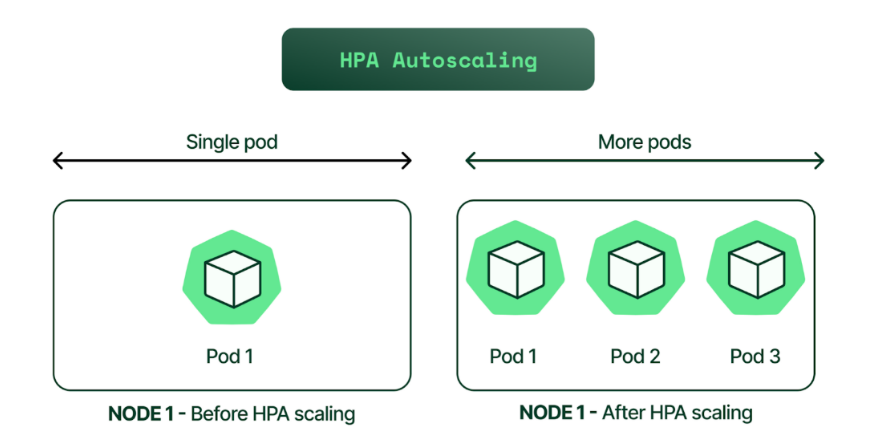

# HPA

## 1. Khái niệm

- HPA( Horizontal Pod Autoscaler) tự động tăng/ giảm số lượng Pod trong một Deployment, ReplicaSet hoặc Stateful dựa trên tài nguyên sử dụng (CPU, memory) hoặc custom metrics



### So sánh Vertical vs Horizontal Scaling

| Loại | Mô tả | Ví dụ |
|------|-------|-------|
| Vertical | Tăng tài nguyên cho Pod (CPU/RAM) | Từ 500m -> 2 CPU |
| Horizontal | Tăng số lượng Pod | Từ 3 -> 10 Pod |

HPA = Horizontal Pod Autoscaler => Chỉ scale số lượng Pod, không thay đổi tài nguyên mỗi Pod.

### Điều kiện để HPA hoạt động

| Yêu cầu | Bắt buộc ? | Ghi chú |
|---------|------------|----------|
| **Metrics Server** | Yes | Thu thập CPU/memory từ Pod |
| **Resource requests** | Yes | Bắt buộc có `requests.cpu` hoặc `requests.memory` |
| **Deployment/ReplicaSet** | Yes | HPA không scale Pod lẻ |
| **Kubernetes ≥ 1.23** | Yes | HPA v2 là default |

## 2. Cài đặt Metrics Server trên Minikube

```bash
minikube addons enable metrics-server
```

Check

```bash
kubectk get pods -n kube-system | grep metrics-server
```

### Cấu hình Deployment có Resource Requests

- Tạo file `php-apache.yaml`

```yaml
apiVersion: apps/v1
kind: Deployment
metadata:
  name: php-apache
spec:
  replicas: 2
  selector:
    matchLabels:
      app: php-apache
  template:
    metadata:
      labels:
        app: php-apache
    spec:
      containers:
      - name: php-apache
        image: registry.k8s.io/hpa-example
        ports:
        - containerPort: 80
        resources:
          requests:
            cpu: 200m     # BẮT BUỘC cho HPA
            memory: 256Mi
          limits:
            cpu: 500m
            memory: 512Mi
```

- Áp dụng : `kubectl apply -f php-apache.yaml`
- Tạo service để expose

```yaml
apiVersion: v1
kind: Service
metadata:
  name: php-apache
spec:
  selector:
    app: php-apache
  ports:
    - port: 80
      targetPort: 80
  type: ClusterIP
```

- Tạo HPA bằng lệnh Imperative 

```bash
kubectl autoscale deployment php-apache \
  --cpu-percent=50 \
  --min=2 \
  --max=10 
```

- `--cpu-percent=50`: Khi cpu trung bình > 50% => scale up
- `--min=2`, `--max=10`: Giới hạn số Pod

Xem HPA:

```bash
kubectl get hpa
kubectl describe hpa php-apache
```

- Tạo HPA bằng YAML: tạo file `hpa.yaml`

```yaml
apiVersion: autoscaling/v2
kind: HorizontalPodAutoscaler
metadata:
  name: php-apache-hpa
spec:
  scaleTargetRef:
    apiVersion: apps/v1
    kind: Deployment
    name: php-apache
  minReplicas: 2
  maxReplicas: 10
  metrics:
  - type: Resource
    resource:
      name: cpu
      target:
        type: Utilization
        averageUtilization: 60  # >60% CPU => scale
```

- Áp dụng: `kubectl apply -f hpa.yaml`

### Tạo Load để kích hoạt HPA

- Mở terminal mới, tạo Pod tạo tải:

```bash
kubectl run -i --tty load-generator --rm --image=busybox --restart=Never -- /bin/sh -c "while true; do wget -q -O- http://php-apache; done"
```

- Theo dõi scale:

```bash
watch kubectl get hpa php-apache
watch kubectl get pods -l app=php-apache
```

### HPA với Memory

```yaml
metrics:
- type: Resource
  resource:
    name: memory
    target:
      type: AverageValue
      averageValue: 500Mi
```

- Dùng `averageValue` (tổng memory/số Pod), không dùng phần trăm

### HPA với Custom Metrics 

- Ví dụ: Scale theo QPS (queries per second) từ Prometheus:

```yaml
- type: Pods
  pods:
    metric:
      name: http_requests_per_second
    target:
      type: AverageValue
      averageValue: 100
```

### Debug HPA không Scale 

| Triệu chứng | Nguyên nhân | Cách fix |
|-------------|-------------|-----------|
| `Unable to get metrics` | Metrics Server chưa chạy | Kiểm tra `kubectl top pod` |
|Máy không load, cpu .... | Thiếu `requests.cpu` | Thêm vào container spec |
| Scale không lên | Đạt `max Replicas` | Tăng giá trị `--max` |
| Scale không xuống | `minReplicas` quá cao | Giảm giá trị `--min`|

Debug nhanh:

```bash
kubectl describe hpa php-apache
kubectl get hpa php-apache -o yaml
```
