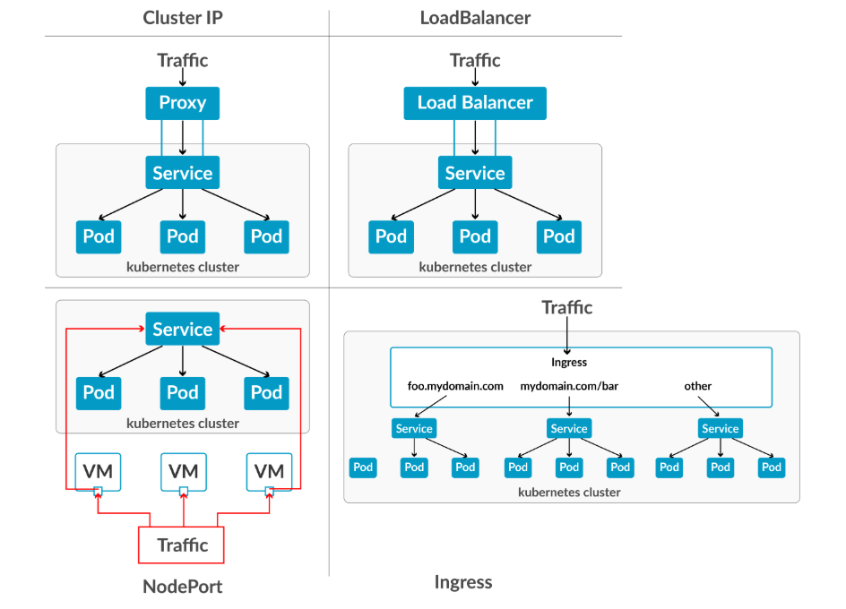

# Service

## 1. Khái niệm

Service là một abstraction layer giúp bạn kết nối đến các Pod một cách ổn định, dù Pod có chết đi sống lại, IP thay đổi liên tục.

| **Vấn đề** | **Giải pháp bằng Service**|
|------------|---------------------------|
| Pod có IP động => không thể hardcode | Service có IP tĩnh (ClusterIP) |
| Nhiều Pod cùng Service => cần load balance | Service tự động round-robin |
| Cần expose ra ngoài cluster | Dùng `NodePort` hoặc `LoadBalancer` |

- Tips: Không bao giờ kết nối trực tiếp bằng Pod IP luôn dùng Service Name (DNS)

## 2. Các loại Service trong Kubernetes

| Loại | Mục đích | Port mở | Dùng khi |
|------|----------|---------|----------|
| **ClusterIP**(default) | Giao tiếp trong cluster | Chỉ nội bộ | API backend, DB, microservices |
| **NodePort**| Expose ra ngoài qua node | 30000 - 32767 | Dev/test, truy cập tạm thời |
| **LoadBalancer** | Expose qua cloud LB | Tùy cloud | Production (AWS ELB, GCP, etc...)|
| **ExternalName** | Map đến DNS bên ngoài | Không mở port | Gọi API bên ngoài |



### 2.1 ClusterIP

- Là loại Service mặc định. Nếu bạn không ghi type thì Kubernetes mặc định type=ClusterIp
- Nó dùng để Cho các workload bên trong Kubernetes cluster giao tiếp với nhau.
- ClusterIP không được thiết kế để client bên ngoài cluster truy cập trực tiếp.

> Lưu ý bắt buộc phải nhớ: `port` là port của Service, còn `targetPort` là port của Application

- ClusterIP có DNS. Nếu Service tên `backend`, namespace: `default` thì Kubernetes DNS sẽ tạo: `backend.default.svc.cluster.local`. Pod khác có thể gọi: `curl http://backend:80`

### 2.2 NodePort

- Sau khi các workload bên trong giao tiếp bình thường. Bây giờ ta muốn client bên ngoài cluster truy cập vào Application.
- NodePort: mở port trên Node để client bên ngoài có thể gọi. 

Ví dụ:

```yaml
apiVersion: v1
kind: Service
metadata:
  name: backend
spec:
  type: NodePort

  selector:
    app: backend

  ports:
  - port: 80
    targetPort: 8080
    nodePort: 30080
```

- Đường đi gói tin:

```text
Client
   │
   │ :30080
   ↓
Node
   │
   │ Service :80
   ↓
Pod :8080
```

- NodePort không phải chỉ mở trên 1 node:
- Giả sử Cluster:

```
Node 1 = 10.0.10.26
Node 2 = 10.0.10.27
Node 3 = 10.0.10.28
```

NodePort: `30080`

- Thì về cơ bản bạn có thể truy cập:

```text
Node 1 = 10.0.10.26
Node 2 = 10.0.10.27
Node 3 = 10.0.10.28
```

- Service routing sẽ đưa traffic tới các backend endpoints phù hợp.

### 2.3 LoadBalancer

- Mục đích: Expose Service ra bên ngoài thông qua một external load balancer / load-balancing mechanism.
- Trong Cloud:

```
AWS → ELB/NLB
GCP → Cloud Load Balancer
Azure → Azure Load Balancer
```

- Trong lab bare-metal của bạn, MetalLB có thể cung cấp IP cho LoadBalancer Service.
- Ví dụ Workflow của LB trên Cloud:

```text
Internet
   │
   │ 203.0.113.50:80
   ↓
AWS Load Balancer
   │
   ↓
Kubernetes Service
   │
   ↓
Backend Pods
```

### 2.4 ExternalName
Nó dùng để: Tạo một Kubernetes Service name trỏ tới một DNS name bên ngoài cluster.

Ví dụ bạn có API bên ngoài:

```text
api.example.com
```

Bạn muốn application trong Kubernetes gọi:

```text
payment-service
```

thay vì:

```text
api.example.com
```

Tạo:

```yaml
apiVersion: v1
kind: Service
metadata:
  name: payment-service
spec:
  type: ExternalName
  externalName: api.example.com
```

### So sánh Load Balancer và NodePort

So sánh bằng ví dụ đời thường

Hãy tưởng tượng Kubernetes cluster là một tòa nhà.

Có 3 nhân viên bảo vệ:

```text
Node 1
Node 2
Node 3
```

NodePort

Bạn nói:

```text
"Mỗi bảo vệ mở cửa số 30080."

Node 1 → cửa 30080
Node 2 → cửa 30080
Node 3 → cửa 30080
```

Khách muốn vào phải biết:

```text
Địa chỉ bảo vệ + số cửa
```

Ví dụ:

```text
10.0.10.26:30080
```

LoadBalancer

```text
Bạn đặt một quầy lễ tân phía trước tòa nhà:

             Lễ tân
          10.0.40.200
               │
        ┌──────┼──────┐
        ↓      ↓      ↓
      Node1  Node2  Node3
```

Khách chỉ cần biết:

```text
10.0.40.200
```

Lễ tân sẽ đưa khách vào nơi phù hợp.

## 3. Cấu trúc YAML Service cơ bản

```yaml
apiVersion: v1
kind: Service
metadata:
  name: my-service
spec:
  selector:
    app: my-app
  ports:
    - protocol: TCP
      port: 80
      targetPort: 8080
  type: ClusterIP
```

> **Lưu ý**: `port` là của Service, `targetPort` là của Pod, `nodePort` là của Node.

## 4. Thực hành 1: Tạo Deployment + Service ClusterIP

### 4.1 Tạo Deployment

```yaml
apiVersion: apps/v1
kind: Deployment
metadata:
  name: nginx-app
spec:
  replicas: 3
  selector:
    matchLabels:
      app: nginx
  template:
    metadata:
      labels:
        app: nginx
    spec:
      containers:
      - name: nginx
        image: nginx:alpine
        ports:
        - containerPort: 80
```

```bash
kubectl apply -f nginx-deployment.yaml
```

### 4.2 Expose Deployment bằng lệnh Imperative

```bash
kubectl expose deployment nginx-app \
  --name=nginx-service
  --port=80 \
  --target-port=80
```

### 4.3 Tạo Service YAML 

```yaml
apiVersion: v1
kind: Service
metadata: 
  name: nginx-service-yaml
spec:
  selector:
    app: nginx
  ports:
    - protocol: TCP
      port: 8080
      tartgetPort: 80
  type: ClusterIP
```

### 4.4 Test kết nối nội bộ

```bash
kubectl run test-pod --image=busybox --rm -it --restart=Never -- sh wget -qO- http://nginx-service-yaml:8080 
```

- Kubernetes tự resolve DNS theo `ServiceName.Namespace.svc.cluster.local`

## 5. Thực hành 2: Chuyển Sang NodePort Expose ra ngoài

### 5.1 Service NodePort YAML

```yaml
apiVersion: v1
kind: Service
metadata: 
  name: nginx-nodeport
spec:
  selector:
    app: nginx
  type: NodePort
  ports:
    - protocol: TCP
      port: 80
      targetPort: 80
      nodePort: 30080
```

Áp dụng: `kubectl apply -f nginx-nodeport.yaml`

- Truy cập từ máy host:

```bash
minikube service nginx-nodeport --url
curl http://$(minikube ip):30080
```

So sánh ClusterIP và NodePort

| Tiêu chí | ClusterIP | NodePort |
|----------|-----------|----------|
| `type` | Mặc định | `NodePort` |
| IP | Nội bộ | IP của Node |
| Port range | Tùy ý | 30000-32767 |
| Sử dụng | Microservices | Test, demo |
| Có `nodePort` ? | Không | Có |
| Lệnh nhanh | `kubectl expose` | `kubectl expose --type=NodePort` |
