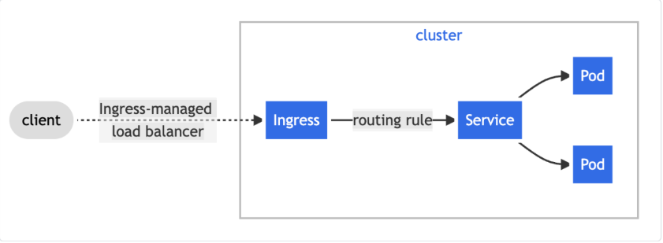
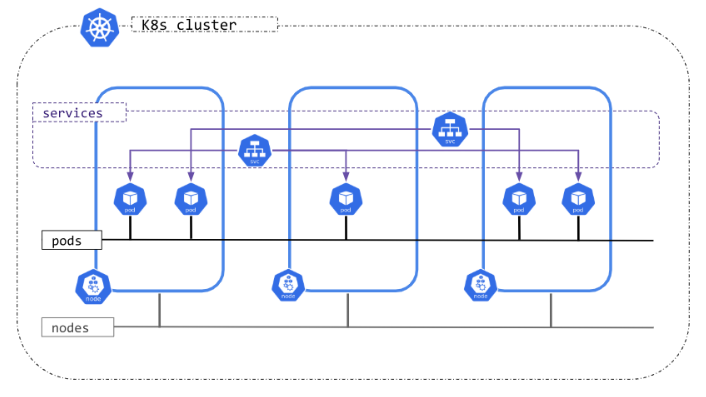

# Ingress HTTP/HTTPS

## 1. Khái niệm 

Ingress là một Kubernetes API object dùng để khai báo luật routing HTTP/HTTPS từ bên ngoài vào các Service trong cluster.

Ingress là một API resource cho phép quản lý external access vào Services qua HTTP/HTTPS, hỗ trợ path-based routing, host-based routing, TLS termination và load balancing.

Hiểu đơn giản nhất: Ingress là một tập luật routing HTTP/HTTPS, dùng để quyết định request từ bên ngoài sẽ được chuyển đến Service nào bên trong Kubernetes.

Ingress là rule; Ingress Controller là thằng thực thi rule đó.

| Vấn đề với NodePort/LoadBalancer | Giải pháp bằng Ingress |
|--------------------------------|-----------|
| Mỗi Service cần port riêng dẫn đến nhanh hết port | Một IP duy nhất, route dựa trên path/host |
| Không hỗ trợ https/tls | TLS offload tại Ingress Controller |
| Không route theo URL | Dùng rules linh hoạt: /api => backend, /web => frontend |

Ingress không phải Service, mà là tập hợp rule được Ingress Controller (như Nginx) thực thi. Trong môi trường thực thi, Ingress Controller đã được cài sẵn.



## 2. Cài đặt Ingress Controller (local/Minikube)

```bash
minikube addons enable ingress
kubectl get pods -n ingress-nginx
```

## 3. Cấu trúc YAML Ingress cơ bản

```yaml 
apiVersion: networking.k8s.io/v1
kind: Ingress
metadata:
  name: my-ingress
  annotations:
    nginx.ingress.kubernetes.io/rewrite-target: /
spec:
  rules:
  - host: example.com
    http:
      paths:
      - path: /app1
        pathType: Prefix
        backend:
          service:
            name: app1-svc
            port:
              number: 80
      - path: /app2
        pathType: Exact
        backend:
          service:
            name: app2-svc
            port:
              number: 8080
```

- Áp dụng: `kubectl apply -f ingress.yaml`

```yaml
apiVersion: networking.k8s.io/v1
kind: Ingress
metadata:
  name: web-ingress
  namespace: ingress-host-routing
spec:
  ingressClassName: nginx
  rules:
  - host: web.example.com
    http:
      paths:
      - path: /
        pathType: Prefix
        backend:
          service:
            name: web
            port:
              number: 80
```

- `ingressClassName: nginx`: Ingress này do Ingress Controller có class `nginx` xử lý.
- `rules`: Các luật routing http
  - Có thể nhiều rules: mỗi `-` là một routing rules.
- `host:`: Đây là host mà request phải match.
- `http:` Rule này áp dụng cho http routing.
- `paths`: Đây là danh sách các URL path mà các bạn muốn route.
- `path: /`: Request có path bắt đầu từ `/`
- `pathType: Prefix` Match theo kiểu Prefix của URL path
- `port.number`: Đây là service port.

### Test Ingress

```bash
minikube ip
curl http://$(minikube ip)/nginx
curl http://$(minikube ip)/httpd
```

- Test từ Pod nội bộ:

```bash
kubectl run test --image=busybox --rm -it -- sh wget -qO- http://ingress-ip/nginx
```

## 4. Ingress với TLS

```bash
kubectl create secret tls my-tls --key=privkey.pem --cert=cert.pem
```

hoặc thêm vào Ingress

```yaml
spec:
  tls:
  - hosts:
    - example.com
    secretName: my-tls
```

## 4. Debug Ingress không hoạt động

| Lỗi | Nguyên nhân | Fix |
|-----|-------------|-----|
| 404 Not Found | Sai path hoặc service | `kubectl describe ingress`|
| No Address | Controller chưa gán IP | | Check pod `ingress-nginx` |
|Invalid host | Sai `host` rule | Dùng `--resolve` trong curl |

Debug nhanh:

```bash
kubectl describe ingress demo-ingress
kubectl logs -n ingress-nginx -l app.kubernetes.io/name=ingress-nginx
```

# Network Policy

## 1. Khái niệm 

**Network Policy** là firewall ở cấp Pod, định nghĩa các rule **ingress/egress** dựa trên labels, namespaces, ports hoặc IPs. Mặc định, Kubernetes allow all traffic => tiềm ẩn rủi ro bảo mật.

- **Ingress**: Kiểm soát traffic vào Pod
- **Egress**: Kiểm soát traffic ra khỏi Pod

### Điều kiện

- CNI (Container Network Interface) của Cluster phải hỗ trợ và enforce NetworkPolicy.

- **Nguyên tắc**: Nếu không có NetworkPolicy áp dụng vào Pod -> traffic được phép mặc định. Nhưng khi Pod được chọn bởi một NetworkPolicy đối với một hướng traffic, Pod đó trở thành isolated theo hướng đó.

## 2. YAML Mẫu Network Policy

```yaml
apiVersion: networking.k8s.io/v1
kind: NetworkPolicy
metadata:
  name: allow-frontend-to-backend
spec:
  podSelector:
    matchLabels:
      app: backend
  policyTypes:
  - Ingress
  ingress:
  - from:
    - podSelector:
        matchLabels:
          app: frontend
    ports:
    - protocol: TCP
      port: 5432
```

- Allow Frontend => Backend

```yaml
apiVersion: networking.k8s.io/v1
kind: NetworkPolicy
metadata:
  name: backend-policy
  namespace: backend-ns
spec:
  podSelector:
    matchLabels:
      app: backend
  policyTypes:
  - Ingress
  ingress:
  - from:
    - namespaceSelector:
        matchLabels:
          project: frontend-project
    ports:
    - protocol: TCP
      port: 80
```

Test:

```bash
Kubectl -n frontend-ns exec -it frontend-pod -- curl backend-svc.backend-ns:80
kubectl exec -it other-pod -- curl backend-svc.backend-ns:80
```

**Policy Deny All**

```yaml
apiVersion: networking.k8s.io/v1
kind: NetworkPolicy
metadata:
  name: deny-all
spec:
  podSelector: {}
  policyTypes:
  - Ingress
  - Egress
```

## 3. Debug Network Policy

| Lỗi | Nguyên nhân | Cách fix |
|-----|------------|----------|
| Traffic vẫn qua | Sai selector | `kubectl describe netpol`|
| Deny sai | Thiếu `policyTypes` | Thêm Ingress/Egress |

# Cluster Networking

## 4 vấn đề Networking chính

Kubernetes cần giải quyết 4 bài toán giao tiếp khác nhau:

- **Container-to-container**(trong cùng 1 Pod): Các container trong cùng Pod chia sẻ network namespace, nên chúng giao tiếp với nhau qua `localhost` - giống như các process trên cùng 1 máy.
- **Pod-to-Pod**: Các Pod khác nhau ( có thể ở node khác nhau) cần giao tiếp được với nhau.
- **Pod-to-Service**: Giao tiếp từ Pod đến Service(một địa chỉ ổn định đại diện cho nhóm Pod).
- **External-to-Service**: Giao tiếp từ bên ngoài cluster vào Service.



## Vì sao Kubernetes không dùng port cố định?

Ý tưởng cốt lõi: thay vì bắt các ứng dụng "chia nhau" port trên cùng 1 máy (dev A dùng port 8080, dev B dùng port 8081...), Kubernetes để mỗi Pod có một IP riêng, giống như mỗi Pod là một "máy ảo mini" độc lập.

Cách tiếp cận cũ (dynamic port allocation) gây rắc rối vì:

- Ứng dụng phải nhận port qua flag/tham số
- API server phải biết cách "chèn" số port động vào cấu hình
- Các service phải có cơ chế để tìm nhau (service discovery phức tạp)

- Kubernetes tránh hết mấy vấn đề này bằng cách cấp IP riêng cho từng Pod.

## Việc cấp phát địa chỉ IP

Cluster cần đảm bảo IP không bị trùng nhau giữa 3 loại đối tượng: Pod, Service, Node. Mỗi loại được cấp IP bởi một thành phần khác nhau:

| **Đối tượng** | **Service cấp IP** |
|---------------|--------------------|
| Pod | Network plugin (CNI) |
| Service | kube-apiserver |
| Node | kubelet hoặc cloud-controller-manager |

## Các loại Cluster theo IP Family

- **IPv4 only**: tất cả 3 thành phần trên chỉ cấp IPv4
- **IPv6 only**: tất cả chỉ cấp IPv6
- **Dual-stack (IPv4/IPv6)**: cả 3 thành phần đều cấp cả IPv4 lần IPv6, và tất cả phải thống nhất về IP family nào là primary

Một server hay Pod thực tế có thể có nhiều IP gắn trên các interface mạng của nó. Nhưng Kubernetes chỉ quan tâm đến các IP được khai báo chính thức trong:

- `pod.status.ips`: đối với Pod
- `node.status.addresses`: đối với Node