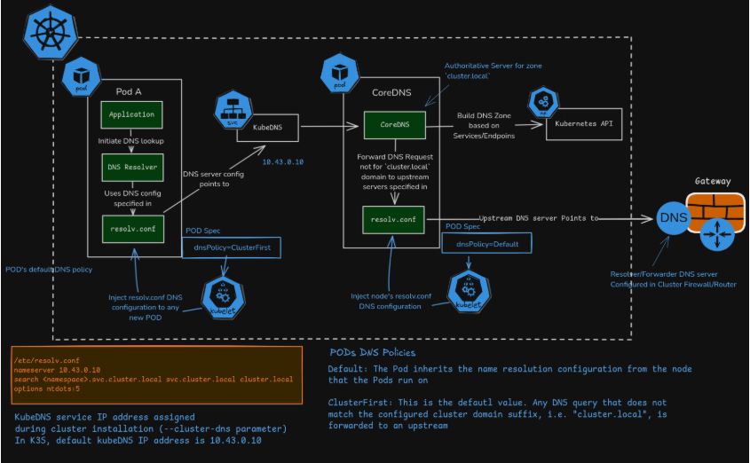
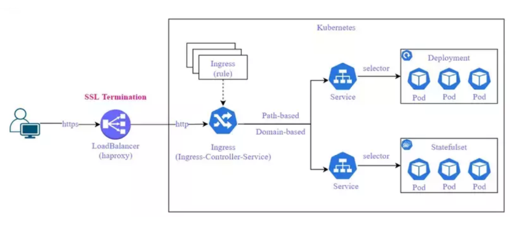

# Quản lý DNS trong Kubernetes



## 1. Khái niệm

Khi bạn tạo một Service, Kubernetes sẽ tự động đăng ký DNS record cho Service đó trong CoreDNS. Mọi Pod trong cluster có thể truy cập Service này bằng tên DNS thay vì IP, ví dụ:

```yaml
<service-name>.<namespace>.svc.cluster.local
```

Service `web` trong namespace `default` có thể được truy cập bằng:

```yaml
web.default.svc.cluster.local
```

## 2. Kiểm tra CoreDNS
CoreDNS là thành phần chịu trách nhiệm phân giải DNS trong cluster. Kiểm tra trạng thái:

```bash
kubectl get pods -n kube-system -l k8s-app=kube-dns
kubectl logs -n kube-system -l k8s-app=kube-dns
```

Nếu DNS không resolve được, bắt đầu bằng việc kiểm tra CoreDNS logs trước.

## 3. Các kiểu dnsPolicy

| dnsPolicy | Ý nghĩa |
|-----------|----------|
| `ClusterFirst` (default) | Dùng DNS của cluster để resolve các Service nội bộ. |
| `Default` | Dùng DNS cấu hình sẵn của node (thường là `etc/resolv.conf`)|
| `ClusterFirstWithHostNet` | Dùng cho Pod có `hostNetwork: true` |
| `None` | Tắt hoàn toàn, dùng `dnsConfig` tùy chỉnh |

ví dụ YAML:

```yaml
apiVersion: v1
kind: Pod
metadata: 
  name: dns-test
spec:
  containers:
  - name: test
    image: busybox
    command: ["sleep","3600"]
  dnsPolicy: ClusterFirst
```

## 4. Kiểm tra DNS Resolution

Tạo Pod busybox để test DNS:

```bash
kubectl run test-dns --image=busybox --rm -it --restart=Never -- nslookup kubernetes.default
```

# Load Balancing trong Kubernetes



## 1. LoadBalancing Ở mức Service

Khi bạn tạo một Service kiểu `ClusterIP` hoặc `NodePort`, kube-proxy sẽ tự động phân phối traffic đến các Pod backend theo cơ chế round-robin (ngẫu nhiên hoặc IPVS).

Ví dụ: Service `web` trỏ đến 3 Pod chạy cùng image `nginx`, khi gửi nhiều request liên tiếp, kube-proxy sẽ điều hướng lần lượt đến các Pod khác nhau.
