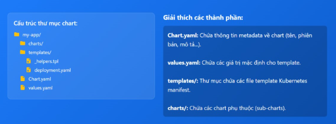

# HELM TRÊN K8s

## Helm là gì ?

Helm là công cụ quản lý gói và quản lý vòng đời ứng dụng dành cho Kubernetes, cho phép đóng gói nhiều tài nguyên Kubernetes (Deployment, Service, Ingress, ConfigMap, ...) thành một đơn vị triển khai logic duy nhất gọi là Helm Chart để cài đặt, nâng cấp và roll back bằng command.

Về bản chất, Helm đóng vài trò "Kubernetes package manager", giúp định nghĩa, chia sẻ và triển khai các ứng dụng từ chart lưu trữ trong repository, đồng thời ghi nhận mỗi lần cài đặt như 1 release riêng biệt để dễ quản lý cấu hình và lịch sử triển khai trên nhiều môi trường khác nhau

## Helm Chart là gì ?

Helm Chart là gói cấu hình dùng cho Kubernetes, đóng gói toàn bộ manifest (YAML) và thiết lập cần thiết để triển khai 1 ứng dụng hoặc 1 stack dịch vụ lên cluster dưới dạng 1 đơn vị duy nhất 

Mỗi chart mô tả tập tài nguyên kubernetes liên quan, cho phép cài đặt, tùy biến cấu hình và quản lý vòng đời ứng dụng thông qua các lệnh helm mà không cần thao tác trực tiếp với từng file YAML rời rạc

## Thành phần cơ bản của Helm

Thành phần cơ bản của Helm bao gồm:

- Helm Client (CLI) để người dùng thao tác
- Helm Library để xử lý chart và tương tác với Kubernetes
- Cấu trúc và thành phần bên trong Helm Chart
- Kubernetes API Server làm điểm kết nối với cluster.

### Helm Client (CLI)

Helm Client là công cụ dòng lệnh mà người dùng sử dụng để làm việc với Helm, bao gồm tạo chart, quản lý repo và cài đặt, nâng cấp, rollback hoặc gỡ bỏ các release trên K8s cluster.

Nó cũng cung cấp các command như:

- helm install 
- helm upgrade
- helm rollback
- helm list

Có thể thực hiện trên máy vận hành hoặc trong CICD

### Helm Library

là lớp thư viện được viết bằng Go, sử dụng k8s client library để giao tiếp với k8s API server nhẳm triển khai, cập nhật và xóa tài nguyên ứng dụng dựa trên chart

### Cấu trúc và thành phần bên trong Helm Chart



Một Helm Chart là thư mục hoặc gói nén `.tgz` chứa toàn bộ định nghĩa tài nguyên Kubernetes dưới dạng template và cấu hình đi kèm

Các thành phần chính gồm:

- `Chart.yaml`: Lưu metadata của chart như tên, phiên bản, mô tả, dependency
- `values.yaml`: Chứa giá trị mặc định cho các biến trong template, có thể bị ghi đè khi cài đặt hoặc nâng cấp 
- `folder templates/`: Chứa các file YAML sử dụng Go templating để sinh ra Deployment, Service, Ingress, ConfigMap, Secret, ... 
- `folder charts/`: Dùng lưu các chart phụ thuộc(sub chart) nếu ứng dụng gồm nhiều thành phần

## helm command

### 1. Kiểm tra phiên bản Helm

```bash
helm version
```

```bash
devops@lab-k8s-master-01:~$ helm version
version.BuildInfo{Version:"v3.21.2", GitCommit:"125963406833fe0525be91f46c8b5b0f22fb9e32", GitTreeState:"clean", GoVersion:"go1.26.4"}
```

### 2. Thêm Helm repository

```bash
helm repo add <repo-name> <repo-url>
```

**Ví dụ:**

```bash
helm repo add bitnami https://charts.bitnami.com/bitnami
```

## 3. Xóa repository

```bash
helm repo remove <repo-name>
```

**Ví dụ:**

```bash
helm repo remove bitnami
```

## 4. Cập nhật Repository

Helm sẽ tải metadata mới nhất của các chart từ remote repo 

```bash
helm repo update
```

## 5. Liệt kê Repository

```bash
helm repo list
```

```bash
devops@lab-k8s-master-01:~$ helm repo list
NAME                            URL
nfs-subdir-external-provisioner https://kubernetes-sigs.github.io/nfs-subdir-external-provisioner/
```

## 6. Tìm chart

Tìm trong repository đã add

```bash
helm search repo <repo-name>
```

```bash
devops@lab-k8s-master-01:~$ helm search repo nfs
NAME                                                    CHART VERSION   APP VERSION     DESCRIPTION
nfs-subdir-external-provisioner/nfs-subdir-exte...      4.0.18          4.0.2           nfs-subdir-external-provisioner is an automatic...
```

Tìm trên Artifact Hub:

```bash
helm search hub <repo-name>
```

```bash
devops@lab-k8s-master-01:~$ helm search hub ingress-nginx
URL                                                     CHART VERSION   APP VERSION     DESCRIPTION
https://artifacthub.io/packages/helm/ingress-ng...      4.15.1          1.15.1          Ingress controller for Kubernetes using NGINX a...
https://artifacthub.io/packages/helm/ingress-ng...      4.1.0           1.2.0           Ingress controller for Kubernetes using NGINX a...
https://artifacthub.io/packages/helm/ingress-ng...      1.13.99         1.13.99         Enables ingress-nginx to validate JWT tokens
https://artifacthub.io/packages/helm/nginx-ingr...      4.0.13          1.1.0           Ingress controller for Kubernetes using NGINX a...
https://artifacthub.io/packages/helm/svtech/ing...      1.1.0           v1.0.0          SVTECH ingress-nginx
https://artifacthub.io/packages/helm/komailo-he...      1.0.0                           A Helm chart with ingress-nginx as subchart
https://artifacthub.io/packages/helm/svtech-pub...      1.0.0           v1.0.0          SVTECH ingress-nginx
https://artifacthub.io/packages/helm/artur9010/...      1.0.9           2026.3.0        A cloudflared with ingress-nginx stack
https://artifacthub.io/packages/helm/api/ingres...      3.29.1          0.45.0          Ingress controller for Kubernetes using NGINX a...
https://artifacthub.io/packages/helm/kubebb/ing...      4.7.0           1.8.0           Ingress controller for Kubernetes using NGINX a...
https://artifacthub.io/packages/helm/ifmethod-h...      4.12.1          1.12.1          Ingress controller for Kubernetes using NGINX a...
https://artifacthub.io/packages/helm/antmedia/i...      4.4.0           1.5.1           Ingress controller for Kubernetes using NGINX a...
https://artifacthub.io/packages/helm/jfrog/ingr...      4.5.2           1.6.4           Ingress controller for Kubernetes using NGINX a...
https://artifacthub.io/packages/helm/gilangvper...      4.0.18          1.1.2           Ingress controller for Kubernetes using NGINX a...
https://artifacthub.io/packages/helm/mxytest/in...      4.15.1          1.15.1          Ingress controller for Kubernetes using NGINX a...
https://artifacthub.io/packages/helm/gpg-dev/in...      4.9.0           1.9.5           Ingress controller for Kubernetes using NGINX a...
https://artifacthub.io/packages/helm/wenerme/in...      4.15.1          1.15.1          Ingress controller for Kubernetes using NGINX a...
https://artifacthub.io/packages/helm/softonic/i...      4.15.1          1.15.1          Ingress controller for Kubernetes using NGINX a...
https://artifacthub.io/packages/helm/kubeblocks...      4.12.1          1.12.1          Ingress controller for Kubernetes using NGINX a...
https://artifacthub.io/packages/helm/wener/ingr...      4.15.1          1.15.1          Ingress controller for Kubernetes using NGINX a...
https://artifacthub.io/packages/helm/kube-botbl...      0.2.2           0.2.0           Easily configure User-Agent blocks for selected...
https://artifacthub.io/packages/helm/error-page...      4.2.2           4.2.2           Tiny, zero-dep HTTP server that serves clean, t...
https://artifacthub.io/packages/helm/charts-rep...      0.1.0           0.44.0          A Helm chart for Kubernetes Ingress NGINX Contr...
https://artifacthub.io/packages/helm/supporttoo...      8.0.0           v8              A Helm chart for ReflowIngressLogs to stream in...
https://artifacthub.io/packages/helm/crowdsec-f...      0.1.0           v0.0.34         CrowdSec Firewall Bouncer — bans malicious IPs ...
https://artifacthub.io/packages/helm/hazelops/web       0.4.3           1.3.1           A simple web application using Istio and Ingres...
```

## 7. Xem thông tin chart

```bash
helm show chart <repo-name>/<release-name>
```

```bash
devops@lab-k8s-master-01:~$ helm show chart nfs-subdir-external-provisioner/nfs-subdir-external-provisioner
apiVersion: v1
appVersion: 4.0.2
description: nfs-subdir-external-provisioner is an automatic provisioner that used
  your *already configured* NFS server, automatically creating Persistent Volumes.
home: https://github.com/kubernetes-sigs/nfs-subdir-external-provisioner
keywords:
- nfs
- storage
- provisioner
kubeVersion: '>=1.9.0-0'
name: nfs-subdir-external-provisioner
sources:
- https://github.com/kubernetes-sigs/nfs-subdir-external-provisioner
version: 4.0.18
```

## 8. Xem README

```bash
helm show readme <repo-name>/<chart-name>
```

## 9. Xem values mặc định

```bash
helm show values <repo-name>/<chart-name> 
```

Lưu ra file ngoài:

```bash
helm show values <repo-name>/<chart-name> > <name-file>.yaml
```

## 10. Download Chart

```bash
helm pull <repo-name>/<chart-name>
```

Thêm option `--untar` để download kèm giải nén

## 11. Cài đặt Chart

```bash
helm install <release-name> <repo-name>/<chart-name>
```

```bash
helm install my-nginx bitnami/nginx
```

### 11.0 Cài với namespace

```bash
helm install my-nginx bitnami/nginx -n nginx --create-namespace
```

### 11.1 Cài bằng values.yaml

```bash
helm install my-nginx bitnami/nginx -f values.yaml
```

### 11.2 Override trực tiếp

```bash
helm install my-nginx bitnami/nginx --set service.type=NodePort --set replicaCount=3
```

## 12. Nâng cấp (Upgrade)

Sau khi xửa `values.yaml`:

```bash
helm upgrade my-nginx bitnami/nginx -f values.yaml
```

Hoặc:

```bash
helm upgrade my-nginx ./nginx
```

## 13. Install nếu chưa có

```bash
helm upgrade --install my-nginx bitnami/nginx
```

- Thường dùng trong CICD

## 14. Rollback

Xem revision của 1 release nào đó

```bash
helm history <release-name> 
```

```bash
devops@lab-k8s-master-01:~$ helm history ingress-nginx -n ingress-nginx
REVISION        UPDATED                         STATUS          CHART                   APP VERSION     DESCRIPTION
1               Fri Jun 26 09:46:58 2026        deployed        ingress-nginx-4.15.1    1.15.1          Install complete
```

## 15. Xem danh sách Release

```bash
helm list
```

Toàn bộ namespace:

```bash
helm list -A
```

```bash
devops@lab-k8s-master-01:~$ helm ls -A
NAME                            NAMESPACE               REVISION        UPDATED                                 STATUS          CHART                                                                                            APP VERSION
fleet-agent-k8stien9alab       cattle-fleet-system     1               2026-06-18 16:00:52.03918802 +0000 UTC  deployed        fleet-agent-k8stien9alab-v0.0.0+s-2dbe734b124db9ecd44d99019b99fd47170b4ddab7bf8639cc202a94b11e8
ingress-nginx                   ingress-nginx           1               2026-06-26 09:46:58.676979448 +0000 UTC deployed        ingress-nginx-4.15.1                                                                             1.15.1
nfs-subdir-external-provisioner nfs-provisioner         1               2026-06-26 07:03:24.47023679 +0000 UTC  deployed        nfs-subdir-external-provisioner-4.0.18                                                           4.0.2
rancher-webhook                 cattle-system           2               2026-06-18 17:01:07.340093438 +0000 UTC deployed        rancher-webhook-104.0.2+up0.5.2            
```

## 16. Xem trạng thái Release

```bash
helm status <release-name>
```

```bash
devops@lab-k8s-master-01:~$ helm status ingress-nginx -n ingress-nginx
NAME: ingress-nginx
LAST DEPLOYED: Fri Jun 26 09:46:58 2026
NAMESPACE: ingress-nginx
STATUS: deployed
REVISION: 1
TEST SUITE: None
NOTES:
The ingress-nginx controller has been installed.
Get the application URL by running these commands:
  export HTTP_NODE_PORT=30080
  export HTTPS_NODE_PORT=30443
  export NODE_IP="$(kubectl get nodes --output jsonpath="{.items[0].status.addresses[1].address}")"

  echo "Visit http://${NODE_IP}:${HTTP_NODE_PORT} to access your application via HTTP."
  echo "Visit https://${NODE_IP}:${HTTPS_NODE_PORT} to access your application via HTTPS."

An example Ingress that makes use of the controller:
  apiVersion: networking.k8s.io/v1
  kind: Ingress
  metadata:
    name: example
    namespace: foo
  spec:
    ingressClassName: nginx
    rules:
      - host: www.example.com
        http:
          paths:
            - pathType: Prefix
              backend:
                service:
                  name: exampleService
                  port:
                    number: 80
              path: /
    # This section is only required if TLS is to be enabled for the Ingress
    tls:
      - hosts:
        - www.example.com
        secretName: example-tls

If TLS is enabled for the Ingress, a Secret containing the certificate and key must also be provided:

  apiVersion: v1
  kind: Secret
  metadata:
    name: example-tls
    namespace: foo
  data:
    tls.crt: <base64 encoded cert>
    tls.key: <base64 encoded key>
  type: kubernetes.io/tls
```

## 17. Gỡ chart

```bash
helm uninstall <release-name>
```

## 18. Xem Manifest đã render

Helm sẽ hiển thị toàn bộ YAML đã sinh ra.

```bash
helm get manifest <release-name>
```

## 19. Xem Notes

```bash
helm get notes <release-name>
```

## 20. Debug

```bash
helm install my-nginx bitnami/nginx \
--debug
```

Hoặc:

```bash
helm upgrade my-nginx bitnami/nginx \
--debug
```
