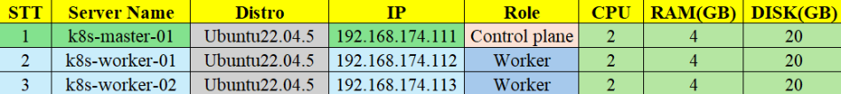
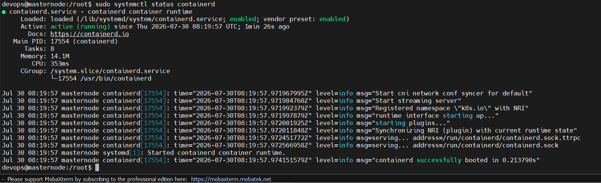
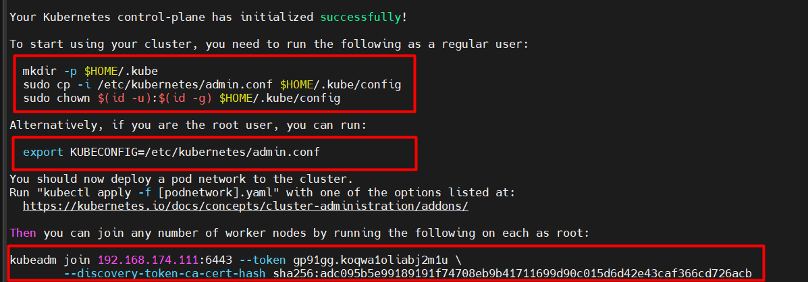

# CÀI K8s BẰNG KUBEADM

>**Feature State**: **Kubernetes v1.35**

## I. `Kubeadm` LÀ GÌ

`kubeadm` là công cụ dòng lệnh do Kubernetes cung cấp để khởi tạo và mở rộng một cụm Kubernetes theo cách chuẩn hóa. Công cụ này tự động hóa các bước phức tạp như tạo chứng chỉ, tệp cấu hình `kubeconfig`, manifest cho các thành phần control plane và token dùng để các node khác tham gia cụm.

Ta thường dùng `kubeadm` theo luồng sau:

1. Chạy `kubeadm init` trên control-plane node để tạo cụm.
2. Cài CNI plugin để các Pod có thể giao tiếp qua mạng.
3. Chạy lệnh `kubeadm join` trên các worker node để đưa chúng vào cụm.

`kubeadm` không thay thế toàn bộ môi trường Kubernetes: trước khi sử dụng, ta vẫn phải chuẩn bị hệ điều hành, container runtime, `kubelet` và các điều kiện mạng cần thiết. Vì vậy, ở phần tiếp theo ta sẽ thiết kế topology và xác định cấu hình cho từng máy trong lab.

## II. THIẾT LẬP MÔI TRƯỜNG ĐỂ DỰNG

### 1. Phân hoạch địa chỉ IP



### 2. Những lưu ý quan trọng trước khi cài

**Lưu ý**: Các máy chủ Linux phả đáp ứng đủ các điều kiện sau:

- Một máy chủ Linux tương thích. Dự án Kubernetes cung cấp những hướng dẫn chung cho các bản phân phối Linux dựa trên Debian và Red Hat, và những bản phân phối không có trình quản lý gói.
- 2 GB RAM hoặc nhiều hơn cho mỗi máy (nếu ít hơn sẽ không đủ tài nguyên cho các ứng dụng của bạn).
- 2 CPU hoặc nhiều hơn cho các máy control plane.
- Kết nối toàn mạng giữa tất cả các máy trong cụm (mạng public hoặc private đều được).
- Mọi máy phải có hostname, địa chỉ MAC, `project_id` là duy nhất trên các Server.
- Cấu hình trước các cổng cần thiết các thành phần giao tiếp với nhau (**CNI**) và cấu hình swap + Cài trước container runtime + Cài đặt các package trên toàn bộ máy chủ như `kubeadm`, `kubelet` và `kubectl`

> Lưu ý: Các kho lưu trữ gói cũ (apt.kubernetes.io và yum.kubernetes.io) đã bị lỗi thời và đóng băng từ ngày 13 tháng 9, 2023. Sử dụng các kho lưu trữ mới được đặt tại pkgs.k8s.io được khuyến nghị mạnh mẽ và yêu cầu để cài đặt các phiên bản Kubernetes phát hành sau ngày 13 tháng 9, 2023. Các kho cũ đã lỗi thời, và nội dung của chúng, có thể bị xóa bất kỳ lúc nào trong tương lai và mà không có thêm thông báo. Các kho lưu trữ mới cung cấp tải về cho các phiên bản Kubernetes bắt đầu từ v1.24.0.
>
> Trong những bản phát hành cũ hơn Debian 12 và Ubuntu 22.04, thư mục /etc/apt/keyrings mặc định không tồn tại, và nó nên được tạo trước lệnh curl.

```bash
# Điều này sẽ ghi đè bất kỳ những cấu hình nào đang có trong /etc/apt/sources.list.d/kubernetes.list
echo 'deb [signed-by=/etc/apt/keyrings/kubernetes-apt-keyring.gpg] https://pkgs.k8s.io/core:/stable:/v1.36/deb/ /' | sudo tee /etc/apt/sources.list.d/kubernetes.list
```

- Cầu hình đồng bộ **cgroup driver** cho các Server . Có thể tham khảo

## III. THỰC HIỆN CÀI ĐẶT

### 1. `Bước 1`: Setup các bước như lưu ý đề cập ở trên cho cả 3 con Server

Xác nhận địa chỉ MAC và `product_uuid` là duy nhất cho từng node:

```bash
ip addr
sudo cat /sys/class/dmi/id/product_uuid
```

Update & Upgrade hệ thống:

```bash
sudo apt update -y && sudo apt upgrade -y 
```

Thêm user mới để thực hiện cài cụm k8s bằng user này

```bash
adduser devops
```

Thêm user mới tạo vào trong group sudo:

```bash
usermod -aG sudo devops
```

Chuyển sang user devops và thực hiện các lệnh sau để cài đặt cụm:

```bash
su devops
```

Tiến hành tắt swap trên hệ thống

```bash
sudo swapoff -a
sudo sed -i '/swap.img/s/^/#/' /etc/fstab
```

Cấu hình module kernel

```bash
sudo nano /etc/modules-load.d/containerd.conf

# Nội dung:

overlay
br_netfilter
```

Tải module kernel:

```bash
sudo modprobe overlay
sudo modprobe br_netfilter
```

Cấu hình hệ thống mạng:

```bash
echo "net.bridge.bridge-nf-call-ip6tables = 1" | sudo tee -a /etc/sysctl.d/kubernetes.conf
echo "net.bridge.bridge-nf-call-iptables = 1" | sudo tee -a /etc/sysctl.d/kubernetes.conf
echo "net.ipv4.ip_forward = 1" | sudo tee -a /etc/sysctl.d/kubernetes.conf
```

Áp dụng cấu hình sysctl:

```bash
sudo sysctl --system
```

Cài đặt các gói cần thiết cho containerd:

```bash
sudo apt install -y curl gnupg2 software-properties-common apt-transport-https ca-certificates
sudo curl -fsSL https://download.docker.com/linux/ubuntu/gpg | sudo gpg --dearmour -o /etc/apt/trusted.gpg.d/docker.gpg
sudo add-apt-repository "deb [arch=amd64] https://download.docker.com/linux/ubuntu $(lsb_release -cs) stable"
```

Cài đặt containerd:

```bash
sudo apt update -y 
sudo apt install -y containerd.io
```

Cấu hình cgroup containerd:

```bash
# Redirect các config ra stdout
containerd config default | sudo tee /etc/containerd/config.toml >/dev/null 2>&1

# Container runtime (containerd) và kubelet cần dùng cùng một cgroup driver.
sudo sed -i 's/SystemdCgroup = false/SystemdCgroup = true/g' /etc/containerd/config.toml
```

Khởi động containerd:

```bash
sudo systemctl restart containerd
sudo systemctl enable containerd
```



Thêm kho lưu trữ Kubernetes

```bash
echo "deb [signed-by=/etc/apt/keyrings/kubernetes-apt-keyring.gpg] https://pkgs.k8s.io/core:/stable:/v1.36/deb/ /" | sudo tee /etc/apt/sources.list.d/kubernetes.list
curl -fsSL https://pkgs.k8s.io/core:/stable:/v1.36/deb/Release.key | sudo gpg --dearmor -o /etc/apt/keyrings/kubernetes-apt-keyring.gpg
```

Cài đặt các gói Kubernetes

```bash
sudo apt update -y
sudo apt install -y kubelet kubeadm kubectl
sudo apt-mark hold kubelet kubeadm kubectl
```

### 2. `Bước 2`: Triển khai mô hình 1 master và 2 worker

Thực hiện trên `k8s-master-01`:

```bash
sudo kubeadm init
```



```bash
# Do ta tạo user thường lên cứ theo hướng đãn của nó
mkdir -p $HOME/.kube
sudo cp -i /etc/kubernetes/admin.conf $HOME/.kube/config
sudo chown $(id -u):$(id -g) $HOME/.kube/config
```

Kiểm tra các node:

```bash
devops@masternode:~$ kubectl get node
NAME         STATUS     ROLES           AGE     VERSION
masternode   NotReady   control-plane   4m10s   v1.36.3
```

Trạng thái của node đang là `NotReady` vì ta chưa cài network cho cụm k8s nên nó chưa thể kéo các tài nguyên về

Thực hiện trên `k8s-worker-01` và `k8s-worker-02`:

```bash
sudo kubeadm join 192.168.174.111:6443 \
  --token gp91gg.koqwa1oliabj2m1u \
  --discovery-token-ca-cert-hash sha256:adc095b5e99189191f74708eb9b41711699d90c015d6d42e43caf366cd726acb
```

### 3. `Bước 3`: Thêm network cho cụm

```bash
kubectl apply -f https://raw.githubusercontent.com/projectcalico/calico/v3.32.1/manifests/calico.yaml
```

Chờ vài phút sau đó kiểm tra lại các node:

```bash
devops@masternode:~$ kubectl get node
NAME           STATUS   ROLES           AGE     VERSION
masternode     Ready    control-plane   4m57s   v1.36.3
worker01node   Ready    <none>          3m14s   v1.36.3
worker02node   Ready    <none>          3m4s    v1.36.3
devops@masternode:~$

# Như vậy cụm k8s đã hoàn toàn khởi chạy thành công !!!
```
