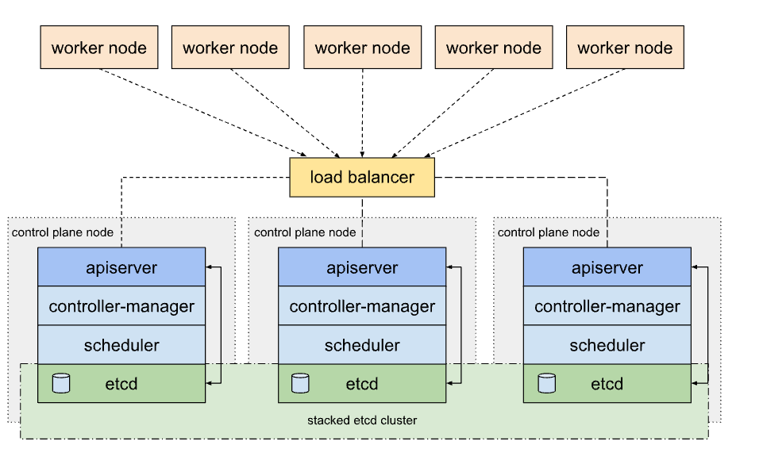
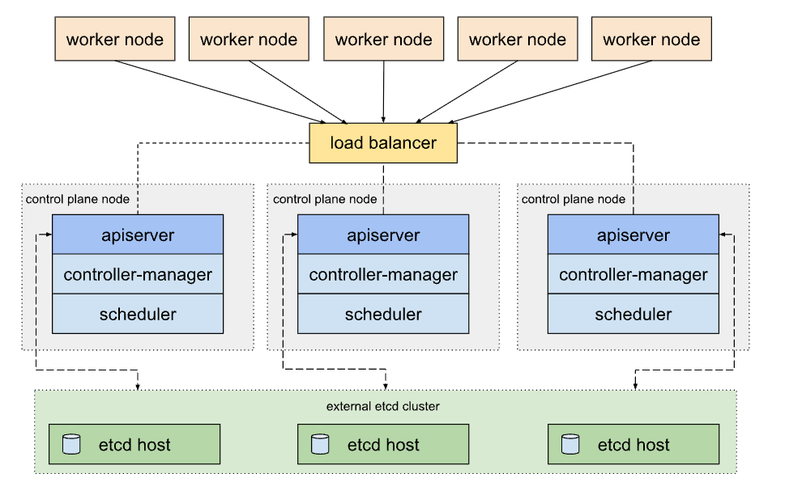
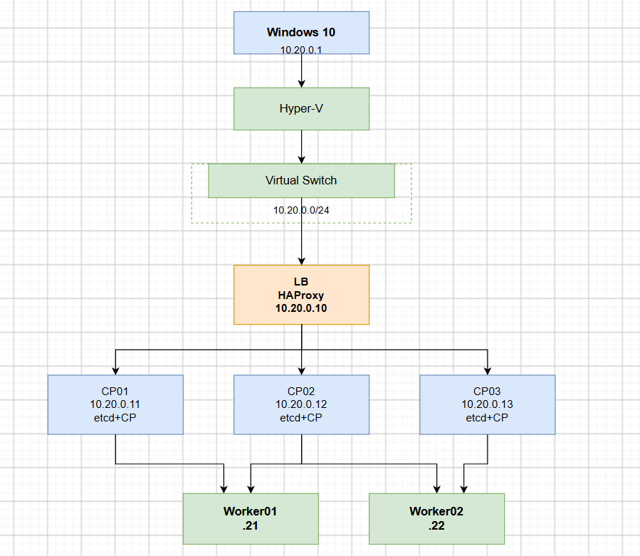
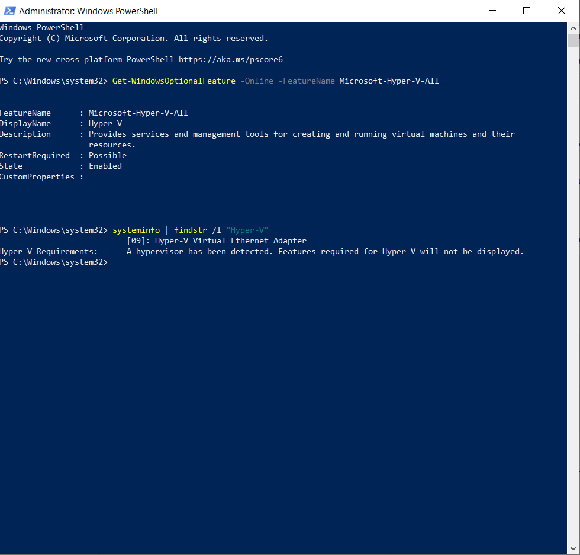
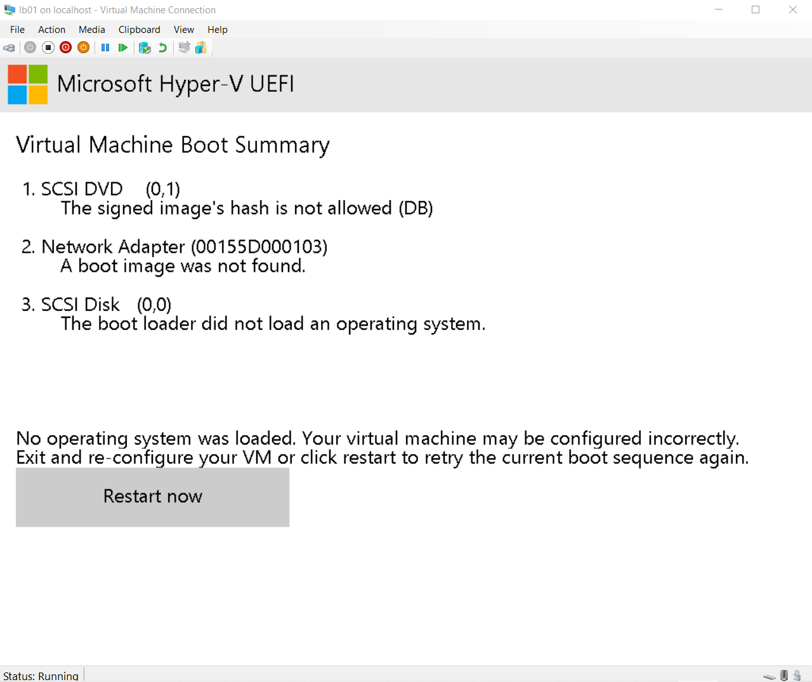
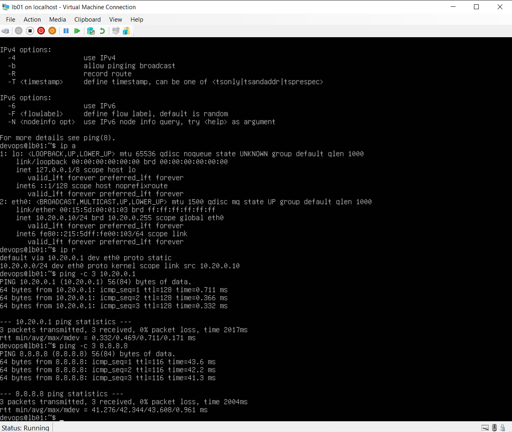
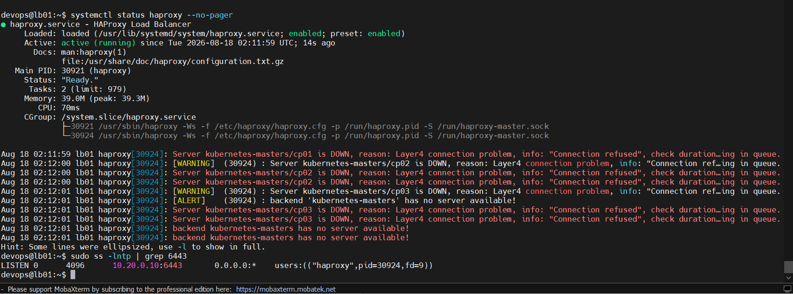
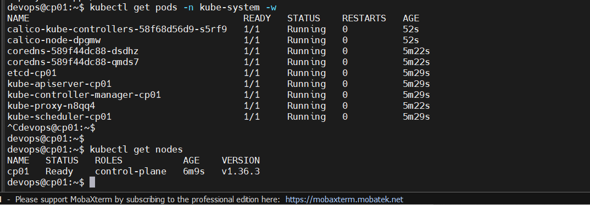
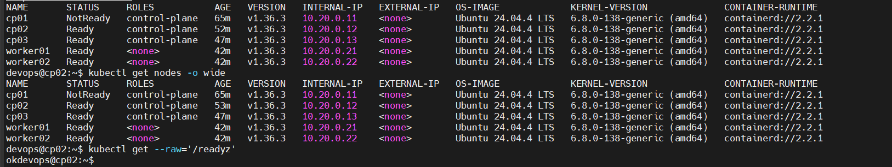
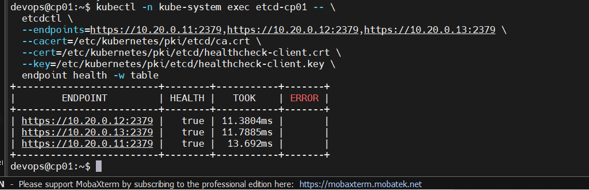

# LAB K8s HA CLUSTER

## I. CÁC MÔ HÌNH TRIỂN KHAI K8s HA CLUSTER

### 1. Kiến trúc etcd xếp chồng(Stacked etcd)

**Stacked etcd HA** là kiến trúc trong đó `etcd` được cài đặt ngay trên các Control Plane Node. Mỗi Control Plane Node đồng thời đảm nhận hai vai trò:

- Chạy các thành phần Control Plane (`kube-apiserver`, `kube-scheduler`, `kube-controller-manager`).
- Chạy một thành viên của cụm `etcd` để lưu trữ dữ liệu của Kubernetes.

Các `kube-apiserver` được đặt phía sau **Load Balancer** để Worker Node và người dùng chỉ cần kết nối đến một địa chỉ duy nhất (Virtual IP hoặc Load Balancer).

Trong khi đó, **etcd member** trên mỗi Control Plane Node chỉ giao tiếp trực tiếp với kube-apiserver chạy trên chính node đó. Các etcd member sẽ đồng bộ dữ liệu với nhau để tạo thành một cụm etcd phân tán.

Ta có thể minh hoạn kiến trúc qua sơ đồ sau:



**Note 0**: Ưu điểm của kiến trúc này:

- Dễ triển khai
- Tiết kiệm tài nguyên so kiến trúc external (Do không cần máy chủ etcd riêng)
- Có khả năng chịu lỗi
- Dễ bảo trì.

=> Phù hợp cho doanh nghiệp nhỏ và vừa

**Note 1**: Nhược điểm của kiến trúc này:

- Dùng chung etcd và control plane sẽ chia sẻ cùng tài nguyên CPU, RAM và đĩa.
- Nếu một control plane gặp sự cố phần cứng, đồng thời mất cả API Server và một thành viên etcd trên node đó.
- Khó mở rộng độc lập cụm etcd so với kiến trúc external etcd.

### 2. Kiến trúc etcd bên ngoài (External etcd - Giống Production lớn)

**Cụm HA với External etcd** là mô hình mà cụm etcd được triển khai trên các máy riêng, tách biệt hoàn toàn với các Control Plane Node. Cụm etcd này chịu trách nhiệm lưu trữ toàn bộ trạng thái (state) của Kubernetes.

Khác với mô hình Stacked etcd, các Control Plane Node không chạy etcd.

Mỗi Control Plane Node chỉ chạy các thành phần của Kubernetes Control Plane:

- `kube-apiserver`
- kube-scheduler
- kube-controller-manager

Các `kube-apiserver` được đặt phía sau Load Balancer để Worker Node và người dùng có thể truy cập thông qua một địa chỉ duy nhất (Virtual IP hoặc Load Balancer).

Trong khi đó, các etcd member chạy trên các máy riêng biệt và mỗi kube-apiserver sẽ kết nối trực tiếp tới cụm etcd để đọc và ghi dữ liệu của Kubernetes.

Ta có thể minh hoạ kiến trúc qua sơ đồ sau:



**Note 2**: Ưu điểm của kiến trúc này:

- Tách biệt hoàn toàn giữa Control Plane và etcd
- Hiệu năng ổn định hơn
- Dễ mở rộng tài nguyên node etcd
- Khả năng chịu lỗi tốt hơn (Do cô lập 2 lớp etcd và Control plane)
- Bảo trì linh hoạt

=> Phù hợp với các doanh nghiệp lớn

**Note 3**:

- Cần nhiều máy chủ hơn => Chi phí cao hơn
- Triển khai phức tạp hơn
- Tăng yêu cầu về mạng
- Quản trị nhiều thành phần hơn

## II. THỰC HÀNH LAB 1 : MÔ HÌNH STACKED ETCD

**Note 4**: Bài Lab sau đây **được viết cho môi trường máy chủ (bare metal hoặc VM) nói chung**, nên không hướng dẫn cách tích hợp với các dịch vụ cloud như Load Balancer và Persistent Volume do nhà cung cấp cloud cung cấp.( Ví dụ **Octavia** của **OpenStack**).

### 1. Chuẩn bị môi trường

Với máy của ta `16 GB RAM + >200 GB free`, nếu mục tiêu là học thật `kubeadm HA`, hiểu stacked etcd, rồi sau đó làm external etcd, ta khuyên không dùng Docker Desktop.

Phương án ta khuyên dùng: Dùng Máy ta như một máy ảo (**Hyper-V**)



| VM         | Vai trò              |         RAM |
| ---------- | -------------------- | ----------: |
| `lb01`     | HAProxy LB           | 512 MB–1 GB |
| `cp01`     | Control Plane + etcd |        2 GB |
| `cp02`     | Control Plane + etcd |        2 GB |
| `cp03`     | Control Plane + etcd |        2 GB |
| `worker01` | Worker               |    1.5–2 GB |
| `worker02` | Worker               |    1.5–2 GB |

### 2. `Bước 1`: Kiểm tra Hyper-V

Mở PowerShell **Run as Administrator**.

Chạy:

```powershell
Get-WindowsOptionalFeature -Online -FeatureName Microsoft-Hyper-V-All
```

Phải có:

```text
State : Enabled
```

Kiểm tra hypervisor:

```powershell
systeminfo | findstr /I "Hyper-V"
```

Nếu thấy:

```text
A hypervisor has been detected.
```

thì không phải lỗi.



### 3. `Bước 2`: Tạo Hyper-v Virtual Switch

Kiểm tra card mạng hiện tại:

```powershell
Get-NetAdapter | Select-Object Name, Status, LinkSpeed
```

Kiểm tra các Virtual Switch đang có:

```powershell
Get-VMSwitch | Select-Object Name, SwitchType
```

Kiểm tra IP của máy Window:

```powershell
ipconfig
```

=> Ta tóm tắt output máy như sau

```text
Wi-Fi thật: 192.168.3.181/24
Gateway: 192.168.3.1
Hyper-V Default Switch: 172.21.32.1/20
VMware VMnet2: 10.10.10.1/24
Hyper-V mới chỉ có Default Switch
```

**Note 5**: Với lab **Kubernetes HA kubeadm**, ta khuyên **không dùng Default Switch** và cũng không dùng **VMware VMnet2**. Ta tạo một **Hyper-V Internal Switch riêng** cho lab.

Ta tạo Internal Switch

- Mở PowerShell Administrator và chạy:

```powershell
New-VMSwitch -Name "K8s-Lab" -SwitchType Internal
```

- Sau đó kiểm tra:

```powershell
Get-VMSwitch | Select-Object Name, SwitchType
```

- Ta sẽ thấy:

```text
Name           SwitchType
----           ----------
Default Switch Internal
K8s-Lab        Internal
```

Tiếp theo, Gán IP cho adapter của K8s-Lab:

- Sau khi tạo switch:

```powershell
Get-NetAdapter | Where-Object {$_.Name -like "*K8s-Lab*"} |
Select-Object Name, Status
```

- Nó thường sẽ xuất hiện kiểu:

```text
Name                   Status
----                   ------
vEthernet (K8s-Lab)    Up
```

- Sau đó đặt IP cho Windows host trên mạng lab:

```powershell
New-NetIPAddress `
  -InterfaceAlias "vEthernet (K8s-Lab)" `
  -IPAddress 10.20.0.1 `
  -PrefixLength 24
```

- Ta dùng mạng:

```text
10.20.0.0/24
```

cho toàn bộ Kubernetes lab.

### 4. `Bước 3`: Setup Network Topology

Sơ đồ Network như sau:

```text
Windows Host
10.20.0.1
      │
      │ Hyper-V Internal Switch
      │ K8s-Lab
      │
      ├── lb01       10.20.0.10
      │
      ├── cp01       10.20.0.11
      ├── cp02       10.20.0.12
      ├── cp03       10.20.0.13
      │
      ├── worker01   10.20.0.21
      └── worker02   10.20.0.22
```

**Note 6**: Internal Switch chỉ cho các VM giao tiếp với Windows host. VM sẽ không tự có Internet để apt update, pull image Kubernetes, v.v.

=> Vì vậy sau khi tạo switch, ta sẽ làm thêm NAT trên Windows:

```text
                         Internet
                            │
                     Wi-Fi 192.168.3.181
                            │
                     Windows Host
                            │
                 NAT: 10.20.0.0/24
                            │
                    K8s-Lab Switch
                            │
          ┌─────────┬───────┼────────┬─────────┐
          │         │       │        │         │
        lb01      cp01    cp02     cp03     workers
       .10        .11     .12      .13      .21/.22
```

Trước hết, Check Net adapter cũ bị trùng:

```powershell
Get-NetIPAddress -AddressFamily IPv4 |
Where-Object {$_.InterfaceAlias -like "*K8s-Lab*"} |
Format-Table InterfaceAlias, IPAddress, PrefixLength

# Và
Get-NetAdapter | Where-Object {$_.Name -like "*K8s-Lab*"} |
>> Format-Table Name, ifIndex, Status, MacAddress, InterfaceDescription
```

- Adapter đúng của K8s-Lab là cái có IP `10.20.0.1/24`:

```text
vEthernet (K8s-Lab)    ifIndex 72
MAC       00-15-5D-00-01-00
IP        10.20.0.1/24
```

Đầu tiên, Tạo NAT cho mạng K8s:

```powershell
# Check
Get-NetNat

# Nếu không có tạo NAT
New-NetNat -Name "K8s-Lab-NAT" -InternalIPInterfaceAddressPrefix "10.20.0.0/24"

# Check lại
Get-NetNat
```

- Output như sau là `OKE`:

PS C:\Windows\system32> Get-NetNat

```text
Name                             : K8s-Lab-NAT
ExternalIPInterfaceAddressPrefix :
InternalIPInterfaceAddressPrefix : 10.20.0.0/24
IcmpQueryTimeout                 : 30
TcpEstablishedConnectionTimeout  : 1800
TcpTransientConnectionTimeout    : 120
TcpFilteringBehavior             : AddressDependentFiltering
UdpFilteringBehavior             : AddressDependentFiltering
UdpIdleSessionTimeout            : 120
UdpInboundRefresh                : False
Store                            : Local
Active                           : True
```

- Cuối cùng, kiểm tra IP adapter:

```powershell
Get-NetIPAddress -InterfaceIndex 72 -AddressFamily IPv4
```

- Output như sau là `OKE`:

```text
IPAddress         : 10.20.0.1
InterfaceIndex    : 72
InterfaceAlias    : vEthernet (K8s-Lab)
AddressFamily     : IPv4
Type              : Unicast
PrefixLength      : 24
PrefixOrigin      : Manual
SuffixOrigin      : Manual
AddressState      : Preferred
ValidLifetime     : Infinite ([TimeSpan]::MaxValue)
PreferredLifetime : Infinite ([TimeSpan]::MaxValue)
SkipAsSource      : False
PolicyStore       : ActiveStore
```

### 5. `Bước 4`: Tạo VM Lb01 (test trc)

Đầu tiên, tạo thư mục chứa VM:

```powershell
New-Item -ItemType Directory -Path "D:\K8s-Lab" -Force
```

Tiếp theo, tải thư mục Ubuntu Server ISO

```text
Ubuntu Server 24.04 LTS

Lưu vào: D:\ISO\ubuntu-24.04.x-live-server-amd64.iso
```

Xong xuôi, ta tạo VM `lb01`:

- Trên Powershell chạy:

```powershell
New-VM `
  -Name "lb01" `
  -Generation 2 `
  -MemoryStartupBytes 1GB `
  -NewVHDPath "D:\K8s-Lab\lb01.vhdx" `
  -NewVHDSizeBytes 10GB `
  -SwitchName "K8s-Lab"
```

- Sau đó, cấp CPU:

```powershell
Set-VMProcessor -VMName "lb01" -Count 1
```

- Gắn ISO:

```powershell
# Nhớ thay bằng phiên bản của mình tải
Get-VMDvdDrive -VMName lb01
Set-VMDvdDrive `
  -VMName "lb01" `
  -Path "D:\ISO\ubuntu-24.04.4-live-server-amd64.iso"
```

- Kiểm tra:

```powershell
Get-VM -Name lb01

# Và
Get-VMNetworkAdapter -VMName lb01 |
Select-Object VMName,SwitchName,MacAddress
```

- Phải thấy:

```text
VMName    SwitchName
------    ----------
lb01      K8s-Lab
```

- Ta boot VM:

```powershell
# Đặt DVD là thiết bị boot đầu tiên
$dvd = Get-VMDvdDrive -VMName lb01

Set-VMFirmware `
  -VMName lb01 `
  -FirstBootDevice $dvd

# Kiểm tra
Get-VMFirmware -VMName lb01
```

- Out put phải ra

```powershell
Get-VMFirmware -VMName lb01

VMName SecureBoot SecureBootTemplate PreferredNetworkBootProtocol BootOrder
------ ---------- ------------------ ---------------------------- ---------
lb01   On         MicrosoftWindows   IPv4                         {Drive, Network, Drive}
```

Sau đó bật VM

```powershell
Start-VM -Name "lb01"

# Mở console
vmconnect.exe localhost lb01

# Hoặc mở
Hyper-V Manager → lb01 → Connect
```

- Nếu gặp lỗi này hãy tắt **Secure Boot**:



```powershell
# Tắt VM
Stop-VM lb01 -Force

# Tắt Secure Boot
Set-VMFirmware -VMName lb01 -EnableSecureBoot Off

# Kiểm tra:
Get-VMFirmware -VMName lb01 |
    Select-Object EnableSecureBoot, BootOrder

# Cần thấy:
EnableSecureBoot
----------------
Off

# kiểm tra ISO vẫn còn
Get-VMDvdDrive -VMName lb01 |
    Select-Object VMName, Path

# Phải thấy:

lb01  D:\ISO\ubuntu-24.04.4-live-server-amd64.iso

# Boot lại
Start-VM lb01

# Trong cửa sổ Virtual Machine Connection, chọn: Action → Restart
```

- Rồi sau đó cài Ubuntu:

```text
hostname:lb01
user:devops
Network:DHCP

Sau khi cài xong mới setup:
IP       10.20.0.10/24
Gateway  10.20.0.1
DNS      10.20.0.1
```

- Setup:

```bash
# Disable phần quản lý network để nó không tạo lại 50-cloud-init.yaml.
echo 'network: {config: disabled}' | sudo tee /etc/netplan/99-disable-network-config.cfg

# Xóa file Netplan do cloud-init đã tạo:
sudo rm -rf /etc/netplan/50-cloud-init.yaml

# Sau đó tạo file static của bạn, ví dụ /etc/netplan/01-k8s-static.yaml, rồi áp dụng:
sudo nano /etc/netplan/01-k8s-static.yaml

# Dán:
network:
  version: 2
  ethernets:
    eth0: # thay bằng tên card mạng thực tế, kiểm tra: ip -br link
      dhcp4: false
      addresses:
        - 10.20.0.10/24
      routes:
        - to: default
          via: 10.20.0.1
      nameservers:
        addresses:
          - 1.1.1.1
          - 8.8.8.8

# Phân quyền cho tất cả file config trong netplan
sudo chown root:root /etc/netplan/*.yaml
sudo chmod 600 /etc/netplan/*.yaml

# Apply
sudo netplan try
sudo netplan apply
```

- Check lại trong `lb01`:

```bash
ip addr
ip r
ping -c 3 10.20.0.1
ping -c 3 8.8.8.8

# Nếu ping OKE là thành công
```



**Note 7**: Nếu ping Gateway không đc do firewall window đang chặn gói tin ICMP ta chỉ set rule là đc

```powershell
New-NetFirewallRule `
  -DisplayName "Allow ICMPv4 from K8s-Lab" `
  -Direction Inbound `
  -Protocol ICMPv4 `
  -IcmpType 8 `
  -Action Allow `
  -InterfaceAlias "vEthernet (K8s-Lab)" `
  -Profile Any

# Xác nhận host gán IP .1 cho swtich
Get-NetIPAddress -InterfaceAlias "vEthernet (K8s-Lab)" -AddressFamily IPv4
```

### 6. `Bước 5`: Tạo 3 VM Control plane

Trên PowerShell. Tạo 3 VM:

```powershell
New-VM `
  -Name "cp01" `
  -Generation 2 `
  -MemoryStartupBytes 2GB `
  -NewVHDPath "D:\K8s-Lab\cp01.vhdx" `
  -NewVHDSizeBytes 20GB `
  -SwitchName "K8s-Lab"

New-VM `
  -Name "cp02" `
  -Generation 2 `
  -MemoryStartupBytes 2GB `
  -NewVHDPath "D:\K8s-Lab\cp02.vhdx" `
  -NewVHDSizeBytes 20GB `
  -SwitchName "K8s-Lab"

New-VM `
  -Name "cp03" `
  -Generation 2 `
  -MemoryStartupBytes 2GB `
  -NewVHDPath "D:\K8s-Lab\cp03.vhdx" `
  -NewVHDSizeBytes 20GB `
  -SwitchName "K8s-Lab"

# Check:
Get-VM cp01,cp02,cp03 |
    Select-Object Name,State,MemoryAssigned,Status

# Phải ra
Name   State MemoryAssigned Status
----   ----- --------------- ------
cp01   Off   0               Operating normally
cp02   Off   0               Operating normally
cp03   Off   0               Operating normally
```

Sau đó, Cấp Cpu cho VM:

```powershell
Set-VMProcessor -VMName cp01 -Count 2
Set-VMProcessor -VMName cp02 -Count 2
Set-VMProcessor -VMName cp03 -Count 2

# Check:
Get-VMProcessor -VMName cp01,cp02,cp03 |
    Select-Object VMName,Count

# Phải ra
VMName Count
------ -----
cp01      2
cp02      2
cp03      2
```

Găn ISO:

```powershell
Add-VMDvdDrive `
  -VMName cp01 `
  -Path "D:\ISO\ubuntu-24.04.4-live-server-amd64.iso"

Add-VMDvdDrive `
  -VMName cp02 `
  -Path "D:\ISO\ubuntu-24.04.4-live-server-amd64.iso"

Add-VMDvdDrive `
  -VMName cp03 `
  -Path "D:\ISO\ubuntu-24.04.4-live-server-amd64.iso"

# Check
Get-VMDvdDrive -VMName cp01,cp02,cp03 |
    Select-Object VMName,Path

# Phải ra
VMName Path
------ ----
cp01   D:\ISO\ubuntu-24.04.4-live-server-amd64.iso
cp02   D:\ISO\ubuntu-24.04.4-live-server-amd64.iso
cp03   D:\ISO\ubuntu-24.04.4-live-server-amd64.iso
```

Tắt Secure Boot:

```powershell
Set-VMFirmware -VMName cp01 -EnableSecureBoot Off
Set-VMFirmware -VMName cp02 -EnableSecureBoot Off
Set-VMFirmware -VMName cp03 -EnableSecureBoot Off

# Check
Get-VMFirmware -VMName cp01,cp02,cp03 |
    Select-Object VMName,EnableSecureBoot,BootOrder

# Phải ra:
cp01  Off
cp02  Off
cp03  Off
```

Đặt DVD Boot đầu tiên cho 3 VM tương tự như `Lb01`

Boot `Cp1` trước rồi set up tương tự cho `Cp2` và `Cp3`

Kiểm tra các VM có ping đc cho nhau không (`Lb01`, `Cp1->3`)

- Set hostname trước:

```bash
hostnamectl

# Trên Cp1
sudo hostnamectl set-hostname cp01

# Trên Cp2
sudo hostnamectl set-hostname cp02

# Trên Cp3
sudo hostnamectl set-hostname cp03
```

Sửa file `/etc/hosts` các máy:

```bash
sudo nano /etc/hosts

# Dán
10.20.0.10 lb01
10.20.0.11 cp01
10.20.0.12 cp02
10.20.0.13 cp03
10.20.0.21 worker01
10.20.0.22 worker02
```

Ping:

```bash
# Ví dụ trên Cp01
ping -c 3 10.20.0.10
ping -c 3 10.20.0.12
ping -c 3 10.20.0.13
```

### 7. `Bước 6`: Tạo 2 VM worker node

Cũng làm tương tự như 3 con Cp

### 8. `Bước 7`: Chuẩn bị OS cho Kubernetes trên 5 node

SSH vào từng node và chạy bộ lệnh dưới đây.

```bash
sudo apt update
sudo apt upgrade -y
sudo apt install -y \
  curl \
  ca-certificates \
  gnupg \
  apt-transport-https
```

Trên 5 node. Tắt swap:

```bash
sudo swapoff -a

# Kiểm tra:

swapon --show

# Không được có output.

# Tắt vĩnh viễn:
sudo sed -i '/\sswap\s/ s/^/#/' /etc/fstab

# Kiểm tra:
free -h

#Swap phải:
Swap: 0B 0B 0B
```

Sau đó. Bật Kernel modules

Trên cả 5 node:

```bash
sudo modprobe overlay
sudo modprobe br_netfilter

# Tạo config:
cat <<EOF | sudo tee /etc/modules-load.d/k8s.conf
overlay
br_netfilter
EOF

# Kiểm tra:
lsmod | grep -E 'overlay|br_netfilter'
```

Cấu hình Sysctl Kubernetes 5 node:

```bash
cat <<EOF | sudo tee /etc/sysctl.d/99-kubernetes.conf
net.bridge.bridge-nf-call-iptables = 1
net.bridge.bridge-nf-call-ip6tables = 1
net.ipv4.ip_forward = 1
EOF

# Apply:
sudo sysctl --system

# Kiểm tra:
sysctl net.ipv4.ip_forward

# Phải:
net.ipv4.ip_forward = 1
```

Cài containerd. Trên cả 5 node:

```bash
sudo apt install -y containerd

# Tạo config:
sudo mkdir -p /etc/containerd


containerd config default | \
sudo tee /etc/containerd/config.toml >/dev/null

# Đổi sang systemd cgroup:
sudo sed -i \
's/SystemdCgroup = false/SystemdCgroup = true/' \
/etc/containerd/config.toml

# Kiểm tra:
grep SystemdCgroup /etc/containerd/config.toml

# Phải:
SystemdCgroup = true

# Restart:
sudo systemctl restart containerd
sudo systemctl enable containerd

# Kiểm tra:
systemctl is-active containerd

# Kết quả:
active
```

Tiêp. Cài Kubernetes packages: Ở đây mình dùng repo Kubernetes chính thức và cùng một version trên tất cả 5 node.

```bash
# Tạo keyring:
sudo mkdir -p -m 755 /etc/apt/keyrings
curl -fsSL https://pkgs.k8s.io/core:/stable:/v1.36/deb/Release.key |
sudo gpg --dearmor -o /etc/apt/keyrings/kubernetes-apt-keyring.gpg

# Thêm repo:
echo 'deb [signed-by=/etc/apt/keyrings/kubernetes-apt-keyring.gpg] https://pkgs.k8s.io/core:/stable:/v1.36/deb/ /' |
sudo tee /etc/apt/sources.list.d/kubernetes.list

# Update:
sudo apt update

# Cài:
sudo apt install -y kubelet kubeadm kubectl

# Giữ version:
sudo apt-mark hold kubelet kubeadm kubectl

# Kiểm tra:
kubeadm version
kubectl version --client
kubelet --version
```

**Note 8**: Nhưng chưa kubeadm init. Đến đây chưa được chạy: `kubeadm init`

Vì mình chưa dựng HAProxy trên `lb01`.

Kiến trúc chuẩn của mình sẽ là:

```text
                    kubeadm
                       │
                       ▼
              10.20.0.10:6443
                    lb01
                   HAProxy
                  /   |   \
                 /    |    \
                ▼     ▼     ▼
             cp01   cp02   cp03
             :6443  :6443  :6443
```

`kubeadm` sẽ dùng:

- `10.20.0.10:6443`

=> Làm **control-plane endpoint**.(Không dùng IP của `cp01`)

Tiếp theo. Sang `lb01`

```bash
# Cài HAProxy:
sudo apt update
sudo apt install -y haproxy

# Backup config:
sudo cp /etc/haproxy/haproxy.cfg \
/etc/haproxy/haproxy.cfg.bak

# Mở:
sudo nano /etc/haproxy/haproxy.cfg

# Thay bằng:
global
    log /dev/log local0
    log /dev/log local1 notice
    daemon


defaults
    log global
    mode tcp
    option tcplog
    timeout connect 10s
    timeout client  1m
    timeout server  1m


frontend kubernetes
    bind 10.20.0.10:6443
    mode tcp
    default_backend kubernetes-masters


backend kubernetes-masters
    mode tcp
    balance roundrobin


    server cp01 10.20.0.11:6443 check
    server cp02 10.20.0.12:6443 check
    server cp03 10.20.0.13:6443 check

# Lưu.

# Kiểm tra config:
sudo haproxy -c -f /etc/haproxy/haproxy.cfg

# Phải ra:
Configuration file is valid

# Start:
sudo systemctl restart haproxy
sudo systemctl enable haproxy

# Kiểm tra:
systemctl status haproxy --no-pager
```

Sau đó. Kiểm tra port `6443`

- Hiện tại cp01/cp02/cp03 chưa chạy kube-apiserver, nên backend HAProxy chưa healthy là bình thường.

- Trên `lb01`:

```bash
sudo ss -lntp | grep 6443

# Phải thấy:
LISTEN ... 10.20.0.10:6443

# Từ cp01:
nc -vz 10.20.0.10 6443
```



**Note 9**: Có thể báo connection refused tùy HAProxy/backend lúc này — không sao, vì API server chưa tồn tại. Cái quan trọng là HAProxy đã bind `10.20.0.10:6443`.

Cuối cùng. Checkpoint trước khi bootstrap.

Đến đây topology phải:

```text
lb01
 └── HAProxy
      └── 10.20.0.10:6443
             │
             ├── cp01:6443
             ├── cp02:6443
             └── cp03:6443

Nhưng:

cp01 API = chưa có
cp02 API = chưa có
cp03 API = chưa có
```

Sau đó mới:

```bash
# cp01
kubeadm init \
  --control-plane-endpoint "10.20.0.10:6443" \
  --upload-certs \
  --pod-network-cidr=192.168.0.0/16
```

### 9. `Bước 8`: Bootstrap trên `cp01` + Cài Network CNI

```bash
sudo kubeadm init \
  --control-plane-endpoint "10.20.0.10:6443" \
  --upload-certs \
  --pod-network-cidr=192.168.0.0/16
```

Kết quả:

```bash
NAME   STATUS     ROLES           AGE   VERSION   INTERNAL-IP   EXTERNAL-IP   OS-IMAGE             KERNEL-VERSION              CONTAINER-RUNTIME
cp01   NotReady   control-plane   76s   v1.36.3   10.20.0.11    <none>        Ubuntu 24.04.4 LTS   6.8.0-138-generic (amd64)   containerd://2.2.1
NAMESPACE     NAME                           READY   STATUS    RESTARTS   AGE
kube-system   coredns-589f44dc88-dsdhz       0/1     Pending   0          68s
kube-system   coredns-589f44dc88-qmds7       0/1     Pending   0          68s
kube-system   etcd-cp01                      1/1     Running   0          75s
kube-system   kube-apiserver-cp01            1/1     Running   0          75s
kube-system   kube-controller-manager-cp01   1/1     Running   0          75s
kube-system   kube-proxy-n8qq4               1/1     Running   0          68s
kube-system   kube-scheduler-cp01            1/1     Running   0          75s
devops@cp01:~$
```

**Note 10**: Control plane đầu tiên đang khỏe; NotReady và CoreDNS Pending chỉ vì chưa có CNI. Bước kế tiếp là cài CNI Calico trên `cp01`

```bash
curl -fsSLO https://raw.githubusercontent.com/projectcalico/calico/v3.32.1/manifests/calico.yaml
kubectl apply -f calico.yaml

# Chờ các Pod lên:
kubectl get pods -n kube-system -w

# Khi calico-node, calico-kube-controllers và hai pod coredns đều Running, nhấn Ctrl+C, rồi chạy:
kubectl get nodes

# cp01 phải chuyển thành Ready
```



### 10. `Bước 9`: Join 2 node cp + 2 node worker còn lại vào cluster

Đối node cp

```bash
mkdir -p "$HOME/.kube"
sudo cp /etc/kubernetes/admin.conf "$HOME/.kube/config"
sudo chown "$(id -u):$(id -g)" "$HOME/.kube/config"

sudo kubeadm join 10.20.0.10:6443 --token un0j5i.3487qejtjpdb3zcv \
        --discovery-token-ca-cert-hash sha256:7381629193a3a3c285a3b4297a312f972d2e48ee964cf03e38954db8b248ccd7 \
        --control-plane --certificate-key 7807f0929bd4fb4d94aae86d28b41712cec0c499cfc45ab520abad6b8d2d0106
```

Đối node worker:

```bash
sudo kubeadm join 10.20.0.10:6443 \
  --token <token> \
  --discovery-token-ca-cert-hash sha256:<hash>
```

### 11. `Bước 10`: Test HA thực sự

Ta sẽ mô phỏng:

```text
                    HAProxy
                  10.20.0.10:6443
                        │
             ┌──────────┼──────────┐
             │          │          │
           cp01       cp02       cp03
          .11:6443   .12:6443   .13:6443
             X          ✓          ✓
            DOWN       UP         UP

Nếu cp01 chết thì:
```

- etcd vẫn phải quorum
- Kubernetes API vẫn phải truy cập được
- HAProxy phải chuyển traffic sang cp02/cp03
- workload trên worker vẫn chạy

Trước tiên trên `cp01`, xem API endpoint hiện tại:

```bash
kubectl cluster-info

# và:
kubectl get --raw='/readyz?verbose'
```

Sau đó kiểm tra HAProxy:

```bash
curl -k https://10.20.0.10:6443/version
```

=> Nếu trả JSON version Kubernetes là OK.

#### a. Test 1 — HAProxy có thấy 3 API server không?

Trên `lb01`:

```bash
sudo journalctl -u haproxy --since "5 minutes ago" --no-pager

# và:
sudo ss -lntp | grep 6443
```

Phải thấy:

`10.20.0.10:6443`

#### b. Test 2 — kiểm tra etcd quorum

Trước khi cố tình làm chết node:

```
kubectl -n kube-system exec etcd-cp01 -- \
  etcdctl \
  --endpoints=https://10.20.0.11:2379,https://10.20.0.12:2379,https://10.20.0.13:2379 \
  --cacert=/etc/kubernetes/pki/etcd/ca.crt \
  --cert=/etc/kubernetes/pki/etcd/healthcheck-client.crt \
  --key=/etc/kubernetes/pki/etcd/healthcheck-client.key \
  endpoint status -w table
```

=> Ta sẽ thấy 3 member.

#### c. Test cố tình shutdown `cp01`

Tắt VM cp01:

```powershell
Stop-VM cp01 -Force
```

Đợi khoảng 20–30 giây. Sau đó từ `cp02`:

```bash
kubectl get nodes -o wide

# và:
kubectl get pods -n kube-system -o wide
```

Quan trọng nhất:

```bash
kubectl get --raw='/readyz'

# Kết quả:
devops@cp02:~$ kubectl get --raw='/readyz'
ok
```



=> API plane vẫn hoạt động khi `cp01` chết.

#### d. Test Heal Cluster

Ta bật lại `cp01`

```powershell
Start-VM cp01
```

Từ `lb01`:

```bash
ping 10.20.0.11

Rồi trên `cp01`:

```bash
kubectl get nodes
```

và kiểm tra etcd lại:

```bash
kubectl -n kube-system exec etcd-cp01 -- \
  etcdctl \
  --endpoints=https://10.20.0.11:2379,https://10.20.0.12:2379,https://10.20.0.13:2379 \
  --cacert=/etc/kubernetes/pki/etcd/ca.crt \
  --cert=/etc/kubernetes/pki/etcd/healthcheck-client.crt \
  --key=/etc/kubernetes/pki/etcd/healthcheck-client.key \
  endpoint health -w table
```

Output phải ra:

```text
cp01 → true
cp02 → true
cp03 → true
```



## THỰC HÀNH LAB 2: MÔ HÌNH EXTERNAL ETCD

### 1. Chuẩn bị môi trường lab

```text
EXTERNAL ETCD HA KUBERNETES LAB
|
|-- Moi truong
|   |-- Windows Host
|   |   |-- Hyper-V: Enabled
|   |   |-- RAM: 16 GB
|   |   |-- Disk trong: >= 200 GB
|   |   `-- Ubuntu Server 24.04 LTS ISO
|   |
|   |-- Hyper-V Internal Switch: K8s-External
|   |   |-- Host adapter: vEthernet (K8s-External)
|   |   |-- Host IP / Gateway: 10.30.0.1/24
|   |   `-- NAT: K8sExternalNAT
|   |       `-- Internal prefix: 10.30.0.0/24
|   |
|   `-- DNS cho tat ca VM
|       |-- 1.1.1.1
|       `-- 8.8.8.8
|
|-- IP Plan: 10.30.0.0/24
|   |
|   |-- ext-lb01
|   |   |-- IP: 10.30.0.10
|   |   |-- Role: HAProxy Load Balancer
|   |   |-- CPU/RAM: 1 vCPU / 512 MB
|   |   `-- API endpoint: 10.30.0.10:6443
|   |
|   |-- External etcd cluster
|   |   |-- ext-etcd01
|   |   |   |-- IP: 10.30.0.21
|   |   |   `-- CPU/RAM: 1 vCPU / 1 GB
|   |   |
|   |   |-- ext-etcd02
|   |   |   |-- IP: 10.30.0.22
|   |   |   `-- CPU/RAM: 1 vCPU / 1 GB
|   |   |
|   |   `-- ext-etcd03
|   |       |-- IP: 10.30.0.23
|   |       `-- CPU/RAM: 1 vCPU / 1 GB
|   |
|   |-- Kubernetes control plane
|   |   |-- ext-cp01
|   |   |   |-- IP: 10.30.0.31
|   |   |   `-- CPU/RAM: 2 vCPU / 2 GB
|   |   |
|   |   |-- ext-cp02
|   |   |   |-- IP: 10.30.0.32
|   |   |   `-- CPU/RAM: 2 vCPU / 2 GB
|   |   |
|   |   `-- ext-cp03
|   |       |-- IP: 10.30.0.33
|   |       `-- CPU/RAM: 2 vCPU / 2 GB
|   |
|   `-- Kubernetes worker
|       `-- ext-worker01
|           |-- IP: 10.30.0.41
|           `-- CPU/RAM: 2 vCPU / 2 GB
|
`-- Network flows
    |-- Worker / kubectl
    |   `-- ext-lb01:6443
    |       `-- ext-cp01, ext-cp02, ext-cp03:6443
    |
    |-- ext-cp01, ext-cp02, ext-cp03
    |   `-- ext-etcd01, ext-etcd02, ext-etcd03:2379
    |
    `-- ext-etcd01 <--> ext-etcd02 <--> ext-etcd03
        `-- Peer replication: TCP 2380
```

### 2. `Bước 1`: Tạo Switch, Tạo VM Test, Tạo Nat, Check Interface

Kết quả:

```powershell
# Làm y như phần stacked etd
PS C:\Windows\system32> Get-NetIPAddress -InterfaceAlias "vEthernet (K8s-External)" -AddressFamily IPv4


IPAddress         : 10.30.0.1
InterfaceIndex    : 33
InterfaceAlias    : vEthernet (K8s-External)
AddressFamily     : IPv4
Type              : Unicast
PrefixLength      : 24
PrefixOrigin      : Manual
SuffixOrigin      : Manual
AddressState      : Preferred
ValidLifetime     : Infinite ([TimeSpan]::MaxValue)
PreferredLifetime : Infinite ([TimeSpan]::MaxValue)
SkipAsSource      : False
PolicyStore       : ActiveStore


PS C:\Windows\system32> Get-NetNat -Name "K8sExternalNAT"


Name                             : K8sExternalNAT
ExternalIPInterfaceAddressPrefix :
InternalIPInterfaceAddressPrefix : 10.30.0.0/24
IcmpQueryTimeout                 : 30
TcpEstablishedConnectionTimeout  : 1800
TcpTransientConnectionTimeout    : 120
TcpFilteringBehavior             : AddressDependentFiltering
UdpFilteringBehavior             : AddressDependentFiltering
UdpIdleSessionTimeout            : 120
UdpInboundRefresh                : False
Store                            : Local
Active                           : True
```

### 3. `Bước 2`: Tạo toàn bộ VM cho lab (ext-lb01, ext-etcd01-03, ext-cp01-03, ext-worker01)

Tạo thư mục chứa VM:

```powershell
New-Item -ItemType Directory -Path "D:\K8s-External" -Force
```

#### a. Tạo `ext-lb01`

```powershell
New-VM `
  -Name "ext-lb01" `
  -Generation 2 `
  -MemoryStartupBytes 1GB `
  -NewVHDPath "D:\K8s-External\ext-lb01.vhdx" `
  -NewVHDSizeBytes 10GB `
  -SwitchName "K8s-External"

Set-VMProcessor -VMName "ext-lb01" -Count 1
Set-VM -Name "ext-lb01" -CheckpointType Disabled

Add-VMDvdDrive -VMName "ext-lb01" -Path "D:\ISO\ubuntu-24.04.4-live-server-amd64.iso"
Set-VMFirmware -VMName "ext-lb01" -EnableSecureBoot Off
$dvd = Get-VMDvdDrive -VMName "ext-lb01"
Set-VMFirmware -VMName "ext-lb01" -FirstBootDevice $dvd
```

#### b. Tạo 3 VM etcd (`ext-etcd01`, `ext-etcd02`, `ext-etcd03`)

```powershell
foreach ($n in 1..3) {
    $name = "ext-etcd0$n"
    New-VM `
      -Name $name `
      -Generation 2 `
      -MemoryStartupBytes 1GB `
      -NewVHDPath "D:\K8s-External\$name.vhdx" `
      -NewVHDSizeBytes 20GB `
      -SwitchName "K8s-External"

    Set-VMProcessor -VMName $name -Count 1
    Set-VM -Name $name -CheckpointType Disabled
    Add-VMDvdDrive -VMName $name -Path "D:\ISO\ubuntu-24.04.4-live-server-amd64.iso"
    Set-VMFirmware -VMName $name -EnableSecureBoot Off
    $dvd = Get-VMDvdDrive -VMName $name
    Set-VMFirmware -VMName $name -FirstBootDevice $dvd
}
```

#### c. Tạo 3 VM control plane (`ext-cp01`, `ext-cp02`, `ext-cp03`)

```powershell
foreach ($n in 1..3) {
    $name = "ext-cp0$n"
    New-VM `
      -Name $name `
      -Generation 2 `
      -MemoryStartupBytes 2GB `
      -NewVHDPath "D:\K8s-External\$name.vhdx" `
      -NewVHDSizeBytes 20GB `
      -SwitchName "K8s-External"

    Set-VMProcessor -VMName $name -Count 2
    Set-VM -Name $name -CheckpointType Disabled
    Add-VMDvdDrive -VMName $name -Path "D:\ISO\ubuntu-24.04.4-live-server-amd64.iso"
    Set-VMFirmware -VMName $name -EnableSecureBoot Off
    $dvd = Get-VMDvdDrive -VMName $name
    Set-VMFirmware -VMName $name -FirstBootDevice $dvd
}
```

#### d. Tạo `ext-worker01`

```powershell
New-VM `
  -Name "ext-worker01" `
  -Generation 2 `
  -MemoryStartupBytes 2GB `
  -NewVHDPath "D:\K8s-External\ext-worker01.vhdx" `
  -NewVHDSizeBytes 20GB `
  -SwitchName "K8s-External"

Set-VMProcessor -VMName "ext-worker01" -Count 2
Set-VM -Name "ext-worker01" -CheckpointType Disabled
Add-VMDvdDrive -VMName "ext-worker01" -Path "D:\ISO\ubuntu-24.04.4-live-server-amd64.iso"
Set-VMFirmware -VMName "ext-worker01" -EnableSecureBoot Off
$dvd = Get-VMDvdDrive -VMName "ext-worker01"
Set-VMFirmware -VMName "ext-worker01" -FirstBootDevice $dvd
```

#### e. Kiểm tra toàn bộ VM

```powershell
Get-VM | Select-Object Name, State, ProcessorCount, MemoryStartup

# Phải thấy đủ 8 VM: ext-lb01, ext-etcd01-03, ext-cp01-03, ext-worker01
```

Start từng VM, cài Ubuntu Server (hostname đặt đúng tên VM, user devops, network để DHCP lúc cài), sau đó gán IP tĩnh theo đúng IP Plan như bảng trên.

### 4. `Bước 3`: Static IP + hostname + /etc/hosts cho toàn bộ 8 node

Mẫu netplan cho từng node (đổi IP theo đúng bảng, ví dụ `ext-etcd01` là `10.30.0.21`):

```bash
echo 'network: {config: disabled}' | sudo tee /etc/netplan/99-disable-network-config.cfg
sudo rm -f /etc/netplan/50-cloud-init.yaml

sudo nano /etc/netplan/01-k8s-static.yaml
```

Dán (ví dụ cho `ext-etcd01`):

```yaml
network:
  version: 2
  ethernets:
    eth0:
      dhcp4: false
      addresses:
        - 10.30.0.21/24
      routes:
        - to: default
          via: 10.30.0.1
      nameservers:
        addresses:
          - 1.1.1.1
          - 8.8.8.8
```

```bash
sudo chown root:root /etc/netplan/*.yaml
sudo chmod 600 /etc/netplan/*.yaml
sudo netplan try
sudo netplan apply
```

Đặt hostname đúng tên node:

```bash
sudo hostnamectl set-hostname ext-etcd01   # đổi tương ứng từng máy
```

`/etc/hosts` — dán **giống nhau trên cả 8 node**:

```bash
sudo nano /etc/hosts
```

```text
10.30.0.10  ext-lb01
10.30.0.21  ext-etcd01
10.30.0.22  ext-etcd02
10.30.0.23  ext-etcd03
10.30.0.31  ext-cp01
10.30.0.32  ext-cp02
10.30.0.33  ext-cp03
10.30.0.41  ext-worker01
```

Kiểm tra ping chéo giữa các node trước khi đi tiếp:

```bash
for h in ext-lb01 ext-etcd01 ext-etcd02 ext-etcd03 ext-cp01 ext-cp02 ext-cp03 ext-worker01; do
  ping -c 1 -W 1 $h >/dev/null 2>&1 && echo "$h OK" || echo "$h FAIL"
done
```

---

### 5. `Bước 4`: Chuẩn bị OS chung cho toàn bộ 8 node

Chạy **trên tất cả 8 node** (giống hệt bước 7-8 ở Lab 1 Stacked etcd — swap off, kernel modules, sysctl, containerd, cài kubeadm/kubelet/kubectl). Riêng `ext-lb01` và `ext-etcd01-03` **không cần** cài containerd/kubelet/kubeadm/kubectl vì chúng không chạy pod Kubernetes — chỉ cần chạy trên `ext-cp01-03` và `ext-worker01`.

```bash
# Trên TẤT CẢ 8 node
sudo apt update && sudo apt upgrade -y
sudo apt install -y curl ca-certificates gnupg apt-transport-https

sudo swapoff -a
sudo sed -i '/\sswap\s/ s/^/#/' /etc/fstab
free -h   # Swap phải = 0B
```

```bash
# Chỉ trên ext-cp01-03 và ext-worker01
sudo modprobe overlay
sudo modprobe br_netfilter

cat <<EOF | sudo tee /etc/modules-load.d/k8s.conf
overlay
br_netfilter
EOF

cat <<EOF | sudo tee /etc/sysctl.d/99-kubernetes.conf
net.bridge.bridge-nf-call-iptables = 1
net.bridge.bridge-nf-call-ip6tables = 1
net.ipv4.ip_forward = 1
EOF
sudo sysctl --system

sudo apt install -y containerd
sudo mkdir -p /etc/containerd
containerd config default | sudo tee /etc/containerd/config.toml >/dev/null
sudo sed -i 's/SystemdCgroup = false/SystemdCgroup = true/' /etc/containerd/config.toml
sudo systemctl restart containerd
sudo systemctl enable containerd

sudo mkdir -p -m 755 /etc/apt/keyrings
curl -fsSL https://pkgs.k8s.io/core:/stable:/v1.36/deb/Release.key |
  sudo gpg --dearmor -o /etc/apt/keyrings/kubernetes-apt-keyring.gpg
echo 'deb [signed-by=/etc/apt/keyrings/kubernetes-apt-keyring.gpg] https://pkgs.k8s.io/core:/stable:/v1.36/deb/ /' |
  sudo tee /etc/apt/sources.list.d/kubernetes.list
sudo apt update
sudo apt install -y kubelet kubeadm kubectl
sudo apt-mark hold kubelet kubeadm kubectl
```

---

### 6. `Bước 5`: Dựng cụm etcd bên ngoài (`ext-etcd01-03`)

Đây là phần khác biệt cốt lõi so với Lab 1. etcd external phải tự quản lý TLS certs (không có kubeadm lo giúp), tự cài binary, tự viết systemd unit.

#### a. Tạo bộ certificate cho etcd bằng `cfssl` (thực hiện trên `ext-etcd01`, rồi copy sang 2 node còn lại)

```bash
# Trên ext-etcd01
sudo apt install -y golang-cfssl
mkdir -p ~/etcd-certs && cd ~/etcd-certs
```

Tạo CA config:

```bash
cat <<EOF > ca-config.json
{
  "signing": {
    "default": {
      "expiry": "8760h"
    },
    "profiles": {
      "server": {
        "expiry": "8760h",
        "usages": ["signing", "key encipherment", "server auth"]
      },
      "client": {
        "expiry": "8760h",
        "usages": ["signing", "key encipherment", "client auth"]
      },
      "peer": {
        "expiry": "8760h",
        "usages": ["signing", "key encipherment", "server auth", "client auth"]
      }
    }
  }
}
EOF

cat <<EOF > ca-csr.json
{
  "CN": "etcd-ca",
  "key": {"algo": "rsa", "size": 2048},
  "names": [{"C": "VN", "O": "K8sLab", "OU": "etcd"}]
}
EOF

cfssl gencert -initca ca-csr.json | cfssljson -bare ca
```

Tạo cert peer/server dùng chung SAN cho cả 3 node etcd (đơn giản hoá lab — dùng 1 cert chung với đủ SAN của cả 3 IP):

```bash
cat <<EOF > etcd-csr.json
{
  "CN": "etcd",
  "key": {"algo": "rsa", "size": 2048},
  "names": [{"C": "VN", "O": "K8sLab", "OU": "etcd"}]
}
EOF

cfssl gencert \
  -ca=ca.pem -ca-key=ca-key.pem -config=ca-config.json \
  -hostname="ext-etcd01,ext-etcd02,ext-etcd03,10.30.0.21,10.30.0.22,10.30.0.23,127.0.0.1,localhost" \
  -profile=peer \
  etcd-csr.json | cfssljson -bare etcd-peer

cfssl gencert \
  -ca=ca.pem -ca-key=ca-key.pem -config=ca-config.json \
  -profile=client \
  etcd-csr.json | cfssljson -bare etcd-client
```

Copy toàn bộ thư mục cert sang `ext-etcd02` và `ext-etcd03` (dùng `scp` từ `ext-etcd01`):

```bash
scp -r ~/etcd-certs devops@10.30.0.22:~/
scp -r ~/etcd-certs devops@10.30.0.23:~/
```

#### b. Cài etcd binary — thực hiện **trên cả 3 node** `ext-etcd01-03`

```bash
ETCD_VER=v3.5.17
curl -fsSL https://github.com/etcd-io/etcd/releases/download/${ETCD_VER}/etcd-${ETCD_VER}-linux-amd64.tar.gz \
  -o /tmp/etcd.tar.gz
tar xzf /tmp/etcd.tar.gz -C /tmp
sudo mv /tmp/etcd-${ETCD_VER}-linux-amd64/etcd /tmp/etcd-${ETCD_VER}-linux-amd64/etcdctl /usr/local/bin/

sudo mkdir -p /etc/etcd/pki /var/lib/etcd
sudo cp ~/etcd-certs/ca.pem ~/etcd-certs/etcd-peer.pem ~/etcd-certs/etcd-peer-key.pem \
        ~/etcd-certs/etcd-client.pem ~/etcd-certs/etcd-client-key.pem /etc/etcd/pki/
sudo chown -R root:root /etc/etcd/pki
sudo chmod 600 /etc/etcd/pki/*-key.pem
```

Tạo systemd unit — **đổi `ETCD_NAME` và `THIS_IP` tương ứng từng node**:

```bash
sudo nano /etc/systemd/system/etcd.service
```

Nội dung — ví dụ cho `ext-etcd01` (`10.30.0.21`):

```ini
[Unit]
Description=etcd key-value store
After=network.target

[Service]
Type=notify
ExecStart=/usr/local/bin/etcd \
  --name ext-etcd01 \
  --data-dir /var/lib/etcd \
  --initial-advertise-peer-urls https://10.30.0.21:2380 \
  --listen-peer-urls https://10.30.0.21:2380 \
  --listen-client-urls https://10.30.0.21:2379,https://127.0.0.1:2379 \
  --advertise-client-urls https://10.30.0.21:2379 \
  --initial-cluster-token etcd-external-cluster \
  --initial-cluster ext-etcd01=https://10.30.0.21:2380,ext-etcd02=https://10.30.0.22:2380,ext-etcd03=https://10.30.0.23:2380 \
  --initial-cluster-state new \
  --client-cert-auth \
  --trusted-ca-file=/etc/etcd/pki/ca.pem \
  --cert-file=/etc/etcd/pki/etcd-peer.pem \
  --key-file=/etc/etcd/pki/etcd-peer-key.pem \
  --peer-client-cert-auth \
  --peer-trusted-ca-file=/etc/etcd/pki/ca.pem \
  --peer-cert-file=/etc/etcd/pki/etcd-peer.pem \
  --peer-key-file=/etc/etcd/pki/etcd-peer-key.pem
Restart=on-failure
RestartSec=5
LimitNOFILE=65536

[Install]
WantedBy=multi-user.target
```

Với `ext-etcd02` đổi `--name ext-etcd02`, các URL `10.30.0.22`; `ext-etcd03` tương tự `10.30.0.23`. `--initial-cluster` giữ **giống hệt nhau trên cả 3 node**.

Start **cùng lúc trên cả 3 node** (etcd cần thấy đủ 3 peer để hình thành quorum lúc `initial-cluster-state new`):

```bash
sudo systemctl daemon-reload
sudo systemctl enable etcd
sudo systemctl start etcd
sudo systemctl status etcd --no-pager
```

#### c. Kiểm tra cụm etcd đã quorum chưa (chạy trên `ext-etcd01`)

```bash
sudo ETCDCTL_API=3 etcdctl \
  --endpoints=https://10.30.0.21:2379,https://10.30.0.22:2379,https://10.30.0.23:2379 \
  --cacert=/etc/etcd/pki/ca.pem \
  --cert=/etc/etcd/pki/etcd-client.pem \
  --key=/etc/etcd/pki/etcd-client-key.pem \
  endpoint status -w table

# Và
sudo ETCDCTL_API=3 etcdctl \
  --endpoints=https://10.30.0.21:2379,https://10.30.0.22:2379,https://10.30.0.23:2379 \
  --cacert=/etc/etcd/pki/ca.pem \
  --cert=/etc/etcd/pki/etcd-client.pem \
  --key=/etc/etcd/pki/etcd-client-key.pem \
  member list -w table
```

Phải thấy đủ 3 member, cột `IS LEADER` có đúng 1 node `true`.

---

### 7. `Bước 6`: Cài HAProxy trên `ext-lb01`

Giống hệt Lab 1, chỉ đổi IP/backend:

```bash
sudo apt update
sudo apt install -y haproxy
sudo cp /etc/haproxy/haproxy.cfg /etc/haproxy/haproxy.cfg.bak
sudo nano /etc/haproxy/haproxy.cfg
```

```text
global
    log /dev/log local0
    log /dev/log local1 notice
    daemon

defaults
    log global
    mode tcp
    option tcplog
    timeout connect 10s
    timeout client  1m
    timeout server  1m

frontend kubernetes
    bind 10.30.0.10:6443
    mode tcp
    default_backend kubernetes-masters

backend kubernetes-masters
    mode tcp
    balance roundrobin
    server ext-cp01 10.30.0.31:6443 check
    server ext-cp02 10.30.0.32:6443 check
    server ext-cp03 10.30.0.33:6443 check
```

```bash
sudo haproxy -c -f /etc/haproxy/haproxy.cfg
sudo systemctl restart haproxy
sudo systemctl enable haproxy
sudo ss -lntp | grep 6443
```

---

### 8. `Bước 7`: Phân phối etcd client cert sang các control plane node

`kube-apiserver` trên mỗi `ext-cp0x` cần cert client để kết nối tới cụm etcd. Copy CA + client cert từ `ext-etcd01` sang cả 3 control plane:

```bash
# Trên ext-etcd01
scp ~/etcd-certs/ca.pem \
    ~/etcd-certs/ca-key.pem \
    ~/etcd-certs/etcd-client.pem \
    ~/etcd-certs/etcd-client-key.pem \
    devops@10.30.0.31:~/
scp ~/etcd-certs/ca.pem \
    ~/etcd-certs/ca-key.pem \
    ~/etcd-certs/etcd-client.pem \
    ~/etcd-certs/etcd-client-key.pem \
    devops@10.30.0.32:~/
scp ~/etcd-certs/ca.pem \
    ~/etcd-certs/ca-key.pem \
    ~/etcd-certs/etcd-client.pem \
    ~/etcd-certs/etcd-client-key.pem \
    devops@10.30.0.33:~/
```

Trên **cả 3** `ext-cp0x`, đưa cert vào đúng thư mục kubeadm sẽ đọc:

```bash
sudo mkdir -p /etc/kubernetes/pki/etcd
sudo cp ~/ca.pem /etc/kubernetes/pki/etcd/ca.crt
sudo cp ~/ca-key.pem /etc/kubernetes/pki/etcd/ca.key
sudo cp ~/etcd-client.pem /etc/kubernetes/pki/apiserver-etcd-client.crt
sudo cp ~/etcd-client-key.pem /etc/kubernetes/pki/apiserver-etcd-client.key
```

**Lưu ý quan trọng**: `ca-key.pem` (private key của CA etcd) chỉ nên tồn tại tạm thời để kubeadm dùng lúc init/join rồi xoá đi sau — trong lab thật production không nên rải private key CA ra nhiều máy. Ở đây làm lab nên chấp nhận được, nhưng nên nhớ dọn lại sau khi cluster đã chạy ổn.

---

### 9. `Bước 8`: `kubeadm init` trên `ext-cp01` với external etcd

Tạo file cấu hình `kubeadm-config.yaml` trên `ext-cp01`:

```bash
nano ~/kubeadm-config.yaml
```

```yaml
apiVersion: kubeadm.k8s.io/v1beta4
kind: ClusterConfiguration
kubernetesVersion: v1.36.3
controlPlaneEndpoint: "10.30.0.10:6443"
networking:
  podSubnet: "192.168.0.0/16"
etcd:
  external:
    endpoints:
      - https://10.30.0.21:2379
      - https://10.30.0.22:2379
      - https://10.30.0.23:2379
    caFile: /etc/kubernetes/pki/etcd/ca.crt
    certFile: /etc/kubernetes/pki/apiserver-etcd-client.crt
    keyFile: /etc/kubernetes/pki/apiserver-etcd-client.key
```

Chạy init:

```bash
sudo kubeadm init --config ~/kubeadm-config.yaml --upload-certs
```

Kết quả mong đợi — **không còn pod `etcd-ext-cp01`** trong `kube-system` (khác với Lab 1 stacked, vì etcd giờ nằm ngoài):

```bash
mkdir -p "$HOME/.kube"
sudo cp /etc/kubernetes/admin.conf "$HOME/.kube/config"
sudo chown "$(id -u):$(id -g)" "$HOME/.kube/config"

kubectl get pods -n kube-system
```

```text
NAME                                READY   STATUS
kube-apiserver-ext-cp01             1/1     Running
kube-controller-manager-ext-cp01    1/1     Running
kube-scheduler-ext-cp01             1/1     Running
kube-proxy-xxxxx                    1/1     Running
coredns-xxxxx                       0/1     Pending   # chờ CNI
coredns-xxxxx                       0/1     Pending   # chờ CNI
```

=> Không có etcd pod là **đúng** — etcd đang chạy như systemd service ở 3 máy riêng.

Cài CNI Calico:

```bash
curl -fsSLO https://raw.githubusercontent.com/projectcalico/calico/v3.32.1/manifests/calico.yaml
kubectl apply -f calico.yaml
kubectl get pods -n kube-system -w
kubectl get nodes    # ext-cp01 phải chuyển Ready
```

Lệnh `kubeadm init` sẽ in ra ở cuối 2 khối lệnh `kubeadm join` — lưu lại để dùng ở bước sau (một khối cho control plane, một khối cho worker).

---

### 10. `Bước 9`: Join `ext-cp02`, `ext-cp03` và `ext-worker01`

**Trên `ext-cp02` và `ext-cp03`** — trước tiên copy cert etcd giống bước 7 (đã làm ở trên rồi), sau đó chạy lệnh join control-plane in ra từ `kubeadm init`:

```bash
sudo kubeadm join 10.30.0.10:6443 \
  --token <token> \
  --discovery-token-ca-cert-hash sha256:<hash> \
  --control-plane --certificate-key <cert-key>
```

```bash
mkdir -p "$HOME/.kube"
sudo cp /etc/kubernetes/admin.conf "$HOME/.kube/config"
sudo chown "$(id -u):$(id -g)" "$HOME/.kube/config"
```

**Trên `ext-worker01`**:

```bash
sudo kubeadm join 10.30.0.10:6443 \
  --token <token> \
  --discovery-token-ca-cert-hash sha256:<hash>
```

**Lưu ý**: token mặc định hết hạn sau 24h. Nếu quá hạn, tạo lại trên `ext-cp01`:

```bash
kubeadm token create --print-join-command
```

Kiểm tra toàn cluster:

```bash
kubectl get nodes -o wide
```

```text
NAME            STATUS   ROLES           
ext-cp01        Ready    control-plane   
ext-cp02        Ready    control-plane   
ext-cp03        Ready    control-plane   
ext-worker01    Ready    <none>          
```

---

### 11. `Bước 10`: Test HA đầy đủ (control plane + etcd riêng)

#### a. Test HAProxy thấy đủ 3 API server

```bash
# Trên ext-lb01
sudo journalctl -u haproxy --since "5 minutes ago" --no-pager
curl -k https://10.30.0.10:6443/version
```

#### b. Test etcd quorum từ control plane

```bash
# Trên bất kỳ ext-cp0x
sudo ETCDCTL_API=3 etcdctl \
  --endpoints=https://10.30.0.21:2379,https://10.30.0.22:2379,https://10.30.0.23:2379 \
  --cacert=/etc/kubernetes/pki/etcd/ca.crt \
  --cert=/etc/kubernetes/pki/apiserver-etcd-client.crt \
  --key=/etc/kubernetes/pki/apiserver-etcd-client.key \
  endpoint health -w table
```

#### c. Test chịu lỗi 1 control plane (không đụng tới etcd)

```powershell
Stop-VM ext-cp01 -Force
```

```bash
# Từ ext-cp02
kubectl get nodes -o wide
kubectl get --raw='/readyz'    # phải trả "ok"
```

=> API vẫn sống vì `ext-cp02`, `ext-cp03` vẫn nói chuyện được với cụm etcd bên ngoài.

#### d. Test chịu lỗi 1 node etcd (khác biệt lớn nhất so với stacked etcd)

```powershell
Stop-VM ext-etcd01 -Force
```

```bash
# Từ ext-cp02
sudo ETCDCTL_API=3 etcdctl \
  --endpoints=https://10.30.0.22:2379,https://10.30.0.23:2379 \
  --cacert=/etc/kubernetes/pki/etcd/ca.crt \
  --cert=/etc/kubernetes/pki/apiserver-etcd-client.crt \
  --key=/etc/kubernetes/pki/apiserver-etcd-client.key \
  endpoint status -w table

kubectl get pods -A    # cluster vẫn hoạt động bình thường, 2/3 vẫn đủ quorum
```

=> Đây chính là điểm khác biệt cốt lõi so với stacked etcd: mất 1 node etcd **không kéo theo mất control plane node**, và ngược lại — 2 lớp fault-domain độc lập nhau.

#### e. Heal lại

```powershell
Start-VM ext-cp01
Start-VM ext-etcd01
```

```bash
kubectl get nodes
sudo ETCDCTL_API=3 etcdctl \
  --endpoints=https://10.30.0.21:2379,https://10.30.0.22:2379,https://10.30.0.23:2379 \
  --cacert=/etc/kubernetes/pki/etcd/ca.crt \
  --cert=/etc/kubernetes/pki/apiserver-etcd-client.crt \
  --key=/etc/kubernetes/pki/apiserver-etcd-client.key \
  endpoint health -w table
```

Output phải ra cả 3 node cp `Ready` và cả 3 node etcd `healthy: true`.