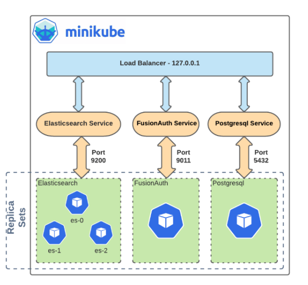
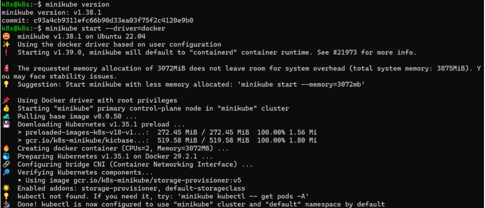

# CÀI ĐẶT MINIKUBE

## 1. Khái niệm

Minikube là một công cụ mã nguồn mở do cộng đồng Kubernetes phát triển, cho phép bạn chạy một cluster Kubernetes đơn giản trên máy tính cá nhân. Nó sử dụng các driver như Docker, VirtualBox, Hyper-V hoặc VMware để tạo một node duy nhất (hoặc multi-node nếu cần), mô phỏng môi trường Production. Minikube hỗ trợ các tính năng như dashboard addons và dễ dàng tích hợp với `kubectl`.

## 2. Lợi ích chính của Minikube

- **Dễ dàng thiết lập**: Chỉ cần vài command để có cluster chạy.
- **Miễn phí**: Không cần AWS, GCP, Azure
- **Tiết kiệm tài nguyên**
- **Gần giống môi trường Production**



## 3. Cài đặt Minikube trên Linux (x86-64)

> Bạn cần cài Docker trước
To install the latest minikube stable release on x86-64 Linux using binary download:

Cách 1: Binary download ( khuyến khích)

```bash
# Tải file binary:
curl -LO https://github.com/kubernetes/minikube/releases/latest/download/minikube-linux-amd64
# Cài đặt và dọn dẹp
sudo install minikube-linux-amd64 /usr/local/bin/minikube && rm minikube-linux-amd64
```

Cách 2: Debian package

```bash
curl -LO https://storage.googleapis.com/minikube/releases/latest/minikube_latest_amd64.deb
sudo dpkg -i minikube_latest_amd64.deb
```

Cách 3: RPM package

```bash
curl -LO https://storage.googleapis.com/minikube/releases/latest/minikube-latest.x86_64.rpm
sudo rpm -Uvh minikube-latest.x86_64.rpm
```

- Kiểm tra phiên bản: `minikube version`
- Thêm User vào nhóm cấp quyền sử dụng docker do minikube sẽ tự động chặn sử dụng quyền root để bảo mật: `sudo usermod -aG docker $USER`, cập nhập quyền cho phiên làm việc hiện tại: `newgrp docker`
- Add driver: `minikube start --driver=docker`
- Khởi động cluster: `minikube start` .
- Xác nhận `minikube status` hoặc `kubectl get nodes`. Nếu thấy node "Ready", thành công.



## 4. Cài đặt và làm quen với `kubectl`

- `kubectl` là công cụ CLI chính thức để tương tác với Kubernetes API. Nó cho phép bạn tạo, xem, cập nhật và xóa tài nguyên như Pods, services.
- Cài đặt trên Linux:

```bash
curl -LO "https://dl.k8s.io/release/$(curl -L -s https://dl.k8s.io/release/stable.txt)/bin/linux/amd64/kubectl" && sudo install kubectl /usr/local/bin/kubectl
```

- Kích hoạt autocomplete cho Bash:

```bash
source <(kubectl completion bash)
```

Thêm vào `~/.bashrc` giúp gõ command nhanh hơn

### 4.1 Cấu hình `kubectl`

- Xem cấu hình hiện tại:

  - hiển thị kubeconfig, bao gồm clusters, users, contexts.

```bash
k8s@k8s:~$ kubectl config view
apiVersion: v1
clusters:
- cluster:
    certificate-authority: /home/k8s/.minikube/ca.crt
    extensions:
    - extension:
        last-update: Fri, 31 Jul 2026 02:47:53 UTC
        provider: minikube.sigs.k8s.io
        version: v1.38.1
      name: cluster_info
    server: https://192.168.49.2:8443
  name: minikube
contexts:
- context:
    cluster: minikube
    extensions:
    - extension:
        last-update: Fri, 31 Jul 2026 02:47:53 UTC
        provider: minikube.sigs.k8s.io
        version: v1.38.1
      name: context_info
    namespace: default
    user: minikube
  name: minikube
current-context: minikube
kind: Config
users:
- name: minikube
  user:
    client-certificate: /home/k8s/.minikube/profiles/minikube/client.crt
    client-key: /home/k8s/.minikube/profiles/minikube/client.key
```

- Cluster:

  - API server: `https://192.168.49.2:8443`
  - Dùng CA nào: `/home/k8s/.minikube/ca.crt`
  - `provider: minikube.sigs.k8s.io` → Cluster này được Minikube tạo ra. Đây là domain chính thức của dự án Minikube.
  - `version: v1.38.1` → Phiên bản Minikube đã tạo/cập nhật cluster.
  - `last-update` → Thời điểm Minikube cập nhật thông tin này.

- Users:
  - Cert và private key để xác minh bản thân với Kubernetes.

- Chuyển context (hồ sơ kết nối) khác

```bash
kubectl config use-context <tên>
```

- Giữ nguyên cluster và user chỉ thay đổi namespace mặc định của hồ sợ kết nối hiện tại:

```bash
kubectl config set-context --current --namespace=<ns>
```

```bash
kubectl version                        # in cả client + server version (mặc định đã gọn)
kubectl cluster-info
kubectl config get-contexts
kubectl config current-context
kubectl config use-context <ten-context>
kubectl config set-context --current --namespace=<ns>   # đổi namespace mặc định
kubectl api-resources                  # liệt kê toàn bộ resource type hỗ trợ
kubectl api-versions
kubectl explain <resource>              # xem field/schema, VD: kubectl explain pod.spec
kubectl explain <resource> --recursive  # xem toàn bộ cây field
```
