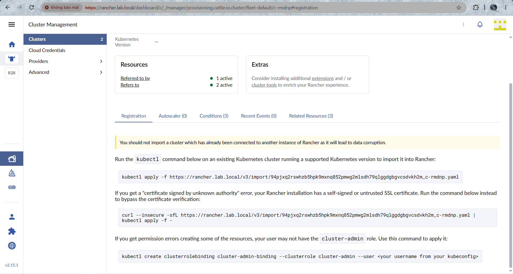
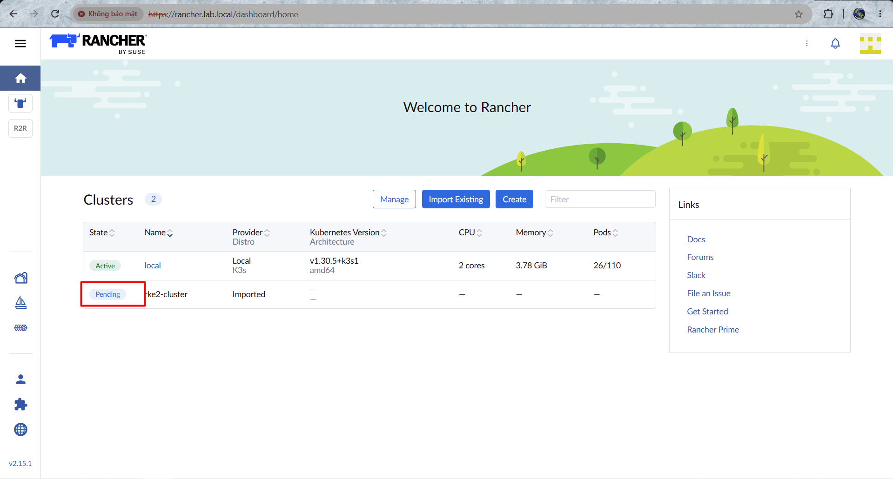

# LAB: Triển khai & Quản lý cụm Kubernetes bằng Rancher

## Rancher là gì ?

Rancher là 1 công cụ triển khai, quản lý và giám sát nhiều cụm k8s trên các môi trường khác nhau, bao gồm cả On-premis và trên các nhà cung cấp dịch vụ cloud như AWS, Azure, Google Cloud, ...

## 1. Kiến trúc lab

| Vai trò | Hostname | Số lượng | Ghi chú |
|---|---|---|---|
| Ansible Control + Rancher Server | `rancher-mgmt` | 1 | Chạy Ansible tại chỗ (local), cài K3s + Rancher (Helm) |
| K8s Master (downstream) | `k8s-master-01` | 1 | Cụm RKE2 control-plane |
| K8s Worker (downstream) | `k8s-worker-01`, `k8s-worker-02` | 2 | Worker node |

- **Hệ điều hành:** Ubuntu 24.04 LTS trên toàn bộ node.
- **Hostname:** đặt theo vai trò để dễ quản lý (xem bảng trên), cấu hình tự động qua Ansible (mục 3.2).
- Cụm Kube: **K3s** dùng cho Rancher server vì nhẹ, phù hợp lab, và chạy tốt chung node với Ansible control. Trong lab chạy single host
- Cụm Kube: **RKE2** dùng cho cụm downstream vì đây là bản phân phối K8s "chuẩn doanh nghiệp" mà Rancher khuyến nghị. Và sẽ có thêm 2 worker node.

### Yêu cầu tài nguyên tối thiểu (mỗi VM)

| Node | vCPU | RAM | Disk |IP|
|---|---|---|---|---|
| rancher-mgmt (control + Rancher) | 2 | 4–6 GB | 30 GB |192.168.70.152|
| k8s-master-01 | 2 | 4 GB | 30 GB |192.168.70.153|
| k8s-worker-01/02 | 2 | 2 GB | 30 GB |192.168.70.154/.155|

## 2. Chuẩn bị môi trường

Toàn bộ bước dưới đây thực hiện **ngay trên node `rancher-mgmt`**, vì đây vừa là máy điều khiển vừa là nơi chạy Rancher.

### 2.1. Cập nhật `/etc/hosts` trên `rancher-mgmt`

```bash
cat <<'EOF' | sudo tee -a /etc/hosts
192.168.70.152  rancher-mgmt
192.168.70.153  k8s-master-01
192.168.70.154  k8s-worker-01
192.168.70.155  k8s-worker-02
EOF
```

### 2.2. Cài Ansible trên `rancher-mgmt`

```bash
sudo apt update
sudo apt install -y software-properties-common
sudo add-apt-repository --yes --update ppa:ansible/ansible
sudo apt install -y ansible sshpass
ansible --version
```

### 2.3. Tạo SSH key và copy đến các node còn lại

Vì `rancher-mgmt` giờ vừa là máy chạy Ansible vừa là target cần cấu hình, bạn chỉ cần copy SSH key sang **2 node RKE2** (không cần copy vào chính nó).

```bash
ssh-keygen -t ed25519 -C "rancher-mgmt" -f ~/.ssh/id_ed25519 -N ""

for host in k8s-master-01 k8s-worker-01 k8s-worker-02; do
  ssh-copy-id -i ~/.ssh/id_ed25519.pub tien9a@$host
done
```

Cấp quyền sudo cho các user trên node rancher/master/ wk1,2 để có quyền cấu hình:

```bash
# Trên từng node, cho phép sudo không cần password (tùy chính sách bảo mật)
echo "tien9a ALL=(ALL) NOPASSWD:ALL" | sudo tee /etc/sudoers.d/tien9a
```

### 2.4. Cài các collection Ansible cần thiết

```bash
ansible-galaxy collection install kubernetes.core community.general ansible.posix
pip install --user kubernetes
```

## 3. Cấu trúc project Ansible

```text
rancher-lab/
├── ansible.cfg
├── inventory/
│   └── hosts.ini
├── group_vars/
│   └── all.yml
├── roles/
│   ├── common/
│   │   └── tasks/main.yml
│   ├── k3s_rancher/
│   │   └── tasks/main.yml
│   └── rke2_cluster/
│       └── tasks/main.yml
└── site.yml
```

### 3.1. `ansible.cfg`

```ini
[defaults]
inventory = inventory/hosts.ini
remote_user = tien9a
host_key_checking = False
private_key_file = ~/.ssh/id_ed25519
```

### 3.2. `inventory/hosts.ini`

`rancher-mgmt` vừa là control node vừa là target cấu hình, nên khai báo với `ansible_connection=local` để Ansible chạy tác vụ trực tiếp trên máy hiện tại thay vì SSH ra chính nó.

```ini
[rancher]
rancher-mgmt ansible_connection=local new_hostname=rancher-mgmt

[k8s_master]
k8s-master-01 ansible_host=192.168.70.153 new_hostname=k8s-master-01

[k8s_worker]
k8s-worker-01 ansible_host=192.168.70.154 new_hostname=k8s-worker-01
k8s-worker-02 ansible_host=192.168.70.155 new_hostname=k8s-worker-02

[k8s_cluster:children]
k8s_master
k8s_worker

[all_nodes:children]
rancher
k8s_cluster
```

### 3.3. `group_vars/all.yml`

```yaml
rke2_version: "v1.30.5+rke2r1"
rke2_token: "SuperSecretClusterToken123"   # đổi giá trị thực tế khi dùng ngoài lab
rancher_hostname: "rancher.lab.local"
rancher_bootstrap_password: "AdminPass123!"
k3s_version: "v1.30.5+k3s1"
```

## 4. Role `common`: chuẩn hoá hệ điều hành + đặt hostname

`roles/common/tasks/main.yml`

```yaml
---
- name: Đặt hostname theo biến new_hostname
  ansible.builtin.hostname:
    name: "{{ new_hostname }}"

- name: Cập nhật /etc/hosts với hostname mới
  ansible.builtin.lineinfile:
    path: /etc/hosts
    regexp: '^127\.0\.1\.1'
    line: "127.0.1.1 {{ new_hostname }}"
    state: present

- name: Cập nhật apt cache
  ansible.builtin.apt:
    update_cache: yes
    cache_valid_time: 3600

- name: Nâng cấp toàn bộ package hiện có
  ansible.builtin.apt:
    upgrade: dist

- name: Cài các gói cần thiết
  ansible.builtin.apt:
    name:
      - curl
      - vim
      - ca-certificates
      - apt-transport-https
      - open-iscsi
      - nfs-common
    state: present

- name: Tắt swap (yêu cầu bắt buộc của K8s)
  ansible.builtin.command: swapoff -a
  when: ansible_swaptotal_mb > 0

- name: Vô hiệu hoá swap vĩnh viễn trong fstab
  ansible.builtin.replace:
    path: /etc/fstab
    regexp: '^([^#].*\sswap\s.*)$'
    replace: '# \1'

- name: Bật các module kernel cần cho K8s networking
  community.general.modprobe:
    name: "{{ item }}"
    state: present
  loop:
    - overlay
    - br_netfilter

- name: Cấu hình sysctl cho K8s networking
  ansible.posix.sysctl:
    name: "{{ item.name }}"
    value: "{{ item.value }}"
    sysctl_set: yes
    state: present
    reload: yes
  loop:
    - { name: "net.bridge.bridge-nf-call-iptables", value: "1" }
    - { name: "net.bridge.bridge-nf-call-ip6tables", value: "1" }
    - { name: "net.ipv4.ip_forward", value: "1" }
```

## 5. Role `k3s_rancher`: cài K3s + Rancher trên node quản lý

`roles/k3s_rancher/tasks/main.yml`

```yaml
---
- name: Cài K3s (single-node, dùng cho Rancher management cluster)
  ansible.builtin.shell: |
    curl -sfL https://get.k3s.io | INSTALL_K3S_VERSION={{ k3s_version }} sh -
  args:
    creates: /usr/local/bin/k3s

- name: Chờ K3s sẵn sàng
  ansible.builtin.wait_for:
    path: /etc/rancher/k3s/k3s.yaml
    state: present
    timeout: 120

- name: Copy kubeconfig ra thư mục user
  ansible.builtin.shell: |
    mkdir -p /home/tien9a/.kube
    cp /etc/rancher/k3s/k3s.yaml /home/tien9a/.kube/config
    chown tien9a:tien9a /home/tien9a/.kube/config
    chmod 600 /home/tien9a/.kube/config
  args:
    creates: /home/tien9a/.kube/config

- name: Cài Helm
  ansible.builtin.shell: |
    curl https://raw.githubusercontent.com/helm/helm/main/scripts/get-helm-3 | bash
  args:
    creates: /usr/local/bin/helm

- name: Thêm Helm repo cert-manager
  kubernetes.core.helm_repository:
    name: jetstack
    repo_url: https://charts.jetstack.io
    kubeconfig: /home/tien9a/.kube/config

- name: Cài cert-manager (Rancher yêu cầu để phát hành TLS nội bộ)
  kubernetes.core.helm:
    name: cert-manager
    chart_ref: jetstack/cert-manager
    release_namespace: cert-manager
    create_namespace: true
    kubeconfig: /home/tien9a/.kube/config
    values:
      installCRDs: true

- name: Thêm Helm repo Rancher (bản stable)
  kubernetes.core.helm_repository:
    name: rancher-stable
    repo_url: https://releases.rancher.com/server-charts/stable
    kubeconfig: /home/tien9a/.kube/config

- name: Cài Rancher server bằng Helm
  kubernetes.core.helm:
    name: rancher
    chart_ref: rancher-stable/rancher
    release_namespace: cattle-system
    create_namespace: true
    kubeconfig: /home/tien9a/.kube/config
    values:
      hostname: "{{ rancher_hostname }}"
      bootstrapPassword: "{{ rancher_bootstrap_password }}"
      replicas: 1
```

## 6. Role `rke2_cluster`: triển khai cụm K8s downstream (RKE2)

`roles/rke2_cluster/tasks/main.yml`

```yaml
---
- name: Cài RKE2 server trên master
  ansible.builtin.shell: |
    curl -sfL https://get.rke2.io | INSTALL_RKE2_VERSION={{ rke2_version }} INSTALL_RKE2_TYPE=server sh -
  args:
    creates: /usr/local/bin/rke2-uninstall.sh
  when: inventory_hostname in groups['k8s_master']

- name: Đảm bảo thư mục /etc/rancher/rke2 tồn tại (master)
  ansible.builtin.file:
    path: /etc/rancher/rke2
    state: directory
    mode: '0755'
  become: true
  when: inventory_hostname in groups['k8s_master']

- name: Cấu hình token dùng chung cho cụm
  ansible.builtin.copy:
    dest: /etc/rancher/rke2/config.yaml
    content: |
      token: {{ rke2_token }}
      tls-san:
        - "{{ hostvars[groups['k8s_master'][0]]['ansible_host'] }}"
  notify: restart rke2-server
  when: inventory_hostname in groups['k8s_master']

- name: Bật & khởi động RKE2 server
  ansible.builtin.systemd:
    name: rke2-server
    enabled: true
    state: started
  when: inventory_hostname in groups['k8s_master']

- name: Cài RKE2 agent trên worker
  ansible.builtin.shell: |
    curl -sfL https://get.rke2.io | INSTALL_RKE2_VERSION={{ rke2_version }} INSTALL_RKE2_TYPE=agent sh -
  args:
    creates: /usr/local/bin/rke2-uninstall.sh
  when: inventory_hostname in groups['k8s_worker']

- name: Đảm bảo thư mục /etc/rancher/rke2 tồn tại (worker)
  ansible.builtin.file:
    path: /etc/rancher/rke2
    state: directory
    mode: '0755'
  become: true
  when: inventory_hostname in groups['k8s_worker']

- name: Cấu hình agent trỏ về master + token
  ansible.builtin.copy:
    dest: /etc/rancher/rke2/config.yaml
    content: |
      server: https://{{ hostvars[groups['k8s_master'][0]]['ansible_host'] }}:9345
      token: {{ rke2_token }}
  when: inventory_hostname in groups['k8s_worker']

- name: Bật & khởi động RKE2 agent
  ansible.builtin.systemd:
    name: rke2-agent
    enabled: true
    state: started
  when: inventory_hostname in groups['k8s_worker']
```

Tạo file handlers:`/ansible-lab/roles/rke2_cluster/handlers/main.yml`:

```yml
  - name: restart rke2-server
    ansible.builtin.systemd:
      name: rke2-server
      state: restarted
```

## 7. Playbook tổng `site.yml`

```yaml
---
- name: Chuẩn hoá hệ điều hành trên toàn bộ node
  hosts: all_nodes
  become: true
  roles:
    - common

- name: Triển khai Rancher management server (K3s + Helm) ngay trên node control
  hosts: rancher
  become: true
  roles:
    - k3s_rancher

- name: Triển khai cụm K8s downstream (RKE2)
  hosts: k8s_cluster
  become: true
  roles:
    - rke2_cluster
```

### Chạy toàn bộ lab bằng một lệnh (thực hiện trên `rancher-mgmt`)

```bash
cd rancher-lab
ansible-playbook site.yml
```

## 8. Import cụm RKE2 vào Rancher

1. Truy cập `https://<IP-rancher-mgmt>` (hoặc `https://rancher.lab.local` nếu đã trỏ DNS/hosts). Nếu trang không bảo mật -> Vào phần **Nâng cao** và **tiếp tục truy cập trang web**
2. Đăng nhập bằng mật khẩu đã đặt trong `rancher_bootstrap_password`.
3. Vào **Cluster Management → Import Existing**.
4. Chọn **Generic** → Rancher sẽ sinh ra một đoạn lệnh `kubectl apply -f ...`.
5. Trên `k8s-master-01`, lấy kubeconfig của RKE2 và chạy lệnh import:

```bash
export KUBECONFIG=/etc/rancher/rke2/rke2.yaml
sudo -E kubectl apply -f https://<rancher-url>/v3/import/<TOKEN>.yaml
```

6. Sau vài phút, cụm sẽ chuyển trạng thái **Active** trên giao diện Rancher.





## 9. Dọn dẹp lab (tuỳ chọn)

```bash
# Trên các node RKE2
sudo /usr/local/bin/rke2-uninstall.sh         # master
sudo /usr/local/bin/rke2-agent-uninstall.sh   # worker

# Trên node rancher-mgmt
sudo /usr/local/bin/k3s-uninstall.sh
```
