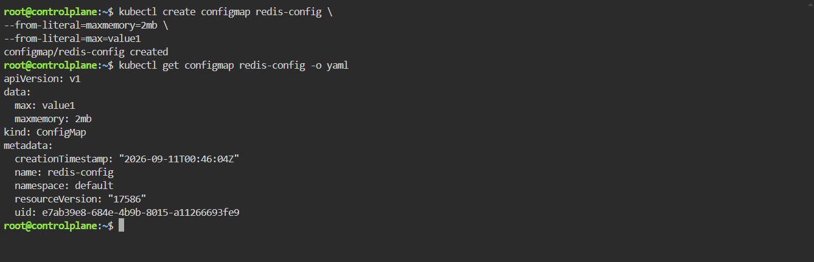

# CÁC BÀI THỰC HÀNH CKAD ĐỂ QUẢN TRỊ CỤM K8S

Các bài thực hành và môi trường được thực hiện trên <https://killercoda.com/chadmcrowell/course/ckad/>

## 1. Creating a pod with configMap

### Bài 1 - Create a configmap: named `redis-config` . Within the configMap, use the key `maxmemory` with value 2mb and key `maxmemory-policy` with value `allkeys-lru` 

Solutions:

```bash
kubectl create configmap redis-config \
--from-literal=maxmemory=2mb \
--from-literal=max=value1
# Đây là cách viết Config map theo imperative(mệnh lệnh). Có ưu điểm nhanh gọn. 
# Còn cách viết Declarative(khai báo) thì nó có file yaml đc lưu lại ,commit vào git và lưu lại được

# Lấy object ConfigMap tên redis-config ra, và in ra dưới dạng YAML đầy đủ
kubectl get configmap redis-config -o yaml
```

Result:



### Bài 2 - Create the YAML for a pod with configMap attached: Create a pod named redis-pod that uses the image redis:7 and exposes port 6379 . Use the command redis-server /redis-master/redis.conf to store redis configuration data and store this in an emptyDir volume. Mount the redis-config configmap data to the pod for use within the container

Solutions:

```bash
kubectl run redis-pod --image=redis:7 --port=6379 \
--dry-run=client -o yaml \
--command redis-server /redis-master/redis-conf > redis-pod.yaml
# khởi động Redis server, đọc cấu hình từ file /redis-master/redis.conf (chính file mà initContainer đã sinh ra trước đó với maxmemory 256mb và maxmemory-policy allkeys-lru).
```

```bash
cat << 'OUTER_EOF' > redis-pod.yaml
apiVersion: v1
kind: Pod
metadata:
  name: redis-pod
spec:
  initContainers:
  - name: init-redis-config
    image: busybox:1.36
    command:
    - sh
    - -c
    - |
      set -e
      cat <<CONF_EOF >/redis-master/redis.conf
      maxmemory $(cat /configmap/maxmemory)
      maxmemory-policy $(cat /configmap/maxmemory-policy)
      CONF_EOF
    volumeMounts:
    - name: redis-config
      mountPath: /redis-master
    - name: redis-config-map
      mountPath: /configmap
      readOnly: true
  containers:
  - name: redis
    image: redis:7
    command:
    - redis-server
    - /redis-master/redis.conf
    ports:
    - containerPort: 6379
    volumeMounts:
    - name: redis-config
      mountPath: /redis-master
    - name: redis-data
      mountPath: /redis-data
  volumes:
  - name: redis-config-map
    configMap:
      name: redis-config
  - name: redis-config
    emptyDir: {}
  - name: redis-data
    emptyDir: {}
OUTER_EOF
```

```bash
k apply -f redis-pod.yaml
k get pod redis-pod -o wide
k logs redis-pod
```

Result:

```bash
root@controlplane:~$ k apply -f
root@controlplane:~$ k get pod redis-pod -o wide
NAME        READY   STATUS   RESTARTS      AGE   IP             NODE           NOMINATED NODE   READINESS GATES
redis-pod   0/1     Error    2 (16s ago)   18s   192.168.0.26   controlplane   <none>           <none>
root@controlplane:~$ k logs redis-pod
Defaulted container "redis" out of: redis, init-redis-config (init)

Defaulted container "redis" out of: redis, init-redis-config (init)
1:C 11 Sep 2026 01:14:05.698 * oO0OoO0OoO0Oo Redis is starting oO0OoO0OoO0Oo
1:C 11 Sep 2026 01:14:05.698 * Redis version=7.4.11, bits=64, commit=00000000, modified=0, pid=1, just started
1:C 11 Sep 2026 01:14:05.698 * Configuration loaded
1:M 11 Sep 2026 01:14:05.698 * Increased maximum number of open files to 10032 (it was originally set to 1024).
1:M 11 Sep 2026 01:14:05.698 * monotonic clock: POSIX clock_gettime
1:M 11 Sep 2026 01:14:05.699 * Running mode=standalone, port=6379.
1:M 11 Sep 2026 01:14:05.699 * Server initialized
1:M 11 Sep 2026 01:14:05.699 * Ready to accept connections tcp
```

### Bài 3: Check the pod configuration settings: Connect to the redis-pod container using the Redis CLI and inspect the configuration values.

Solutions:

```bash
kubectl exec -it redis-pod -- redis-cli
CONFIG GET maxmemory
CONFIG GET maxmemory-policy
```

Result:

```bash
root@controlplane:~$ kubectl exec -it redis-pod -- redis-cli
Defaulted container "redis" out of: redis, init-redis-config (init)
127.0.0.1:6379> CONFIG GET maxmemory
1) "maxmemory"
2) "268435456"
127.0.0.1:6379> CONFIG GET maxmemory-policy
1) "maxmemory-policy"
2) "allkeys-lru"
127.0.0.1:6379> 
```

## 2. Debug services in Kubernetes

### Check if pods are running and have endpoints

1. Run the command to list the pods and their labels
2. Run the command to list the pods by their label
3. Run a command to get the pod IP addresses
4. Run the command to view which port the pods are exposed on.
5. Use this command to run busybox pod and get a shell to it for troubleshooting:

```bash
kubectl run -it --rm --restart=Never busybox --image=gcr.io/google-containers/busybox sh
```

Solution:

```bash
# Lists pod show label
kubectl get pods --show-labels
# list the pods by their label
kubectl get pods -l app=hostnames
# Run a command to get the pod IP addresses
kubectl get pod -o wide
# Run the command to view which port the pods are exposed on.
for ep in 192.168.0.85:9376 192.168.0.26:9376 192.168.0.124:9376; do
    wget -qO- $ep
done
```

Result:

```bash
NAME                         READY   STATUS    RESTARTS   AGE     LABELS
hostnames-56d58486f5-8kbvn   1/1     Running   0          4m57s   app=hostnames,pod-template-hash=56d58486f5
hostnames-56d58486f5-cdzkt   1/1     Running   0          4m57s   app=hostnames,pod-template-hash=56d58486f5
hostnames-56d58486f5-lx4ts   1/1     Running   0          4m57s   app=hostnames,pod-template-hash=56d58486f5

NAME                         READY   STATUS    RESTARTS   AGE
hostnames-56d58486f5-8kbvn   1/1     Running   0          4m57s
hostnames-56d58486f5-cdzkt   1/1     Running   0          4m57s
hostnames-56d58486f5-lx4ts   1/1     Running   0          4m57s

NAME                         READY   STATUS    RESTARTS   AGE     IP              NODE           NOMINATED NODE   READINESS GATES
hostnames-56d58486f5-8kbvn   1/1     Running   0          4m57s   192.168.0.85    controlplane   <none>           <none>
hostnames-56d58486f5-cdzkt   1/1     Running   0          4m57s   192.168.0.26    controlplane   <none>           <none>
hostnames-56d58486f5-lx4ts   1/1     Running   0          4m57s   192.168.0.124   controlplane   <none>           <none>

hostnames-56d58486f5-8kbvn
hostnames-56d58486f5-cdzkt
hostnames-56d58486f5-lx4ts 
```

## 3. Create Node affinity to a pod

### Bài 1: In the namespace named 012963bd , create a pod named az1-pod which uses the busybox:1.28 image. This pod should use node affinity, and prefer during scheduling to be placed on the node with the label availability-zone=zone1 with a weight of 80. Also, have that same pod prefer to be scheduled to a node with the label availability-zone=zone2 with a weight of 20

Solution:

```bash
kubectl create namespace 012963bd
kubectl get namespace 
```

```bash
kubectl get nodes -A
```

```bash
kubectl label node controlplane availability-zone=zone1 --overwrite
kubectl label node node01 availability-zone=zone2 --overwrite
```

```bash
echo <<'EOF_MANIFEST' > az1-pod.yaml
apiVersion: v1
kind: Pod
metadata:
    name: az1-pod
    namespace: 012963bd
spec:
    affinity:
        nodeaffinity:
            preferredDuringSchedulingIgnoredDuringExecution:
            - weight: 80
              preference:
                matchExpressions:
                - key: availability-zone
                  operator: In
                  values:
                  - zone1
            - weight: 20
              preference:
                matchExpressions:
                - key: availability-zone
                  operator: In
                  values:
                  - zone2
    containers:
    - name: main
      image: busybox:1.28
      command: ["sh","-c","sleep 3600"]
    restartPolicy: Never
EOF_MANIFEST
```

## 4. Create a expose nodeport port=8080 targetport=8080.

```bash
kubectl expose deployment java-hello --port=8080 --target-port=8080 --type=NodePort
kubectl expose deploy custom-nginx --port=80 --type=NodePort --name=custom-nginx-svc
```

## 5. Explain affinity

```bash
kubectl explain pod.spec.affinity.nodeAffinity --recursive
```

## 6. Update deployment

```bash
kubectl set
```

## 7. Delete all pod but keep ns intact

```bash
kubectl delete pods --all
# → Pod cũ biến mất, vài giây sau Pod MỚI xuất hiện (tên khác, IP khác.Nhờ Replica Set 
```

## 8. Command

Cu phap:

```bash
--command -- <command> <arg1> <arg2> ...
```

Ví dụ:

```bash
kubectl run sleeper -n session283884 --image=busybox --command -- sh -c "sleep 3600"
```

## 9. Create a pod in the session283884 namespace with a preStop lifecycle hook that sleeps for 10 seconds before termination. Use image nginx

```bash
apiVersion: v1
kind: Pod
metadata:
  name: prestop
spec:
  containers:
  - name: nginx
    image: nginx
    lifecycle:
      preStop:
        exec:
          command: ["sleep", "10"]
```

Rồi:

```bash
kubectl apply -f prestop.yaml
#preStop: Cho phép bạn chạy 1 lệnh can thiệp vào đúng thời điểm container sắp bị kill, trước khi Kubernetes gửi tín hiệu dừng thật sự.
```

## 10. add labels

```bash
kubectl label pod nginx app=web tier=frontend
kubectl label node nginx app=web tier=frontend
```

## 11. Create a one-time Job

```bash
kubectl -n session283884 create job oneshot --image=busybox -- command -- sh -c "echo Hello CKAD"
nano countdown.yaml
```

```yaml
apiVersion: batch/v1
kind: Job
metadata:
  name: countdown
spec:
  template:
    metadata:
      name: countdown
    spec:
      containers:
      - name: counter
        image: centos: 7
        command:
        - sh
        - -c
        - "for i in 9 8 7 6 5 4 3 2 1; do echo $i ; done"
      restartPolicy: Never
```

```bash
kubectl apply -f countdown.yaml
```

```bash
# List job:
kubectl get job
kubectl get pods

# Check Kq Job:
kubectl logs job/countdown
9
8
...
```

## 12. Secret as env vars

```yaml
apiVersion: v1
kind: Pod
metadata:
  name: pod1
spec:
  containers:
  - name: containers
    image: nginx
    env:
    - name: vuive1
      valueFrom:
        secretKeyRef:
          name: db-secret
          key: ref1
```

```yaml
apiVersion: v1
kind: Pod
metadata:
  name: limited
  namespace: testckad
spec:
  containers:
  - name: nginx
    image: nginx
    resources:
      requests:
        memory: "64Mi"
        CPU: "100m"
      limits:
        memory: "128Mi"
        CPU: "200m"
```

> Tức là giá trị của: `db-secret/ref1` được đưa vào container dưới biến môi trường: `vuive1`

```bash
kubectl apply -f pod1.yaml
kubectl get pod pod1
kubectl exec pod1 -- printenv vuive1
kubectl get secret db-secret
# db-secret phải tồn tại trước
```

## 13. Resource requests và limits

YAML này:

```yaml
apiVersion: v1
kind: Pod
metadata:
  name: limited
  namespace: testckad
spec:
  containers:
  - name: nginx
    image: nginx
    resources:
      requests:
        memory: "64Mi"
        CPU: "100m"
      limits:
        memory: "128Mi"
        CPU: "200m"
```

Ý nghĩa:

`requests`:
  
- CPU    = 100m = 0.1 CPU
- memory = 64Mi

`limits`:
  
- CPU    = 200m = 0.2 CPU
- memory = 128Mi

> **requests** là lượng tài nguyên Kubernetes dùng để tính toán/sắp xếp Pod lên node.
>
>**limits** là mức tối đa container được phép sử dụng.

Tạo namespace trước nếu chưa có:

```bash
kubectl create namespace testckad
```

Apply:

```bash
kubectl apply -f limited.yaml
```

Kiểm tra:

```bash
kubectl -n testckad describe pod limited
```

## 14. ReadinessProbe

```yaml
apiVersion: v1
kind: Pod
metadata:
  name: nginx-ready
  namespace: session283884
spec:
  containers:
  - name: nginxcontainer
    image: nginx
    readinessProbe:
      httpGet:
        path: /
        port: 80
      initialDelaySeconds: 3
      periodSeconds: 10
      successThreshold: 3
```

>**Readiness Probe**: Mục đích là cho Kubernetes biết Pod đã sẵn sàng nhận traffic hay chưa.

```bash
nano readiness.yaml
kubectl apply -f readiness.yaml
kubectl get pod -n session283884

# Ban đầu có thể thấy: 0/1 Running

# sau khi probe thành công 3 lần thì hiện: 1/1 Running

# Có thể xem chi tiết:
kubectl describe pod nginx-ready -n session283884

# phần Events sẽ thấy các lần probe thành công/thất bại.
```

## 15. Forward Port

```bash
kubectl port-forward pod/nginx-pf 8080:80
# Forward gói tin từ máy local host vào trong Pod
```

## 16. Xem tong so container trong 1 Pod

```bash
kubectl get pod nginx -o jsonpath='{.spec.containers[*].name}'
```

## 17. ServiceAccount

**ServiceAccount** (viết tắt là SA) trong Kubernetes là một tài nguyên dùng để cấp danh tính (identity) và quyền truy cập cho ứng dụng/Pod khi nó cần tương tác với Kubernetes API Server.

User Account (Tài khoản người dùng): Dành cho con người (Developer, Admin, DevOps) đăng nhập để quản lý cluster (thường qua kubectl).

ServiceAccount (Tài khoản dịch vụ): Dành cho phần mềm / Pod / Container đang chạy bên trong cluster (ví dụ: Nginx Ingress, CI/CD runner, Prometheus...).

- ServiceAccount = "Thẻ căn cước" của Pod/Ứng dụng trong Kubernetes.

```bash
kubectl -n session283884 create serviceaccount build-bot
```

```yaml
apiVersion: v1
kind: Pod
metadata:
  name: podcreate
spec:
  serviceAccountName: build-bot
  containers:
  - name: vuive
    image: busybox
    command:
    - sh
    - -c
    - sleep 3600
```

## 18. Role and RoleBinding

```bash
kubectl -n session283884 create role pod-reader --verb=get,list,watch --resource=pods
kubectl -n session283884 create rolebinding read-pods-binding --role=pod-reader --serviceaccount=session283884:build-bot
```

### Create a Role in the session283884 namespace that restricts deleting pods and test access with `kubectl auth can-i`

```bash
kubectl -n session283884 create role no-delete-pods --verb=get,list --resource=pods
kubectl -n session283884 create rolebinding deny-delete-binding --role=no-delete-pods --serviceaccount=session283884:build-bot
kubectl -n session283884 auth can-i delete pods --as=system:serviceaccount:session283884:build-bot
```

## 19. Drop Linux Capabilities

```yaml
apiVersion: v1
kind: Pod
metadata:
  name: test
  namespace: session283884
spec:
  containers:
  - name: nginx
    image: nginx
    securityContext:
      capabilites:
        drop: "All"
```

## 20. PodSecurity Restricted Namespace

```bash
kubectl label ns session283884 pod-security.kubernetes.io/enforce=restricted
# bật mức bảo mật restricted cho namespace session283884
```

```yaml
apiVersion: v1
kind: Pod
metadata:
  name: sajdk
  namespace: session283884
spec:
  containers:
  - name: jdasd
    image: nginx
    securityContext:
      privileged: true
```

## 21. Deny All Ingress

```yaml
apiVersion: v1
kind: Namespace
metadata:
  name: payments
---
apiVersion: apps/v1
kind: Deployment
metadata:
  name: api
  namespace: payments
spec:
  replicas: 2
  selector:
    matchLabels:
      app: api
  template:
    metadata:
      labels:
        app: api
    spec:
      containers:
      - name: nginx
        image: nginx:1.25
        ports:
        - containerPort: 80
---
apiVersion: v1
kind: Service
metadata:
  name: api
  namespace: payments
spec:
  selector:
    app: api
  ports
  - port: 80
    targetPort: 80
---
apiVersion: apps/v1
kind: Deployment
metadata:
  name: worker
  namespace: payments
spec:
  replicas: 1
  selector:
    matchLabels:
      app: worker
  template:
    metadata:
      labels:
        app: worker
    specs:
      containers:
      - name: busybox
        image: busybox:1.36
        command:
        - sh
        - -c
        - sleep 3600
apiVersion:  networking.k8s.io/v1
kind: NetworkPolicy
metadata:
  name: default-deny
  namespace: payments
spec:
  podSelector: {}
  policyTypes:
  - Ingress
  - Egress
  ingress: []
  egress: []
```

## 22. AllowNameSpace Traffic

```yaml
apiVersion: v1
kind: NetworkPolicy
metadata:
  name: allow-namespace-traffic
  namespace: allow-ns
spec:
  podSelector:
    matchLabels:
      app=web
  policyTypes:
  - Ingress
  ingress:
  - from:
    - namespaceSelector:
        matchLabels:
          access: granted
    ports:
    - protocol: TCP
      port: 80
```

Allow Label-Based Traffic

```yaml
apiVersion: networking.k8s.io/v1
kind: NetworkPolicy
metadata:
  name: allow-label-traffic
  namespace: testckad
spec:
  podSelector:
    matchLabels:
      app: web
  policyTypes:
  - Ingress
  ingress:
  - from:
    - podSelector:
        matchLabels:
          access: granted
    ports:
    - protocol: TCP
      port: 80
```

```yaml
apiVersion: networking.k8s.io/v1
kind: NetworkPolicy
metadata:
  name: allow-only-port
  namespace: allow-port
spec:
  podSelector:
    matchLabels:
      app: api
  policyTypes:
  - Ingress
  ingress:
    ports:
    - port: 80
      protocol: TCP 
    from: 
    - podSelector: {} 
```

Lưu ý:

- `from`: danh sách nguồn được phép
- `podSelector: {}`: mọi Pod trong Namespace hiện tại
- Nếu xóa 2 dòng cuối này đi nghĩa là mọi traffic từ bất kỳ nguồn nào. Còn ghi như này nghĩa là chỉ traffic trong Namespace.
- `spec.podSelector` khác hoàn toàn `ingress.from.podSelector`(Cho phép Pod frontend → Pod được policy bảo vệ.) và `egress.to.podSelector`(Pod được policy bảo vệ được phép đi ra database.). `spec.podSelector` nó chọn Pod mà NetworkPolicy áp dụng vào.

```yaml
apiVersion: networking.k8s.io/v1
kind: NetworkPolicy
metadata:
  name: block-egress
  namespace: block-egress
spec:
  podSelector:
    matchLabels:
      app: api
  policyTypes:
  - Ingress
  - Egress
  ingress:
  - ports:
    - protocol: TCP
      port: 80
    from:
    - podSelector: {}
  egress: []
```

## 23. Headless Service

- Service không có ClusterIP
- Nó dùng khi bạn không muốn Kubernetes đưa cho mình một IP đại diện, mà muốn client nhìn thấy trực tiếp IP của các Pod phía sau Service.

Ví dụ:

```apiVersion: v1
kind: StatefulSet
metadata:
  name: web
  namespace: stateful-demo
spec:
  serviceName: web
  replicas: 3
  seletor:
    matchLabels:
      app: web
  template:
    metadata:
      labels:
        app: web
    spec:
      serviceAccountName: web-sa
      containers:
      - name: nginx
        image: nginx:1.25
        ports
        - containerPort: 80
```

```yaml
apiVersion: v1
kind: Service
metadata:
  name: api
spec:
  clusterIP: None
  selector:
    app: api
  ports:
    - port: 80
```

## 24. Test DNS Resolution

```yaml
kubectl create namespace dns-lab
kubectl create namespace web
```

```yaml
apiVersion: v1
kind: Pod
metadata:
  name: dns-client
  namespace: dns-lab
spec:
  containers:
  - name: dns-lab
    image: busybox:1.36
    command:
    - sh
    - -c
    - sleep 3600
---
apiVersion: v1
kind: Service
metadata:
  name: web
  namespace: web
spec:
  selector:
    app: web
  ports:
  - port: 80
    targetPort: 80
```

Test

```bash
kubectl -n dns-lab exec dns-client -- nslookup web
```

Fail because namespace different

```bash
kubectl -n dns-lab exec dns-client --nslookup web.web.svc.cluster.local
altimage
```

**Lý do**: Kubernetes DNS (thường là CoreDNS) tự động tạo DNS record cho Service:

```text
web.web.svc.cluster.local
│   │   │   │
│   │   │   └── cluster domain
│   │   └────── service
│   └────────── namespace
└────────────── service name
```

- Khi chỉ ghi mỗi web như trường hợp đầu tiên nó sẽ hiểu thành: `web.dns-lab.svc.cluster.local` do đang đứng ở namespace: `dns-lab.svc`

- Khi ghi đầy đủ: FQDN, CoreDNS nhận được và biết sau đó trả về ClusterIP của Service.

- DNS được tạo cho Service ngay cả khi chưa có Pod: chỉ cần bạn selector: app: web thì ngay cả chưa tạo Pod thì Service vẫn tồn tại.

- Convert to headless service and resolve pod

```bash
kubectl -n web delete service web
kubectl -n web expose deployment web --name=web --port=80 --cluster-ip=None
```

Test:

```bash
kubectl -n dns-lab exec dns-client -- nslookup web.web.svc.cluster.local
altimage
```

## 25. ExternalName Service

```bassh
apiVersion: v1
kind: Service
metadata:
  name: external-search
  namespace: externalname-demo
spec:
  type: ExternalName
  externalName: www.google.com
```

Lưu ý: **ExternalName** là một loại Kubernetes Service đặc biệt. Nó dùng khi bạn muốn: Một tên Service trong Kubernetes trỏ tới một hostname bên ngoài Kubernetes. Nó không phải là DNS Server.

## 26. Create an Ingress named web-ingress that routes web.example.com to a service named web

```bash
apiVersion: networking.k8s.io/v1
kind: Ingress
metadata:
  name: web-ingress
  namespace: ingress-host-routing
spec:
  ingressClassName: nginx
  rules:
  - host: web.example.com
    http:
      paths:
      - path: /
        pathType: Prefix
        backend:
          service:
            name: web
            port:
              number: 80
```

```bassh
kubectl -n ingress-host-routing get ingress web-ingress
```

```bash
NODE_IP=$(kubectl get nodes -o jsonpath='{range .items[*]}{.status.addresses[?(@.type=="InternalIP")].address}{"\n"}{end}')
curl -I -H 'Host: web.example.com' http://$NODE_IP:30000/
```

## 27. Ingress with TLS

- Create a cert.

```bash
openssl req -x509 -nodes -days 365 -newkey rsa:2048 -keyout tls.key -out tls.crt \
  -subj "/CN=tls.example.com/O=Example Org"
```

Create secret for cert.

```bash
kubectl -n ingress-tls create secret tls tls-secret --cert=tls.crt --key=tls.key
```

```bash
kubectl -n ingress-tls create deploy web --image=nginx:1.25 --port=80
kubectl -n ingress-tls expose deploy web --port=80 --target-port=80
```

```yaml
apiVersion: networking.k8s.io/v1
kind: Ingress
metadata:
  name: web-ingress
  namespace: ingress-tls
spec:
  ingressClassName: nginx
  tls:
  - hosts:
    - tls.example.com
    secretName: tls-secret
  rules:
  - host: tls.example.com
    http:
      paths:
      - path: /
        pathType: Prefix
        backend:
          service:
            name: web
            port:
              number: 80
```

```bash
kubectl -n ingress-tls get ingress web-ingress -o yaml | sed -n '1,40p'
```

Test

```bash
NODE_IP=$(kubectl get nodes -o jsonpath='{range .items[*]}{.status.addresses[?(@.type=="InternalIP")].address}{"\n"}{end}')
curl -kI -H 'Host: tls.example.com' https://$NODE_IP:30443/
```

## 28. Ingress Install

```bash
#apply the official manifest
kubectl apply -f https://raw.githubusercontent.com/kubernetes/ingress-nginx/main/deploy/static/provider/cloud/deploy.yaml
```

```bash
# wait for the controller pod to be ready
kubectl -n ingress-nginx rollout status deploy/ingress-nginx-controller --timeout=180s
```

```bash
# list controller pods
kubectl -n ingress-nginx get pods -l app.kubernetes.io/component=controller
```

```bash
# inspect the service exposing the controller
kubectl -n ingress-nginx get svc ingress-nginx-controller
```

**Note**: In the Killercoda environment the EXTERNAL-IP column displays permanently, because there is no external load balancer available. Use the NodePort listed in the service instead when you need to access the controller.

```bash
# change the service type to NodePort so it is reachable
kubectl -n ingress-nginx patch svc ingress-nginx-controller -p '{"spec":{"type":"NodePort","ports":[{"name":"http","port":80,"protocol":"TCP","targetPort":80,"nodePort":30000},{"name":"https","port":443,"protocol":"TCP","targetPort":443,"nodePort":30443}]}}'
```

```bassh
# confirm the NodePort that was allocated
kubectl -n ingress-nginx get svc ingress-nginx-controller -o wide
```

```bash
# just the INTERNAL-IP column for quick reference
NODE_IP=$(kubectl get nodes -o jsonpath='{range .items[*]}{.status.addresses[?(@.type=="InternalIP")].address}{"\n"}{end}')
```

```bash
# sample backend to exercise the controller
kubectl create deploy demo --image=nginx:1.25 --port=80
kubectl expose deploy demo --port=80 --target-port=80
```

```yaml
apiVersion: networking.k8s.io/v1
kind: Ingress
metadata:
  name: demo
  namespace: default
spec:
  ingressClassName: nginx
  rules:
  - host: demo.local
    http:
      paths:
      - path: /
        pathType: Prefix
        backend:
          service:
            name: demo
            port:
              number: 80
```

```bash
# hit the ingress with the Host header
curl -I -H 'Host: demo.local' http://$NODE_IP:30
```

## 29. Canary Ingress

Các bước thực hiện:

- Tạo Web và webv2 để scale Canary dần dần lên.

```bash
# Solution commands for canary-ingress
cat <<'EOF' | kubectl apply -f -
apiVersion: v1
kind: Namespace
metadata:
  name: canary-ingress
---
apiVersion: apps/v1
kind: Deployment
metadata:
  name: web
  namespace: canary-ingress
spec:
  replicas: 2
  selector:
    matchLabels:
      app: web
  template:
    metadata:
      labels:
        app: web
    spec:
      containers:
      - name: echo
        image: hashicorp/http-echo:0.2.3
        args:
        - "-text=web"
        ports:
        - containerPort: 5678
---
apiVersion: apps/v1
kind: Deployment
metadata:
  name: web-v2
  namespace: canary-ingress
spec:
  replicas: 1
  selector:
    matchLabels:
      app: web-v2
  template:
    metadata:
      labels:
        app: web-v2
    spec:
      containers:
      - name: echo
        image: hashicorp/http-echo:0.2.3
        args:
        - "-text=web-v2"
        ports:
        - containerPort: 5678
---
apiVersion: v1
kind: Service
metadata:
  name: web
  namespace: canary-ingress
spec:
  selector:
    app: web
  ports:
  - port: 80
    targetPort: 5678
---
apiVersion: v1
kind: Service
metadata:
  name: web-v2
  namespace: canary-ingress
spec:
  selector:
    app: web-v2
  ports:
  - port: 80
    targetPort: 5678
EOF
```

```bash
# primary ingress sending 100% of traffic to web
cat <<'EOF' | kubectl apply -f -
apiVersion: networking.k8s.io/v1
kind: Ingress
metadata:
  name: web
  namespace: canary-ingress
  annotations:
    nginx.ingress.kubernetes.io/rewrite-target: /
spec:
  ingressClassName: nginx
  rules:
  - host: canary.local
    http:
      paths:
      - path: /
        pathType: Prefix
        backend:
          service:
            name: web
            port:
              number: 80
EOF
```

```bash
# canary ingress sending 10% of traffic to web-v2
cat <<'EOF' | kubectl apply -f -
apiVersion: networking.k8s.io/v1
kind: Ingress
metadata:
  name: web-canary
  namespace: canary-ingress
  annotations:
    nginx.ingress.kubernetes.io/canary: "true"
    nginx.ingress.kubernetes.io/canary-weight: "10"
spec:
  ingressClassName: nginx
  rules:
  - host: canary.local
    http:
      paths:
      - path: /
        pathType: Prefix
        backend:
          service:
            name: web-v2
            port:
              number: 80
EOF
```

```bash
# busybox client to probe ingress responses
kubectl -n canary-ingress run curl --image=busybox:1.36 --restart=Never --command -- sh -c "while true; do wget -O- \
  --header="Host: canary.local" \
  http://10.0.10.26:30000 && sleep 1; done"
```

```bash
# stream several responses to observe ~90/10 split
kubectl -n canary-ingress logs -f curl
```

### 29.1 Các cách tăng Canary đang có hiện tại:

- Thông thường người ta phải tăng Canary lên phiên bản mới hơn nếu nó hoạt động tốt và ổn định vậy tăng như nào:

- `Cách 1`: Sửa YAML rồi apply

  - Đổi: canary-weight: "20" rồi apply

- `Cách 2`: Sửa trực tiếp bằng kubectl overwrite:

```bash
kubectl -n canary-ingress annotate ingress web-canary \
  nginx.ingress.kubernetes.io/canary-weight="20" \
  --overwrite
```

- `Cách 3`: Edit: kubectl -n canary-ingress edit ingress web-canary

### 29.2 Sau khi test xong

- Bạn test xong và cho rằng v2 đã hoàn toàn tốt và ổn định đủ để thay thế bản cũ:

  - Sửa main ingress:

```yaml
backend:
  service:
    name: web-v2
```

- Apply lại

- Sau đó xóa Canary Ingress: kubectl -n canary-ingress delete ingress web-canary