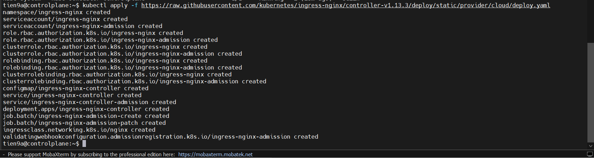
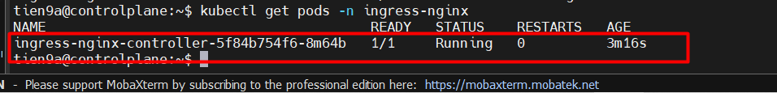
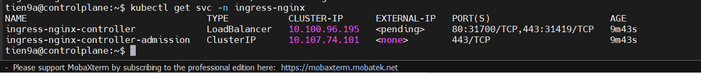
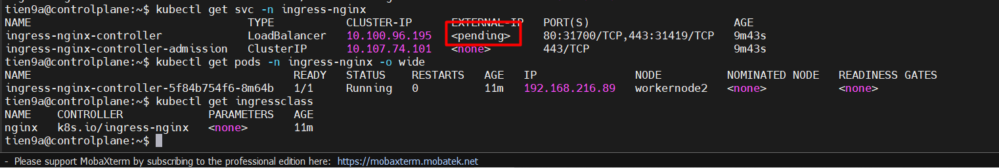
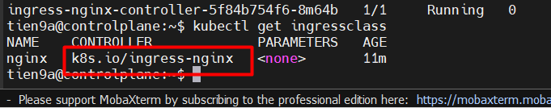
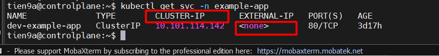
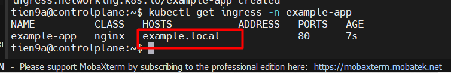
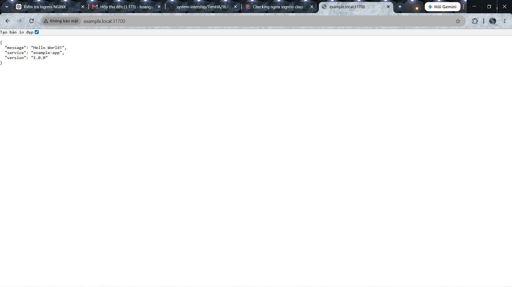
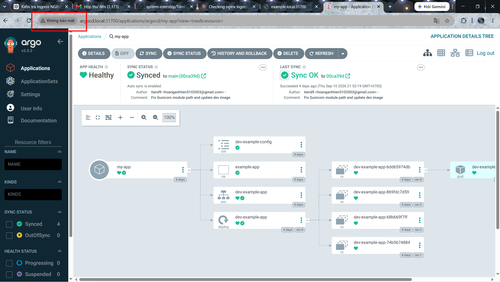
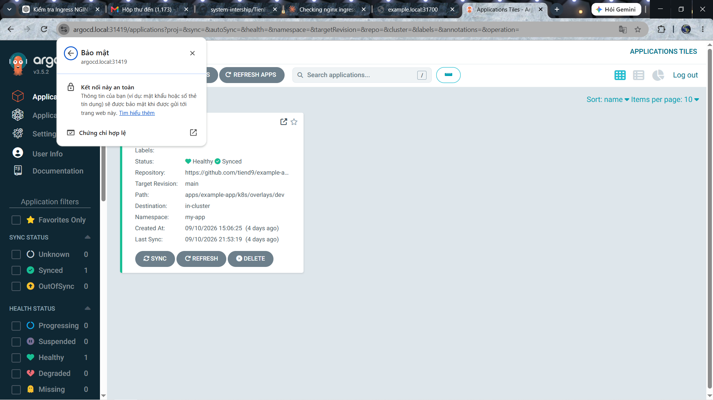

# CÀI ĐẶT INGRESS CONTROLLER CHO CỤM K8s VÀ INGRESS + TLS

Ingress là một Kubernetes API object dùng để khai báo luật routing HTTP/HTTPS từ bên ngoài vào các Service trong cluster.

Ingress là một API resource cho phép quản lý external access vào Services qua HTTP/HTTPS, hỗ trợ path-based routing, host-based routing, TLS termination và load balancing.

Hiểu đơn giản nhất: Ingress là một tập luật routing HTTP/HTTPS, dùng để quyết định request từ bên ngoài sẽ được chuyển đến Service nào bên trong Kubernetes

**Ingress** là rule; **Ingress Controller** là thằng thực thi rule đó.

## LAB

### Bước 1: Cài Ingress Controller vào cụm K8s để cấu hình cho service `dev-example-app`

Giả sử ta có 1 cụm K8s bất kì: Minikube, K8s thường. Ta lấy cụm làm Lab AgroCD ở bài [trước](https://github.com/tiend9/system-intership/blob/master/TienHA/16.K8s/Labs/07.Deploy_app_with_ArgoCD.md) Ta cài đặt Ingress Controller về:

```bash
# Cụm K8s thường. Tải bằng manifest chính thức:
kubectl apply -f https://raw.githubusercontent.com/kubernetes/ingress-nginx/controller-v1.13.3/deploy/static/provider/cloud/deploy.yaml

# Cụm minikube
minikube addons enable ingress
```



Sau đó. Check:

```bash
# Cụm K8s thường
kubectl get pods -n ingress-nginx
```



Sau đó đợi pods chuyển sang:`ingress-nginx-controller-xxxxx   1/1   Running`

Rồi kiểm tra:

```bash
# check Ingress NGINX được expose ra ngoài bằng cách nào
kubectl get svc -n ingress-nginx
# Check Kiểm tra IngressClass mà cluster có
kubectl get ingressclass
```



Output:



=> Output này cho thấy Ingress NGINX đã tạo Service thành công, nhưng có một điểm cần chú ý:

`ingress-nginx-controller   LoadBalancer   10.100.96.195   <pending>   80:31700/TCP,443:31419/TCP`

Trong đó:

- TYPE: **LoadBalancer** → Service muốn được cấp IP bên ngoài cluster.
- CLUSTER-IP: 10.100.96.195 → IP nội bộ Kubernetes.
- EXTERNAL-IP: `<pending>` → chưa có External IP.
- `80:31700` → HTTP có thể được truy cập qua NodePort 31700.
- `443:31419` → HTTPS qua NodePort 31419.



=> Output này cho thấy Cluster của bạn đang có một IngressClass tên là nginx, được điều khiển bởi controller `k8s.io/ingress-nginx`

Trong đó:

- Controller ingress-nginx đã được cài đặt và tự đăng ký thành một IngressClass hợp lệ trong cluster.
- Bất kỳ Ingress nào khai báo spec.ingressClassName: nginx sẽ được controller này xử lý.

### Bước 2: Cấu hình file manifest để thêm Ingress cho `dev-example-app`

Lab hiện tại ta có:

```text
Argo CD
   │
   └── example-app
          │
          └── Service
```

Ta sẽ thêm:

```text
                    ┌── Argo CD
                    │
Browser ──> Ingress NGINX ──> example-app Service ──> Pod
```

Ta viết file manifest cấu hình `Ingress.yaml`. Form mẫu sẽ như sau:

```yaml
apiVersion: networking.k8s.io/v1
kind: Ingress
metadata:
  name: example-app
  namespace: example-app
spec:
  ingressClassName: nginx
  rules:
    - host: example.local
      http:
        paths:
          - path: /
            pathType: Prefix
            backend:
              service:
                name: example-app
                port:
                  number: 80
```

=> **đừng áp dụng đoạn YAML này ngay**, vì phải biết chính xác Service của `example-app` tên gì và port bao nhiêu.

Ta check `Service` của `example-app` tên gì và port bao nhiêu:

```bash
kubectl get svc -n example-app # liệt kê tất cả các Service trong namespace example-app
kubectl get ingress -A # liệt kê tất cả các Ingress resource trên mọi namespace trong cluster
```

Output:



Trong đó:

- `example-app` sử dụng **Cluster-IP** để giao tiếp nội bộ trong Kubernetes Cluster. Service `dev-example-app` cung cấp địa chỉ IP nội bộ `10.101.114.142` và cổng `80`, cho phép các thành phần khác trong cluster, như **Ingress NGINX**, chuyển tiếp request đến các Pod của ứng dụng mà không cần expose ứng dụng trực tiếp ra bên ngoài.

Luồng hiện tại của lab:

```text
                    Kubernetes Cluster
┌─────────────────────────────────────────────────┐
│                                                 │
│  Ingress NGINX                                  │
│  Service: LoadBalancer                          │
│  NodePort: 31700                                │
│       │                                         │
│       ↓                                         │
│  Ingress Controller                             │
│       │                                         │
│       │  Ingress rule                           │
│       ↓                                         │
│  Service: dev-example-app                       │
│  Type: ClusterIP                                │
│  ClusterIP: 10.101.114.142:80                   │
│       │                                         │
│       ↓                                         │
│  example-app Pod                                │
│                                                 │
└─────────────────────────────────────────────────┘
```

Sau khi đã có tên của service ta viết file `Ingress.yaml`:

```yaml
apiVersion: networking.k8s.io/v1 # Api version mà resource sử dụng
kind: Ingress # Loại resource
metadata: # chứa thông tin nhận dạng resource.
  name: example-app # Tên của Ingress resource
  namespace: example-app # Resource Ingress được tạo trong namespace
spec: # là phần chứa cấu hình mong muốn của Ingress.
  ingressClassName: nginx # Báo cho K8s ResourceIngress này do Ingress Controller thuộc class nginx xử lý.
  rules: # nơi định nghĩa luật routing
    - host: example.local # rule này áp dụng cho request có hostname
      http: # rule này xử lý HTTP request
        paths: # Định nghĩa các đường dẫn URL mà Ingress xử lý.
          - path: / # Tất cả request bắt đầu từ / đều được xử lý.
            pathType: Prefix # so khớp theo tiền tố
            backend: # Request sau khi match rule thì chuyển đến đâu?
              service: # chuyển request tới Kubernetes Service.
                name: dev-example-app # Tên Service của app mà ta vừa kiểm tra
                port:
                  number: 80 # Ingress gửi request tới port 80 của Service.
```

### Bước 3: Expose Service `dev-example-app` bên trong Cluster thông qua Node Port

Đầu tiên, ta apply file `ingress.yaml`:

```bash
kubectl apply -f ingress.yaml
```

Kiểm tra:

```bash
kubectl get ingress -n example-app
```

Output:



Tiếp theo, trỏ domain `example.local` về IP Node.

- Vì lab của ta không có DNS thật, trên **máy Windows đang mở browser**, sửa file:
  `C:\Windows\System32\drivers\etc\hosts`

```md
# Thêm

192.168.70.148 example.local

# Nếu IP của controlplane là 192.168.70.150 và Ingress NGINX có thể nhận NodePort trên node đó thì dùng IP này.(Có thể truy cập qua IP của bất kỳ node nào trong cluster, miễn là node đó reachable và cấu hình mạng cho phép)
```

Sẽ có 1 vài trường hợp không truy cập từ browser đc có khả năng chưa allow port ở node K8s:

- Vào Node K8s mà ta truy cập:

```bash
sudo ufw allow 31700/tcp
sudo ufw reload
```

- Ngoài ra cho Node Port hoạt động trên mọi Node(Như output trên Node Port đang chỉ hoạt động ở WorkNode2):

```bash
# Kiểm tra manifest service ingress-nginx-controller
kubectl get svc ingress-nginx-controller -n ingress-nginx -o yaml
# Nếu có dòng:
externalTrafficPolicy: Local
# Chỉnh thành:
externalTrafficPolicy: Cluster
# Có thể Patch cấu hình:
kubectl patch svc ingress-nginx-controller -n ingress-nginx \
  -p '{"spec":{"externalTrafficPolicy":"Cluster"}}'
```

Cuối cùng, truy cập vào Browser. Mở : `http://example.local:31700`



### Bước4: Làm tương tự với ArgoCDUI nhưng sẽ cấu hình thêm TLS

Luồng triển khai tiếp theo:

```text
                       Ingress NGINX
                             │
              ┌──────────────┴──────────────┐
              │                             │
      Host: example.local            Host: argocd.local
              │                             │
              ↓                             ↓
    dev-example-app:80             argocd-server:443
              │                             │
              ↓                             ↓
        example-app Pods                 Argo CD
```

- `argocd-server` thường phục vụ HTTPS, nên Ingress cho Argo CD cần cấu hình phù hợp với backend HTTPS. Không nên đơn giản copy nguyên Ingress `example-app` rồi đổi tên Service.

Cho Argo CD server chạy HTTP phía sau Ingress:

- Tạo và sửa ConfigMap:

```bash
kubectl edit cm argocd-cmd-params-cm -n argocd
```

- Thêm:

```yaml
data:
  server.insecure: "true"
```

- Nếu data: đã tồn tại thì chỉ thêm dòng: `server.insecure: "true"`

- Sau đó restart Argo CD server:

```bash
kubectl rollout restart deployment argocd-server -n argocd
```

- Kiểm tra:

```bash
kubectl get pods -n argocd
```

Tiếp theo kiểm tra Service ArgoCD:

```bash
kubectl get svc argocd-server -n argocd

# Output
tien9a@controlplane:~$ kubectl get svc argocd-server -n argocd
NAME            TYPE        CLUSTER-IP      EXTERNAL-IP   PORT(S)          AGE
argocd-server   ClusterIP   10.96.124.130   <none>        80/TCP,443/TCP   4d
tien9a@controlplane:~$
```

Tạo file Ingress.yaml cho ArgoCD:

```yaml
apiVersion: networking.k8s.io/v1
kind: Ingress
metadata:
  name: argocd
  namespace: argocd
  annotations:
    nginx.ingress.kubernetes.io/force-ssl-redirect: "false"
    nginx.ingress.kubernetes.io/backend-protocol: "HTTP"
spec:
  ingressClassName: nginx
  rules:
    - host: argocd.local
      http:
        paths:
          - path: /
            pathType: Prefix
            backend:
              service:
                name: argocd-server
                port:
                  number: 80
```

Rồi apply:

```bash
kubectl apply -f argocd-ingress.yaml
```

Sau đó, chỉnh file hosts trên máy local :

```md
# Ta đã có

192.168.70.148 example.local

# Thêm

192.168.70.148 argocd.local
```

Cuối cùng, trên Webbrowser truy cập: http://argocd.local:31700



### Bước 5: Cấu hình ArgoCD truy cập bằng HTTPS

Có 2 cách:

**Cách A — Ingress NGINX terminate TLS**: browser → HTTPS → NGINX, rồi NGINX → HTTP → Argo CD. Dễ làm cho lab.

**Cách B — TLS passthrough**: browser → HTTPS → NGINX → HTTPS → Argo CD. Phức tạp hơn vì Argo CD dùng cả HTTP/HTTPS và gRPC trên port 443. Tài liệu Argo CD cũng nêu rõ điểm này.

Với lab của này, ta khuyên **Cách A**.

Đầu tiên, Tạo Root CA:

Trên `controlplane`:

```bash
mkdir -p ~/argocd-tls
cd ~/argocd-tls
```

Tạo private key của Root CA:

```bash
openssl genrsa -out lab-root-ca.key 4096
```

Tạo Root CA certificate:

```bash
openssl req -x509 -new -nodes \
  -key lab-root-ca.key \
  -sha256 \
  -days 3650 \
  -out lab-root-ca.crt \
  -subj "/C=VN/ST=Hanoi/L=Hanoi/O=K8s-Lab/OU=Lab/CN=K8s Lab Root CA"
```

Kiểm tra:

```bash
openssl x509 -in lab-root-ca.crt -text -noout
```

Ta sẽ có:

```text
lab-root-ca.key    # private key - KHÔNG đưa lên Windows
lab-root-ca.crt    # Root CA certificate - cái này đưa lên Windows
```

Chỉ copy `lab-root-ca.crt` sang Windows.

Sau đó, Tạo certificate cho `argocd.local`

- Vì `argocd.local` là domain nội bộ lab, **Let's Encrypt** không phù hợp để cấp chứng chỉ cho hostname này. Với lab, đơn giản nhất là tự tạo **self-signed certificate**.

- Trên máy controlplane:

- Tạo private key:

```bash
# trên thư mục ~/argocd-tls
openssl genrsa -out argocd.local.key 2048
```

**Lưu ý trước khi tạo cert**: browser hiện đại kiểm tra **SAN**, không chỉ `CN`. Vì vậy nên tạo certificate có SAN.

- Tạo file:

```bash
# trên thư mục ~/argocd-tls
nano openssl.cnf
```

- Nội dung:

```ini
[req]
default_bits = 2048
prompt = no
default_md = sha256
req_extensions = req_ext
distinguished_name = dn

[dn]
CN = argocd.local

[req_ext]
subjectAltName = @alt_names

[alt_names]
DNS.1 = argocd.local
```

- Sau đó tạo csr:

```bash
openssl req -new \
  -key argocd.local.key \
  -out argocd.local.csr \
  -config openssl.cnf
```

- Ký certificate bằng Root CA:

```bash
openssl x509 -req \
  -in argocd.local.csr \
  -CA lab-root-ca.crt \
  -CAkey lab-root-ca.key \
  -CAcreateserial \
  -out argocd.local.crt \
  -days 825 \
  -sha256 \
  -extensions req_ext \
  -extfile openssl.cnf
```

- Kiểm tra:

```bash
openssl x509 -in argocd.local.crt -text -noout | grep -A2 "Subject Alternative Name"
```

- Phải thấy: `DNS:argocd.local`

Đưa certificate vào Kubernetes Secret

- Chạy:

```bash
kubectl create secret tls argocd-ingress-tls \
  -n argocd \
  --cert=argocd.local.crt \
  --key=argocd.local.key
```

- Kiểm tra:

```bash
kubectl get secret argocd-ingress-tls -n argocd
```

- Sẽ có:

```bash
argocd-ingress-tls   kubernetes.io/tls
```

=> Đây chính là cơ chế chuẩn của Kubernetes Ingress: **TLS certificate/private key** được đặt trong Secret và Ingress tham chiếu secretName.

Tiếp theo, tạo Ingress HTTPS cho Argo CD:

- Sửa file `argocd-ingress.yaml`:

```yaml
apiVersion: networking.k8s.io/v1
kind: Ingress
metadata:
  name: argocd
  namespace: argocd
  annotations:
    nginx.ingress.kubernetes.io/backend-protocol: "HTTP"
spec:
  ingressClassName: nginx

  tls:
    - hosts:
        - argocd.local
      secretName: argocd-ingress-tls

  rules:
    - host: argocd.local
      http:
        paths:
          - path: /
            pathType: Prefix
            backend:
              service:
                name: argocd-server
                port:
                  number: 80
```

- Apply:

```bash
kubectl apply -f argocd-ingress.yaml
```

**Note**: Ta nhớ phải có cấu hình:

```bash
kubectl edit cm argocd-cmd-params-cm -n argocd
```

- Phải có

```yaml
   data:
  server.insecure: "true"
```

Sửa file host máy local + add `lab-root-ca.crt` và tra trình duyệt web broswer thì kết nối hiển thị an toàn



**Note**:Trong lab dùng Nginx-Ingress Controller để quản lí traffic xuống svc thì còn có các Ingress Controller khác như là **Traefik**, **Kong Ingress Controller**, **Istio Ingress Gateway**