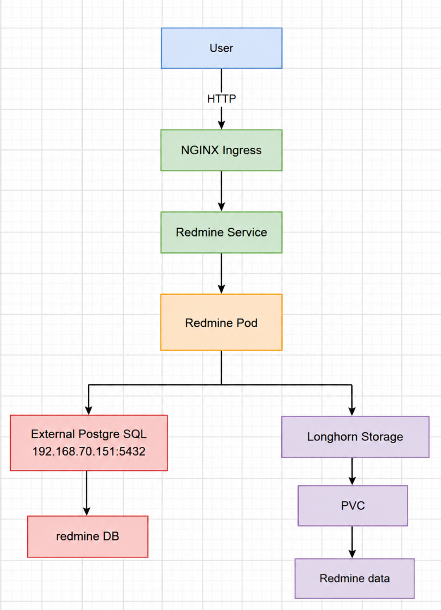
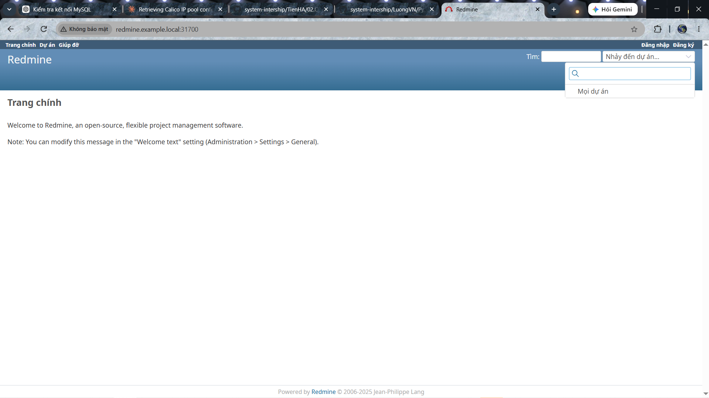
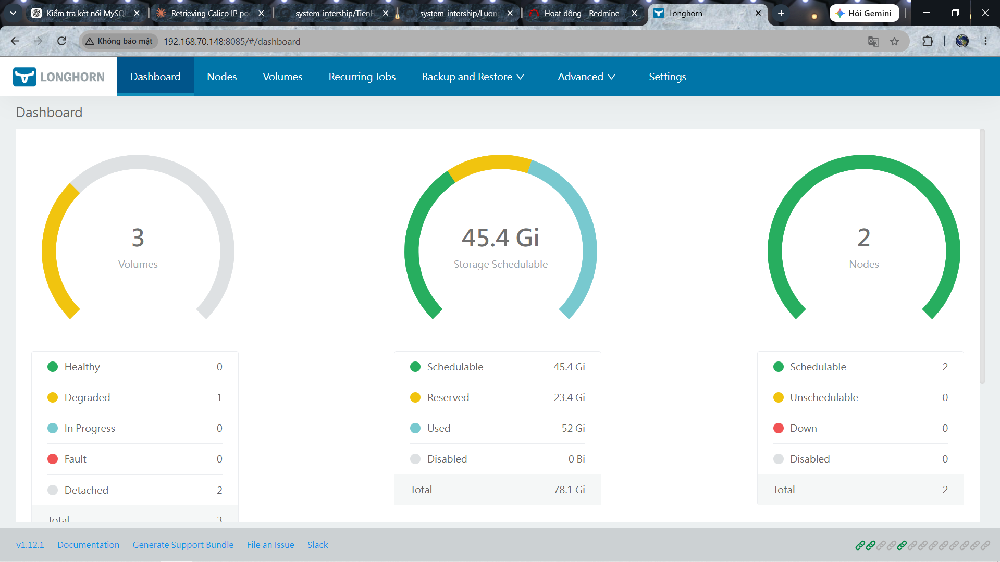

# DEPLOY APP BẰNG HELM CHART

## SỬ DỤNG HELM CHART DEPLOY REDMINE & EXTERNAL POSTGRESQL & LONGHORN

### Sơ đồ bài lab



=> Bài lab này ta sẽ deploy app Redmine sử dụng 2 Backend lưu trữ song song: 1. Backend PostgreSQL bên ngoài Node K8s và 2. Backend bên trong K8s Node sử dụng Longhorn vè thông qua PVC

**Helm chart** giống như một "gói cài đặt" cho ứng dụng chạy trên Kubernetes — tương tự như file .exe cài phần mềm trên Windows, hoặc gói apt install trên Linux.

> Không có Helm — bạn phải tự viết và apply từng file. Có Helm — chỉ cần 1 lệnh

**Longhorn**: là một hệ thống lưu trữ phân tán (distributed storage) dành cho Kubernetes.

Hiểu đơn giản:

> Kubernetes lo chạy app, còn Longhorn lo lưu dữ liệu bền vững (persistent storage) cho app. Pod Redmine chết hoặc được tạo lại thì dữ liệu trong PVC vẫn còn.

**Redmine** là phần mềm quản lý dự án mã nguồn mở (project management), dùng để: quản lý issue/ticket, theo dõi tiến độ, wiki, Gantt chart, quản lý nhiều dự án cùng lúc. Tương tự Jira nhưng miễn phí, viết bằng Ruby on Rails.

Trong bài lab này ta sẽ sử dụng luôn cụm K8s bài [trước](https://github.com/tiend9/system-intership/blob/master/TienHA/16.K8s/Labs/07.Deploy_app_with_ArgoCD.md)

### 1. Cài LongHorn trước

Kiểm tra cluster trước:

```bash
kubectl get nodes
kubectl get storageclass
```

Nếu không thấy StorageClass `longhorn`. Ta sẽ cài về cụm:

- Cài các tiên quyết trc khi cài LongHorn(Trên cả 3 Node):

```bash
sudo apt update
sudo apt install open-iscsi -y
sudo systemctl enable --now iscsid
```

- Sau đó mới cài Helm + LongHorn(Trên node Controller)

```bash
sudo snap install helm --classic

# Add repo
helm repo add longhorn https://charts.longhorn.io
helm repo update

# Có thể check version muốn cài or cài luôn
kubectl create namespace longhorn-system
helm install longhorn longhorn/longhorn --namespace longhorn-system
```

- Check:

```bash
kubectl get pods -n longhorn-system
```

- Check Storage Class lại:

```bash
kubectl get storageclass
```

- Kiểm tra:

```bash
kubectl get storageclass longhorn
```

```bash

tien9a@controlplane:~$ kubectl get storageclass longhorn

NAME       PROVISIONER          RECLAIMPOLICY   VOLUMEBINDINGMODE   ALLOWVOLUMEEXPANSION   AGE

longhorn   driver.longhorn.io   Delete          Immediate           true                   12m

# Binding volume mode tức khi PVC được tạo Volume đc tạo ngay lập tức. Và ALLOWVOLUMEEXPANSION: True là có thể mở rộng volume sau này
```

### 2. Chuẩn bị 1 Node External PostgreSQL

Ta có 3 Node K8s (Controller, WorkerNode1, WorkerNode2)có IP lần lượt là: `192.168.70.148`,`192.168.70.149`,`192.168.70.150` và ta sẽ thêm 1 Node PostgreSQL cấu hình IP `192.168.70.151`:

- Sau khi cài PostgreSQL xong, đăng nhập vào PostgreSQL:(Nhớ chỉnh `bind-port`)

```bash
sudo -u postgres psql
```

- Tạo database và user:

```bash
CREATE DATABASE redmine;
CREATE USER redmine WITH PASSWORD 'Redmine@123';
GRANT ALL PRIVILEGES ON DATABASE redmine TO redmine;

\c redmine

GRANT ALL ON SCHEMA public TO redmine;
ALTER DATABASE redmine OWNER TO redmine;

# Kiểm tra
\l
\du

\c redmine
SELECT current_database();
```

Restart:

```bash
sudo systemctl restart postgresql
```

- Sửa file cấu hình xác thực (authentication) của PostgreSQL:

```bash
sudo nano /etc/postgresql/16/main/pg_hba.conf

# Thêm:
host    redmine    redmine    <IP_Pod_postgresql_client>    scram-sha-256
```

### 3. Test login PostgreSQL từ Kubernetes

- Có thể chạy một pod tạm:

```bash
kubectl run postgres-client \
  --rm -it \
  --image=postgres:16 \
  --command -- bash
```

- Trong container:

```bash
psql -h 192.168.70.151 \
  -U redmine \
  -d redmine \
  -p 5432
```

Nhập:`Redmine@123`

> Note: Đoạn này pod PostgreSQL client trên worker node sẽ không có routing ra node PostgreSQL lên ta cần thêm route thủ công vào node PostgreSQL(Trong Th test nhanh). Trong production thực tế, ta có thể chỉnh ở Router hạ tầng và 1 cách dễ hơn có thể chỉnh cấu hình Calico BGP

```text

              Kubernetes Cluster
       ┌──────────────────────────┐
       │                          │
       │ worker1      worker2     │
       │ .149         .150        │
       │   │            │         │
       │   │ BGP        │ BGP     │
       └───┼────────────┼─────────┘
           │            │
           └──────┬─────┘
                  │
             BGP peering
                  │
          ┌───────▼────────┐
          │ Router thực tế │
          │ / ToR switch   │
          │ 192.168.70.2   │
          └───────┬────────┘
                  │
                  ▼
          ┌────────────────┐
          │ PostgreSQL     │
          │ 192.168.70.151 │
          └────────────────┘

```

```bash
# Liệt kê tất cả các IPPool custom resource do Calico CNI quản lý
kubectl get ippools.crd.projectcalico.org -o yaml

# kiểm tra trực tiếp BGP configuration
kubectl get bgpconfiguration.crd.projectcalico.org -A -o yaml

# kiểm tra trực tiếp BGP peer
kubectl get bgppeers.crd.projectcalico.org -A

# Kiểm tra BGP trạng thái trực tiếp tại node chạy pod

## Kiểm tra
kubectl -n kube-system exec calico-node-<id_node_chua_pod> birdcl show protocols
kubectl -n kube-system exec calico-node-<id_node_chua_pod> birdcl show route

## Kết quả

tien9a@controlplane:~$ kubectl -n kube-system exec calico-node-gkncj -- birdcl show protocols

Defaulted container "calico-node" out of: calico-node, upgrade-ipam (init), install-cni (init), mount-bpffs (init)
BIRD v0.3.3+birdv1.6.8 ready.
name     proto    table    state  since       info
static1  Static   master   up     01:16:07
kernel1  Kernel   master   up     01:16:07
device1  Device   master   up     01:16:07
direct1  Direct   master   up     01:16:07

Mesh_192_168_70_148 BGP      master   up     01:16:09    Established
Mesh_192_168_70_149 BGP      master   up     01:16:09    Established

tien9a@controlplane:~$ kubectl -n kube-system exec calico-node-gkncj -- birdcl show route

Defaulted container "calico-node" out of: calico-node, upgrade-ipam (init), install-cni (init), mount-bpffs (init)
BIRD v0.3.3+birdv1.6.8 ready.
0.0.0.0/0          via 192.168.70.2 on ens33 [kernel1 01:57:27] * (10)
192.168.70.0/24    dev ens33 [direct1 01:57:27] * (240)
                   via 192.168.70.149 on ens33 [Mesh_192_168_70_149 01:57:27] (100/0) [i]
                   via 192.168.70.148 on ens33 [Mesh_192_168_70_148 01:57:27] (100/0) [i]
192.168.70.2/32    via 192.168.70.148 on ens33 [Mesh_192_168_70_148 01:57:27] * (100/0) [i]
                   via 192.168.70.149 on ens33 [Mesh_192_168_70_149 01:57:27] (100/0) [i]
                   dev ens33 [kernel1 01:57:27] (10)
192.168.216.127/32 dev calif8d9c9e5442 [kernel1 01:16:20] * (10)
192.168.49.64/26   via 192.168.70.148 on ens33 [Mesh_192_168_70_148 01:16:09] * (100/0) [i]
192.168.216.78/32  dev calia66dd6347b6 [kernel1 01:16:37] * (10)
192.168.216.80/32  dev cali4f35f3ccf7f [kernel1 01:16:34] * (10)

# Do .2 Là Là NAT device trong VMWare Host lên ta không thể cấu hình BGP lên đó. Nhưng nếu giả sử là hạ tầng thật thì ta sẽ cấu hình:

## Trên router .2: bật BGP:
router bgp 65000
bgp router-id 192.168.70.2

## Trên Calico: cấu hình BGP peer với .2:
192.168.70.150
AS 65001

## Trên Kubernetes tạo BGPPeer. Ví dụ:
apiVersion: projectcalico.org/v3
kind: BGPPeer
metadata:
  name: peer-router

spec:
  peerIP: 192.168.70.2
  asNumber: 65000

## Sau khi applu file mani Router sẽ học route

BGP table:
192.168.216.64/26
    next-hop 192.168.70.150
192.168.212.0/26
    next-hop 192.168.70.149

## Ta có thể xoá route cũ mà ta add ở Node PostgreSQL. Và Router sẽ BGP learned route.
```

### 4. Tạo namespaces cho Redmine

```bash
kubectl create namespace redmine
```

- Kiểm tra:

```bash
kubectl get ns
```

### 5. Tìm Helm Chart Redmine + cấu hình Redmine sử dụng PostgreSQL

- Thêm repo Bitnami:

```bash
helm repo add bitnami https://charts.bitnami.com/bitnami
helm repo update
```

- Tìm Redmine:

```bash
helm search repo redmine
```

- Xem chart:

```bash
helm show chart bitnami/redmine

## Kết quả:
tien9a@controlplane:~$ helm search repo redmine

NAME            CHART VERSION   APP VERSION     DESCRIPTION
bitnami/redmine 34.0.0          6.0.6           Redmine is an open source management applicatio...
```

- Xem các option cấu hình:

```bash
helm show values bitnami/redmine > redmine-values.yaml
```

- Mở:

```bash
nano redmine-values.yaml
```

```yaml
image:

  registry: docker.io
  repository: bitnamilegacy/redmine
  tag: 6.0.6-debian-12-r6

redmineUsername: admin
redminePassword: bitnami@123
redmineEmail: bitnami@tien9a.com
databaseType: postgresql

mariadb:                          # Tắt database mặc định, sử dụng PostgreSQL bên ngoài
  enabled: false

postgresql:
  enabled: false

externalDatabase:

  host: 192.168.70.151
  port: 5432
  user: redmine
  password: Redmine@123
  database: redmine

persistence:

  enabled: true
  storageClass: longhorn
  size: 10Gi
```

**Note**: tên key chính xác có thể thay đổi theo phiên bản chart, nên trước khi `helm install` hãy kiểm tra trước khi điền. Sao cho các trường trên phải khớp schema chart:

```bash
helm show values bitnami/redmine | grep -A20 -B2 "externalDatabase"
helm show values bitnami/redmine | grep -A15 -B2 "persistence"
```

### 6. Cài Redmine bằng Helm

Đoạn này cài version 34.0.0 (**Đó là cái hay của helm chart vì nó có thể chcek các values trong template để biết version đó hỗ trợ cái gì**)

- Check values repo bitnami/redmine để xác nhận externalDatabase dùng PostgreSQL:

```bash
helm show values bitnami/redmine --version 34.0.0 | grep -n -A45 -B10 "^externalDatabase:"
helm show values bitnami/redmine --version 34.0.0 | grep -n -A25 -B10 "^databaseType:"
```

- Nếu thấy `databaseType: postgresql` thì dùng version này.
- Chạy:

```bash
helm install redmine bitnami/redmine \
  --namespace redmine \
  -f redmine-values.yaml
```

- Kiểm tra Helm:

```bash
helm list -n redmine
```

- Kiểm tra Pod:

```bash
kubectl get pods -n redmine
```

### 7. Kiểm tra PVC

```bash
kubectl get pvc -n redmine
```

- Mong muốn:

```bash
NAME      STATUS   VOLUME   CAPACITY   STORAGECLASS
redmine   Bound    pvc-...  10Gi       longhorn
```

=> Nếu PVC `Pending` thì phải xử lý Longhorn trước, chưa cần debug Redmine.

### 8. Kiểm tra Longhorn

```bash
kubectl get volumes.longhorn.io -n longhorn-system
```

Kiểm tra volume:

```bash
kubectl describe pvc -n redmine
```

### 9. Kiểm tra Redmine kết nối PostgreSQL

- Xem log:

```bash
kubectl logs -n redmine deployment/redmine
```

Nếu có lỗi kiểu: `Can't connect to PostgreSQL server` thì kiểm tra:

```text
Kubernetes
    │
    ├── DNS/IP PostgreSQL
    ├── Port 5432
    ├── Firewall
    ├── PostgreSQL listen_addresses
    ├── PostgreSQL user / pg_hba.conf
    └── Password
```

### 10. Kiểm tra Service Redmine

```bash
kubectl get svc -n redmine
```

Ví dụ:

```bash
NAME      TYPE        CLUSTER-IP      PORT
redmine   ClusterIP   10.96.x.x       3000
```

### 11. Test Redmine trong cluster

Port-forward:

```bash

kubectl port-forward \
  -n redmine svc/redmine \
  8080:3000
```

Trên máy Windows mở: <http://localhost:8080>

Nếu thấy giao diện Redmine → Redmine hoạt động.

### 12. Nếu muốn truy cập bằng Ingress

Nếu cluster đã có NGINX Ingress Controller:

```bash
kubectl get ingressclass
```

Tạo:

```bash
nano redmine-ingress.yaml
```

Ví dụ:

```yaml
apiVersion: networking.k8s.io/v1
kind: Ingress
metadata:
  name: redmine
  namespace: redmine
spec:
  ingressClassName: nginx
  rules:
    - host: redmine.example.local
      http:
        paths:
          - path: /
            pathType: Prefix
            backend:
              service:
                name: redmine
                port:
                  number: 80
```

Apply:

```bash
kubectl apply -f redmine-ingress.yaml
```

Kiểm tra:

```bash
kubectl get ingress -n redmine
```





### 13. Những feature đáng chú ý của LongHorn

| Feature                    | Ý nghĩa thực tế                                                                              |
| -------------------------- | -------------------------------------------------------------------------------------------- |
| **Distributed Storage**    | Volume được lưu trên nhiều node trong cluster thay vì phụ thuộc một node                     |
| **Replica**                | Có thể giữ nhiều bản sao của volume. Ví dụ `replica=3` thì dữ liệu được nhân bản trên 3 node |
| **HA**                     | Nếu một node chứa replica bị down, volume vẫn có thể được phục vụ từ replica khác            |
| **Snapshot**               | Chụp trạng thái volume tại một thời điểm để rollback hoặc test                               |
| **Backup**                 | Backup volume lên S3/NFS/Azure Blob... tùy cấu hình                                          |
| **Restore**                | Khôi phục volume từ backup                                                                   |
| **Clone**                  | Clone một volume thành volume mới, tiện tạo môi trường test                                  |
| **Volume Expansion**       | Tăng dung lượng PVC mà không cần tạo lại volume                                              |
| **Node / Disk Scheduling** | Longhorn quyết định replica được đặt ở node/disk nào                                         |
| **Rebuild Replica**        | Khi một replica hỏng, Longhorn có thể tạo replica mới để phục hồi độ dư thừa                 |
| **UI**                     | Có giao diện web để xem volume, replica, node, disk, snapshot, backup...                     |
| **Recurring Jobs**         | Lập lịch snapshot/backup định kỳ                                                             |
| **RWX support**            | Có thể cung cấp volume ReadWriteMany thông qua share manager                                 |
| **Encryption**             | Hỗ trợ volume encryption                                                                     |
| **Kubernetes integration** | Dùng trực tiếp với PVC/StorageClass/CSI                                                      |
