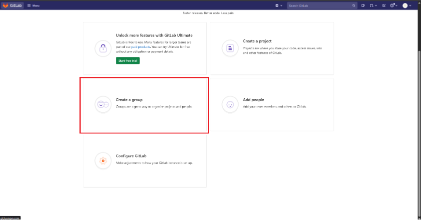
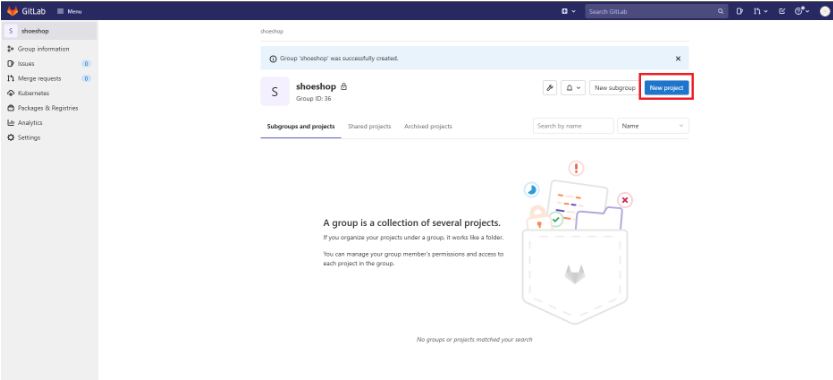
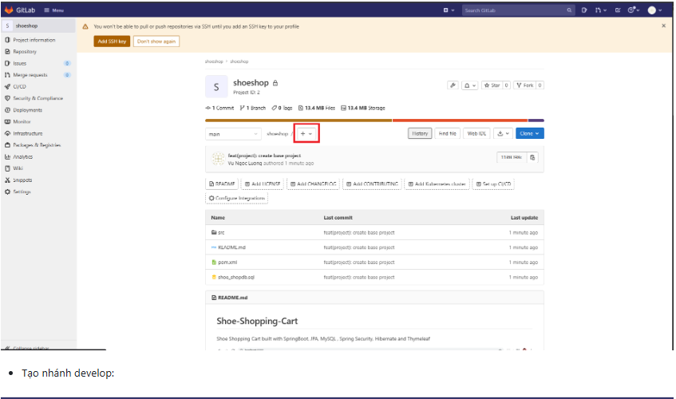
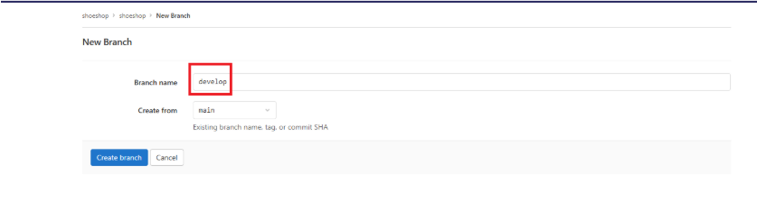
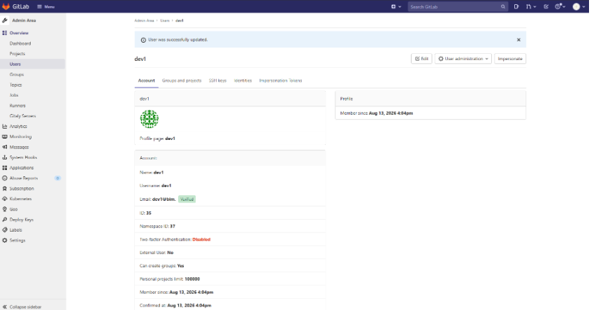
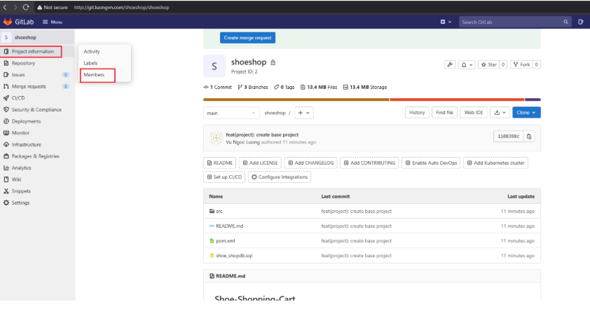
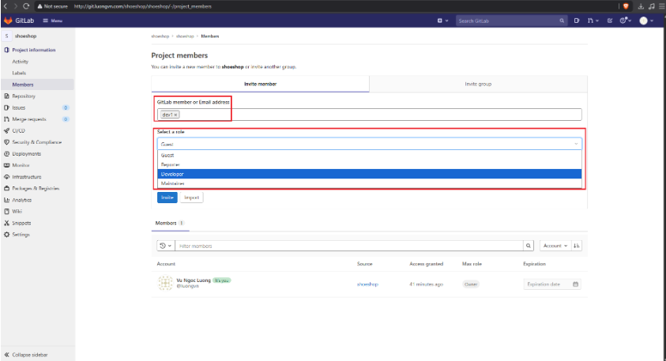
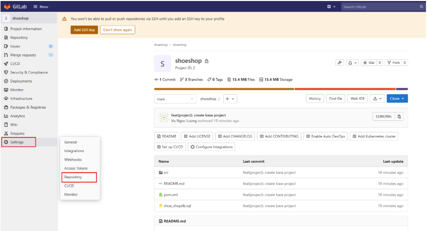
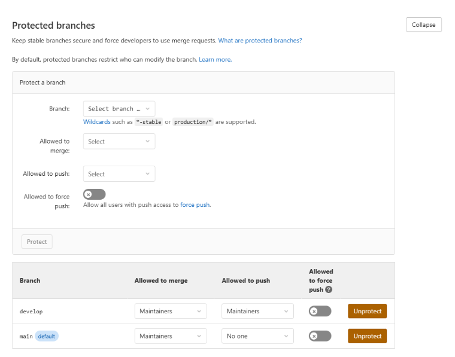
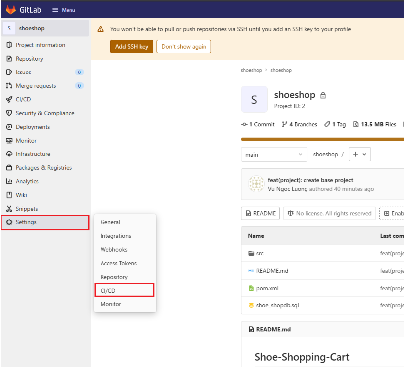

# GIT & GITLAB & GITLAB CI & GITLAB RUNNER & GITOPS ENGINE (FluxC+ ArgoCD)

## Khái niệm Git

**Git** là hệ thống quản lý phiên bản phân tán, dùng để theo dõi lịch sử thay đổi của source code, hỗ trợ làm việc nhóm và quản lý các phiên bản của project.Là công cụ chạy local trên máy bạn.

## Khái niệm GitLab & Làm quen

**GitLab**:Tương tự như GitHub nhưng được nhiều công ty sử dụng để kiểm soát dữ liệu nội bộ:

- **GitLab CE** (Community Edition) → tự cài trên server công ty, **MIỄN PHÍ, full tính năng cơ bản**(Nhiều cty dùng để tiết kiệm chi phí)
- **GitHub** → self-host phải trả phí (GitHub Enterprise Server)
- **GitLab CI/CD** — có sẵn ngay khi tạo project, chỉ cần file `.gitlab-ci.yml`, tích hợp rất sâu với pipeline, container registry, Kubernetes deploy(Github thì luồng Workflow tách biệt hơn)
- **GitLab** định vị là nền tảng DevOps toàn diện (code → CI/CD → security scan → monitor → deploy) trong 1 sản phẩm.

Ví dụ:

- Tạo group:



- Tạo project `shoeshop` trong Group `shoeshop`:



- Tạo nhánh:



- Tạo nhánh develope:



- Tạo user mới cho prj đặt tên là `dev1`:



- Add user `dev1` vào prj:





- Setting Merge request:





## Khái niệm Gitlab CI & Làm quen

### a.GitLab CI/CD

**GitLab CI/CD** là hệ thống CI/CD tích hợp trong GitLab, cho phép tự động hóa các bước:

```text
Code
 ↓
Build
 ↓
Test
 ↓
Package
 ↓
Deploy
```

Pipeline được khai báo bằng file: `.gitlab-ci.yml`

Ví dụ đơn giản:

```yaml
stages:
  - test
  - build

test:
  stage: test
  script:
    - echo "Running tests"

build:
  stage: build
  script:
    - echo "Building application"
```

Khi developer:

```git
git add .
git commit -m "update app"
git push
```

GitLab sẽ đọc `.gitlab-ci.yml` và tạo pipeline.

### b. GitLab CI gồm những gì?

- GitLab: Nơi lưu source code và quản lý pipeline.
- GitLab Runner: Là agent thực thi các job.
- Pipeline: Là toàn bộ quy trình CI/CD.

### c. Job và Stage

Stage = giai đoạn.

```yaml
stages:
  - test
  - build
  - deploy
```

Job = công việc cụ thể trong stage.

```yaml
test-app:
  stage: test
  script:
    - pytest
```

## Khái niệm Gitlab Runner & Làm quen

**GitLab Runner** là agent thực thi các job trong pipeline CI/CD của GitLab — nó chính là "worker" chạy thật sự các lệnh (build, test, deploy...) mà bạn định nghĩa trong file `.gitlab-ci.yml`. Và trả về kết quả cho Gitlab:

```text
GitLab Server (nơi bạn push code, định nghĩa pipeline)
        │
        │  giao job cần chạy
        ▼
GitLab Runner (máy/container thực thi job)
        │
        │  chạy lệnh: build, test, deploy...
        ▼
   Trả kết quả về GitLab (pass/fail, log)
```

- Cài gitlab-runner trên Rocky 9:

```bash
curl -L "https://packages.gitlab.com/install/repositories/runner/gitlab-runner/script.rpm.sh" | sudo bash
export GITLAB_RUNNER_DISABLE_SKEL=true
sudo -E dnf install gitlab-runner -y
```

- Kiểm tra:

```bash
[root@Rocky-server shoeshop]# sudo systemctl status gitlab-runner
● gitlab-runner.service - GitLab Runner
     Loaded: loaded (/etc/systemd/system/gitlab-runner.service; enabled; preset: disabled)
     Active: active (running) since Thu 2026-08-13 23:33:00 +07; 9s ago
   Main PID: 55551 (gitlab-runner)
      Tasks: 8 (limit: 10843)
     Memory: 18.4M (peak: 18.9M)
        CPU: 60ms
     CGroup: /system.slice/gitlab-runner.service
             └─55551 /usr/bin/gitlab-runner run --config /etc/gitlab-runner/config.toml --working-directory /home/gitlab-runner --service gitlab-runner --user gitlab-runner

Aug 13 23:33:00 Rocky-server gitlab-runner[55551]: Runtime platform                                    arch=amd64 os=linux pid=55551 revision=343288f1 version=19.2.2
Aug 13 23:33:00 Rocky-server gitlab-runner[55551]: Starting multi-runner from /etc/gitlab-runner/config.toml...  builds=0 max_builds=0
Aug 13 23:33:00 Rocky-server gitlab-runner[55551]: Running in system-mode.
Aug 13 23:33:00 Rocky-server gitlab-runner[55551]:
Aug 13 23:33:00 Rocky-server gitlab-runner[55551]: Created missing unique system ID                    system_id=s_45ec4c31fb20
Aug 13 23:33:00 Rocky-server gitlab-runner[55551]: Usage logger disabled                               builds=0 max_builds=1
Aug 13 23:33:00 Rocky-server gitlab-runner[55551]: Configuration loaded                                builds=0 max_builds=1
Aug 13 23:33:00 Rocky-server gitlab-runner[55551]: listen_address not defined, metrics & debug endpoints disabled  builds=0 max_builds=1
Aug 13 23:33:00 Rocky-server gitlab-runner[55551]: [session_server].listen_address not defined, session endpoints disabled  builds=0 max_builds=1
Aug 13 23:33:00 Rocky-server gitlab-runner[55551]: Initializing executor providers                     builds=0 max_builds=1
```

- Check version:

```bash
[root@Rocky-server shoeshop]# gitlab-runner -v
Version:      19.2.2
Git revision: 343288f1
Git branch:   19-2-stable
GO version:   go1.26.4
Built:        2026-08-12T15:19:39Z
OS/Arch:      linux/amd64
```

Ví dụ kết nối dự án với Git-lab:

- Chọn setting -> `CI/CD`, sau đó chọn Runner để lấy URL vs Token



- Trên Rocky server nhập:

```bash
gitlab-runner register
```

- Hãy điền thông tin vs option như sau:

```bash
[root@Rocky-server shoeshop]# gitlab-runner register
Runtime platform                                    arch=amd64 os=linux pid=55686 revision=343288f1 version=19.2.2
Running in system-mode.

Enter the GitLab instance URL (for example, https://gitlab.com/):
http://git.luongvn.com/
Enter the registration token:
W_u9N8mhyH74Z_47fqoo
Enter a description for the runner:
[Rocky-server]: Rocky-server
Enter tags for the runner (comma-separated):
Rocky-server
Enter optional maintenance note for the runner:

WARNING: Support for registration tokens and runner parameters in the 'register' command has been deprecated in GitLab Runner 15.6 and will be replaced with support for authentication tokens. For more information, see https://docs.gitlab.com/ci/runners/new_creation_workflow/
Registering runner... succeeded                     correlation_id=01KZY016ZDMGW5479SVNC47X6E runner=W_u9N8mhy runner_name=Rocky-server
Enter an executor: docker-windows, docker-autoscaler, docker+machine, custom, instance, kubernetes, ssh, parallels, virtualbox, shell, docker:
shell
Runner registered successfully. Feel free to start it, but if it's running already the config should be automatically reloaded!

Configuration (with the authentication token) was saved in "/etc/gitlab-runner/config.toml"
```

Run gitlab-runner:

```bash
[root@Rocky-server shoeshop]# nohup gitlab-runner run --working-directory /home/gitlab-runner/ --config /etc/gitlab-runner/config.toml --service gitlab-runner --user gitlab-runner 2>&1 &
```

Example config CI/CD:

```yaml
variables: 
    projectname: shoe-ShoppingCart
    version: 0.0.1-SNAPSHOT
    projectuser: shoeshop
    projectpath: /datas/shoeshop

stages: 
    - build
    - deploy
    - showlog

build: 
    stage: build
    variables: 
        GIT_STRATEGY: clone 
    script: 
        - mvn install -DskipTests=true
    tags: 
        - Rocky-server
    only: 
        - tags 

deploy: 
    stage: deploy
    variables: 
        GIT_STRATEGY: none
    when: manual
    script:
      - |
        if [ "$GITLAB_USER_LOGIN" == "luongvn" ]; then
          sudo cp target/$projectname-$version.jar $projectpath
          sudo chown -R $projectuser. $projectpath

          sudo su $projectuser -c "kill -9 \$(ps -ef | grep $projectname-$version.jar | grep -v grep | awk '{print \$2}')"

          sudo su $projectuser -c "cd $projectpath/; nohup java -jar $projectname-$version.jar > nohup.out 2>&1 &"
        else
          echo "Permission Denied"
          exit 1
        fi
    tags: 
        - Rocky-server
    only: 
        - tags 

showlog: 
    stage: showlog
    variables:
        GIT_STRATEGY: none
    when: manual
    script: 
        - sudo su $projectuser -c "cd $projectpath/; tail -n 10000 nohup.out"
    tags: 
        - Rocky-server
    only: 
        - tags```
```

## Khái niệm GitOPs & Git Ops Engine & Làm quen (FluxCD + ArgoCD)

**GitOps** là một phương pháp vận hành hệ thống, sử dụng Git làm Source of Truth để quản lý cấu hình và trạng thái mong muốn (Desired State) của hệ thống.

**GitOps** Engine là thành phần thực hiện quá trình reconciliation, giúp đưa trạng thái thực tế (Live State) của hệ thống về đúng với Desired State được khai báo.

**Reconciliation**: liên tục hoặc định kỳ so sánh Desired State với Live State, phát hiện sự khác biệt và thực hiện đồng bộ.

**Ví dụ**:

```text
Git
 │
 │ Desired State
 ▼
GitOps Tool
 │
 │ Reconciliation
 ▼
Kubernetes
 │
 │ Live State
 ▼
Application
```

Hai công cụ GitOps phổ biến:

**Argo CD**:

- Có Web UI trực quan.
- Dễ quan sát trạng thái Synced / OutOfSync.
- Dễ demo và debug bằng UI.
- Tích hợp tốt với Kubernetes.
- Phù hợp khi cần quản lý application deployment tập trung.

**Flux CD**:

- Thiết kế theo hướng Kubernetes-native.
- Kiến trúc gồm nhiều controller chuyên trách.
- Tích hợp tốt với Helm, Kustomize và các Kubernetes resources.
- Có thể quản lý GitOps mà không phụ thuộc vào một Web UI lớn.

Có thể nhớ đơn giản:

```text
             GitOps
                │
       ┌────────┴────────┐
       │                 │
    Argo CD            Flux CD
       │                 │
       └────────┬────────┘
                ▼
           Kubernetes
```
